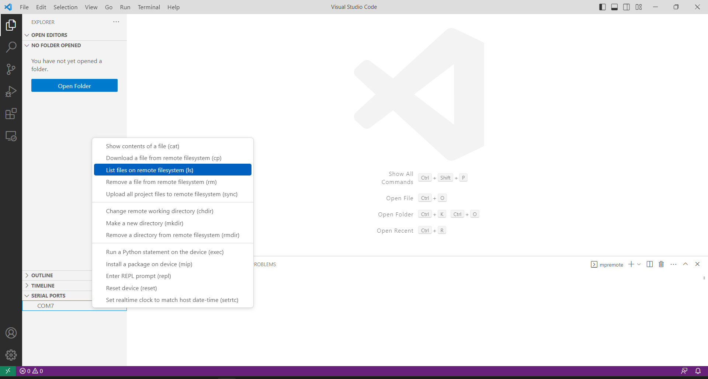
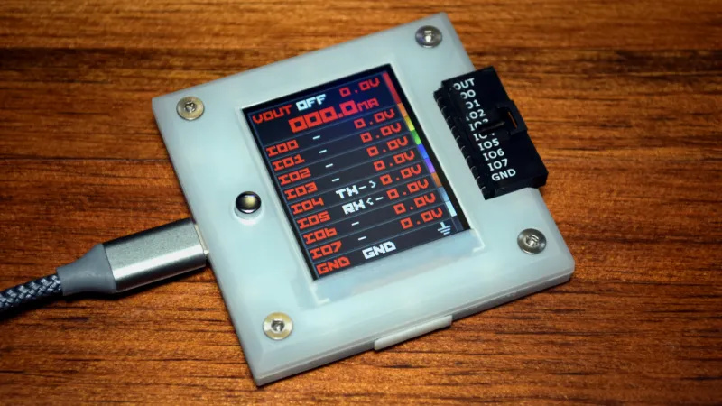

**Sean** to give Matt a bit of a break, Sean presented this month's news round-up

## News Round-up

### Arduino Alvik

Arduino have announced [a cute pocket-sized little robot, called Alvik](https://www.arduino.cc/education/arduino-alvik/)

* Comes loaded with MicroPython out of the box
* Built-in [Arduino Nano ESP32, using an ESP32-S3](https://www.espressif.com/en/news/Alvik_ESP32-S3)
* Comes with numerous sensors:
    * line-following
    * Time-of-Flight (distance)
    * 6-axis accelerometer and gyroscope
    * proximity
    * colour

### Using a Raspberry Pi Pico to Enhance a Vintage Radio Shack Microcomputer Kit

Can a vintage microcontroller from 1985 run MicroPython? Of course not! Especially not one with a 4-bit architecture and 512 _bits_ of RAM. But, [this All About Circuits project using the Radio Shack Science Fair Microcomputer Trainer coupled to a Raspberry Pi Pico](https://www.allaboutcircuits.com/projects/using-a-raspberry-pi-pico-to-enhance-a-vintage-radio-shack-microcomputer-kit/) serves as a great introduction to how simple computers work.

* Interesting intoduction to the Texas Instruments TMS1100, a very simple system-on-chip microcontroller (and claimed to be the first such chip)

### MPRemote Visual Studio Code Extension

> The goal of the MPRemote extension for Visual Studio Code is to give easy point and click access to many of the functions of the MicroPython project's MPRemote command-line tool. Rather than typing commands in a separate window, you simply navigate to them using the VS Code user interface.

* Thanks to Dave, [DavesCodeMusings on GitHub](https://github.com/DavesCodeMusings)
* Have a look at [the GitHub repo](https://github.com/DavesCodeMusings/mpremote-vscode) or [detailed wiki page](https://github.com/DavesCodeMusings/mpremote-vscode/wiki) for more info

### Bus Pirate 5

Hackaday [have written up a very detailed hand-on review](https://hackaday.com/2024/02/12/hands-on-bus-pirate-5/) of [the new Bus Pirate 5](https://buspirate.com/bus-pirate-5-rev-10-now-available/)

* Latest version of the Bus Pirate, a very handy protocol analyser and multi-tool
* Serial text-based interface, no special software needed (just a serial terminal)
* Has a display to show I/O configuration
* 1.2 V to 5.5 V I/O tolerance
* Programmable power supply, with current limiting
* Open source firmware, still in its infancy, but is [under active development](https://github.com/DangerousPrototypes/BusPirate5-firmware)
* I want one! Seems like it's US$38, [from their website](https://buspirate.com/get/)

### Closing Thought

  From [@markb139](https://twitter.com/markb139) [on X](https://twitter.com/markb139/status/1753061279797788681):

  > At one point I was debugging a C extension to micropython in one vscode and debugging python code in another. It was at that point I realised what an amazing set of low cost tools we have access to
