*Damien* ports his keyboard to MicroPython(!). *Matt* delivers the News.

## Links from Damien's talk

- [Splitkb](https://splitkb.com/) make great keyboards
  - Kyria v3
- [qmk](https://qmk.fm/) keyboard firmware
- [zmk](https://zmk.dev/) keyboard firmware (Zephyr, better BLE support)
- [kmk](https://github.com/KMKfw/kmk_firmware) firmware (CircuitPython)

## News Round-up

### Headlines

#### MicroPython v1.23 Release

On the last day of May, [v1.23 was
released](https://github.com/micropython/micropython/releases/tag/v1.23.0)!

Featuring dynamic USB devices, OpenAMP support, huge improvements to webassembly
and much, *much* more.

However, development of MicroPython rarely pauses, and the [v1.24
milestone](https://github.com/micropython/micropython/milestone/7) already
contains some exciting features!

#### ViperIDE

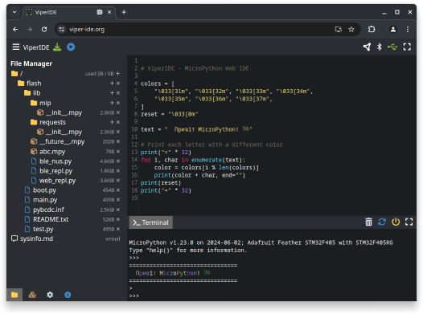

Volodymyr Shymanskyy, co-founder of [Blynk](https://blynk.io/), released
[ViperIDE](https://github.com/vshymanskyy/ViperIDE).

It's a browser-based IDE designed to work with MicroPython. It leverages WebUSB
and WebBluetooth to establish connections to a device and uses the usual
protocols from mpremote for file transfers. It's also got a built-in mip-based
package manager and a live REPL.

While generally pretty great, it's a *particularly fantastic* tool on Chromebooks
where it's often not possible to install packages.

[Try it out](https://viper-ide.org/)!

Les Pounder from [Tom's Hardware also interviewed
Volodymyr](https://www.youtube.com/watch?v=owDVI7z5GAk) about ViperIDE - but
they also covered Blynk and an as-yet-unreleased library to connect MicroPython
devices to Blynk.

---

#### PyCon AU: Call for proposals

PyCon AU opened up the [call for proposals](https://2024.pycon.org.au/program/)
on the 1st June. It closes Sunday 21 July 2024 (*before* the next meetup!) so
get those proposals submitted!

As well as the 'main' conference track, there are three specialist tracks this year are:

* Education
* Scientific Python
* DevOops

If there's enough interest we may consider running a MicroPython Development
Sprint around the time of the event. Let me know if you're interested!

#### Teardown 2024

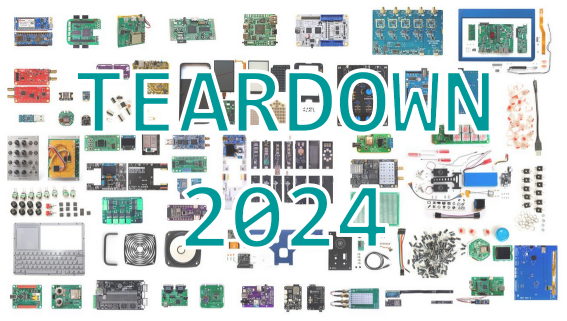

[Crowd Supply](https://www.crowdsupply.com/)'s Teardown is an annual conference "about the practice and the art
of hardware...".

As he shared in a [Discussion
post](https://github.com/orgs/micropython/discussions/15243), Ned Konz ~~is
giving~~ gave a talk of particular interest to us: [Prototype to product with
MicroPython: faster and happier embedded systems
development](https://www.crowdsupply.com/teardown/portland-2024/long-talk/prototype-to-product-with-micropython-faster-and-happier-embedded-systems-development)

Videos from Teardown aren't yet published but Ned's slides looked great!

---

#### Programming ESP32: Learn MicroPython Coding and Electronics [book]

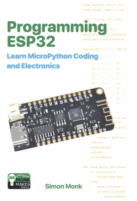

[Dr Simon Monk](https://simonmonk.org/) has released [Programming ESP32: Learn
MicroPython Coding and Electronics](https://simonmonk.org/esp32).

Currently it's available on Amazon but Dr Monk's [blog
announcement](https://www.doctormonk.com/2024/06/new-book-on-esp32-and-micropython.html)
indicates that it'll soon also be released on [MonkMakes](https://monkmakes.com/).

[Hot tip: The Amazon link on the blog post doesn't allow purchases in Australia,
but Dr Monk was kind enough to source a [different link that we can use Down
Under](https://www.amazon.com.au/Programming-ESP32-MicroPython-Coding-Electronics/dp/1739487451/)!]

At the same blog post he also discusses his decision to use Thonny and the
specific ESP32 boards used in the book. All the example code used in the book
[is available](https://github.com/simonmonk/prog_esp32).

---

#### Is MicroPython better than Basic?

In Kevin McAleer's latest video he reprograms some retro games using MicroPython
instead of the original Basic:

---

### Matt's New Hardware

Waveshare? Nope. Next month!

---

### Hardware News

#### LilyGo

LilyGo have another spate of [new releases](https://www.lilygo.cc/collections/new).

Here are a couple that are worth checking out, but the [T-QT
C6](https://www.lilygo.cc/products/t-qt-c6) and [T-Camera Plus
S3](https://www.lilygo.cc/products/t-camera-plus-s3) will probably also be of
interest!

##### T-Glass

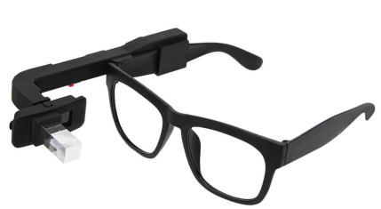

- ESP32-S3 FN4R2
- 4MB Flash, 2MB PSRAM
- Microphone, RTC, touch button
- 294x126 AMOLED (JD9613)
- 6-axis IMU (BHI260AP)

<iframe width="560" height="315" src="https://www.youtube.com/embed/7bza881G9mA?si=zNbKLVqYv9tlga20" title="YouTube video player" frameborder="0" allow="accelerometer; autoplay; clipboard-write; encrypted-media; gyroscope; picture-in-picture; web-share" referrerpolicy="strict-origin-when-cross-origin" allowfullscreen></iframe>

**US$41**

##### T-Encoder Pro

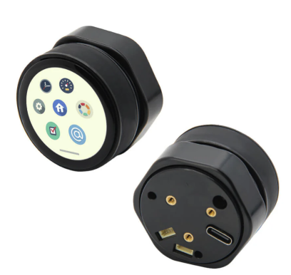

- ESP32-S3 R8
- 16MB Flash, 8MB PSRAM
- Buzzer, 2xQwiic
- 1.2" 390x390 AMOLED (SH8601A-W16-T06)
- Rotary encoder
- Touch display (CHSC5816)

**US$33**

---

#### M5Stack

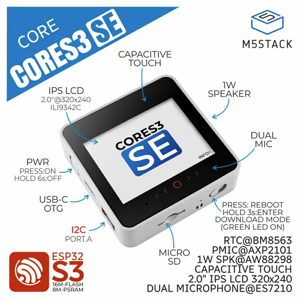

[M5Stack CoreS3 SE](https://shop.m5stack.com/products/m5stack-cores3-se-iot-controller-w-o-battery-bottom) released

* ESP32-S3, 16MB flash, 8MB RAM
* 2" cap touch display
* RTC
* I2S input and amplier, with 1W speaker
* Low power

Cheaper than the original M5Core S3, the SE drops the camera, prox sensor, IMU
and magnetic compass. And it's half the thickness, dropping the included DinBase
of the original.

**US$39**

---

### Software News

#### MicroPython on the Playdate

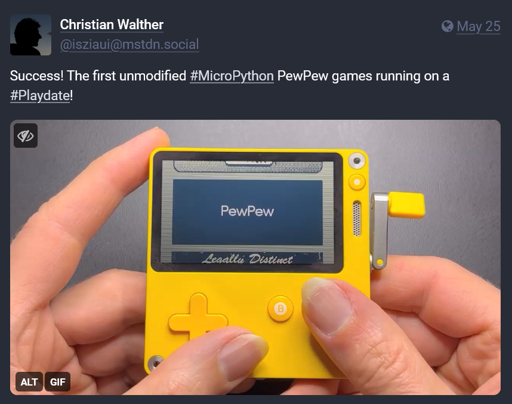

Quick update: [pew-playdate
v0.1](https://github.com/cwalther/pew-playdate/releases/tag/v0.1) released by
Christian. "First release that actually runs unmodified PewPew games."

---

#### micropython-bleradio

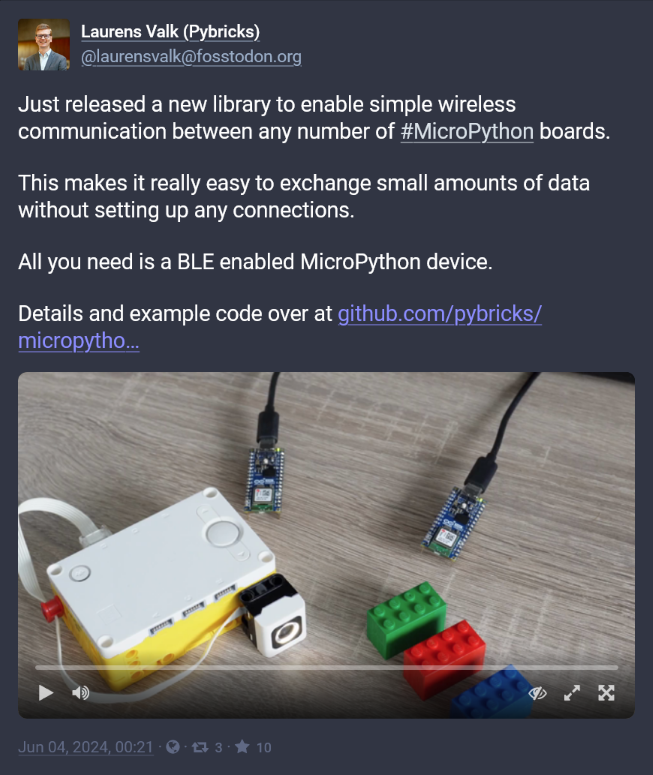

[Laurens Valk announced](https://fosstodon.org/@laurensvalk/112553130854602227)
that he'd released a lightweight library -
[micropython-bleradio](https://github.com/pybricks/micropython-bleradio/) - to
perform simple but low-level BLE comms. Uses only the BLE advertising packet,
takes care to embed data in *very few* bytes.

---

#### MPDisplay

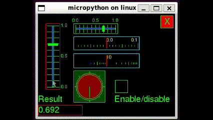

Brad Barnett has been doing some *fantastic* work with his GUI library
[MPDisplay](https://github.com/bdbarnett/mpdisplay). Read - and get involved
with! - [his discussion
post](https://github.com/orgs/micropython/discussions/15261) that introduces
MPDisplay.

From the post:

"MPDisplay is a display and event driver that works on CPython, CircuitPython
and MicroPython. It enables you to develop your app's UI on your deskop and the
code immediately transfers to your microcontroller!"

Brad has been looking to bridge the MicroPython and LVGL worlds but this library
appears to be even more ambitious!

---

#### Tim plays movies..and releases bitgraphics

Tim Hanewich has been looking at ways [of rendering monochrome
videos](https://x.com/TimHanewich/status/1801400923370963410) efficiently on the
venerable - and very cheap - SSD-1306 OLED displays.

<iframe width="560" height="315" src="https://www.youtube.com/embed/iat1-5_J558?si=BvR-OcqVYeRyq01u" title="YouTube video player" frameborder="0" allow="accelerometer; autoplay; clipboard-write; encrypted-media; gyroscope; picture-in-picture; web-share" referrerpolicy="strict-origin-when-cross-origin" allowfullscreen></iframe>

<iframe width="560" height="315" src="https://www.youtube.com/embed/FdT1iwp20k0?si=GtRyjfKWHp6EcvIk" title="YouTube video player" frameborder="0" allow="accelerometer; autoplay; clipboard-write; encrypted-media; gyroscope; picture-in-picture; web-share" referrerpolicy="strict-origin-when-cross-origin" allowfullscreen></iframe>

Tim has been keeping busy it seems; he's also released
[bitgraphics](https://github.com/TimHanewich/bitgraphics), a MicroPython module
for displaying images, text and other graphics on the SSD-1306. It's a bit like
dialing framebuf up to 11.

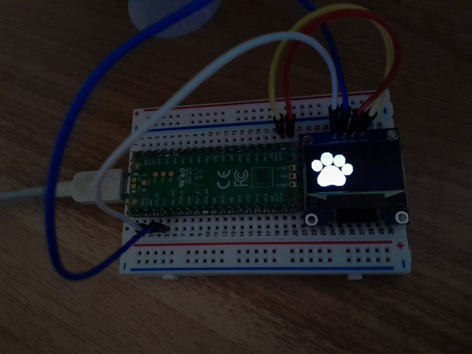

---

#### RISC-V QEMU port and emitter

Alessandro Gatti has been doing some interesting work with RISC-V.

[Add a RISC-V RV32IMC native code
emitter](https://github.com/micropython/micropython/pull/15231)

[Add RISC-V 32 bit QEMU
port](https://github.com/micropython/micropython/pull/12853)

Note that inline RISC-V assembly isn't yet supported...but these PRs lay the
necessary groundwork.

---

#### When a Mongoose met a MicroPython

An excellent write-up on how to integrate [Cesanta](https://cesanta.com/)'s
popular open-source embedded C MQTT library - [Mongoose](https://mongoose.ws/) -
so you can use it from MicroPython. An excellent real-world example of how to
implement user modules.

[Part 1](https://www.embeddedrelated.com/showarticle/1649.php)

[Part 2](https://www.embeddedrelated.com/showarticle/1670.php)

#### Framebuf for the Console

Owen Carter
[announced](https://fosstodon.org/@easytarget@social.makerforums.info/112660490256467490)
a framebuf driver for REPL console use. His [discussion
post](https://github.com/orgs/micropython/discussions/15327) has more details;
it allows you to render output that would normally go to a display to the
console instead. Handy! We've started discussing extending the idea...

---

#### MicroPython for the TC32

<iframe width="560" height="315" src="https://www.youtube.com/embed/sv58aPvIonw?si=VW2eribgqjD-Rtv7" title="YouTube video player" frameborder="0" allow="accelerometer; autoplay; clipboard-write; encrypted-media; gyroscope; picture-in-picture; web-share" referrerpolicy="strict-origin-when-cross-origin" allowfullscreen></iframe>

[David Given ports MicroPython to a $3 Aliexpress-bought
watch](https://github.com/orgs/micropython/discussions/15333). I think the first
line sets the scene: "I have a new watch. It's terrible."

It uses an obscure micro, the Telink TLSR8232. 512KB flash (good!) but 16KB RAM
(ouch, tight!).

His video also made it [to the front page of Hacker
News](https://news.ycombinator.com/item?id=40769882). [Twitter
announcement](https://x.com/hjalfi/status/1804892354244923882)

---

#### ESP32-C6 port

Update: [AndrewL and dmfaria resolved the last known
issue](https://github.com/micropython/micropython/pull/11869#issuecomment-2191349221);
ADC's are fixed for the C6.

One feature of the C6 that I'd neglected to notice; although it's a relatively
affordable device, Espressif included support for [CAN
(TWAI)](https://docs.espressif.com/projects/esp-idf/en/stable/esp32c6/api-reference/peripherals/twai.html).

---

### Projects

#### Caravan motor home leveler

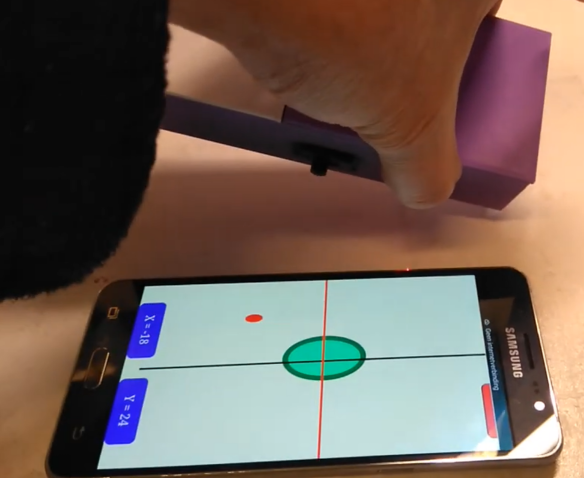

Luc Volders has been building a caravan/motor-home leveler with a six-part blog
write-up! The neat thing about this project is that you can leave the device in
the caravan and level the vehicle from the outside.

[Part 2 covers the MicroPython
software](http://lucstechblog.blogspot.com/2024/05/caravanmotor-home-leveler-part-2.html).

<iframe width="560" height="315" src="https://www.youtube.com/embed/JyXKkpkgIXU?si=wy_5QfoNlwvZAJgC" title="YouTube video player" frameborder="0" allow="accelerometer; autoplay; clipboard-write; encrypted-media; gyroscope; picture-in-picture; web-share" referrerpolicy="strict-origin-when-cross-origin" allowfullscreen></iframe>

---

#### Ultimate Open Source Smart Sit-Stand Desk

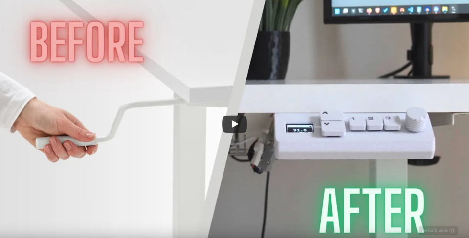

[Walid has built a smart sit-stand
desk](https://x.com/waliori/status/1796291807908700511) based on a broken,
manual IKEA desk. All the [MicroPython firmware is
available](https://github.com/waliori/RP-pico-sit-stand-firmware) and Walid
would love feedback on it.

This was a *beautiful* build, Walid has clearly put a lot of time and effort
into it and has put together a stunning video of the construction, from start to
finish:

<iframe width="560" height="315" src="https://www.youtube.com/embed/PKzvHBzcGJ4?si=Lez3InxnNaakBOAo" title="YouTube video player" frameborder="0" allow="accelerometer; autoplay; clipboard-write; encrypted-media; gyroscope; picture-in-picture; web-share" referrerpolicy="strict-origin-when-cross-origin" allowfullscreen></iframe>

---

#### Balance droid

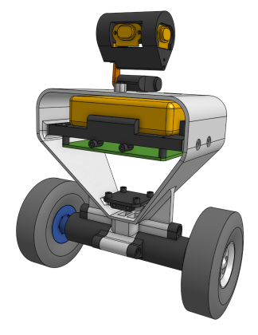

John Hyland is working on a Balance Droid, if you're interested then follow his
[balanceDroid](https://github.com/JonHylands/balanceDroid) repository and join
in the [MicroPython Discord](https://micropython.org/discord) where he's
discussing implementation details.

---

### Final Thoughts

#### Meetup alternative?

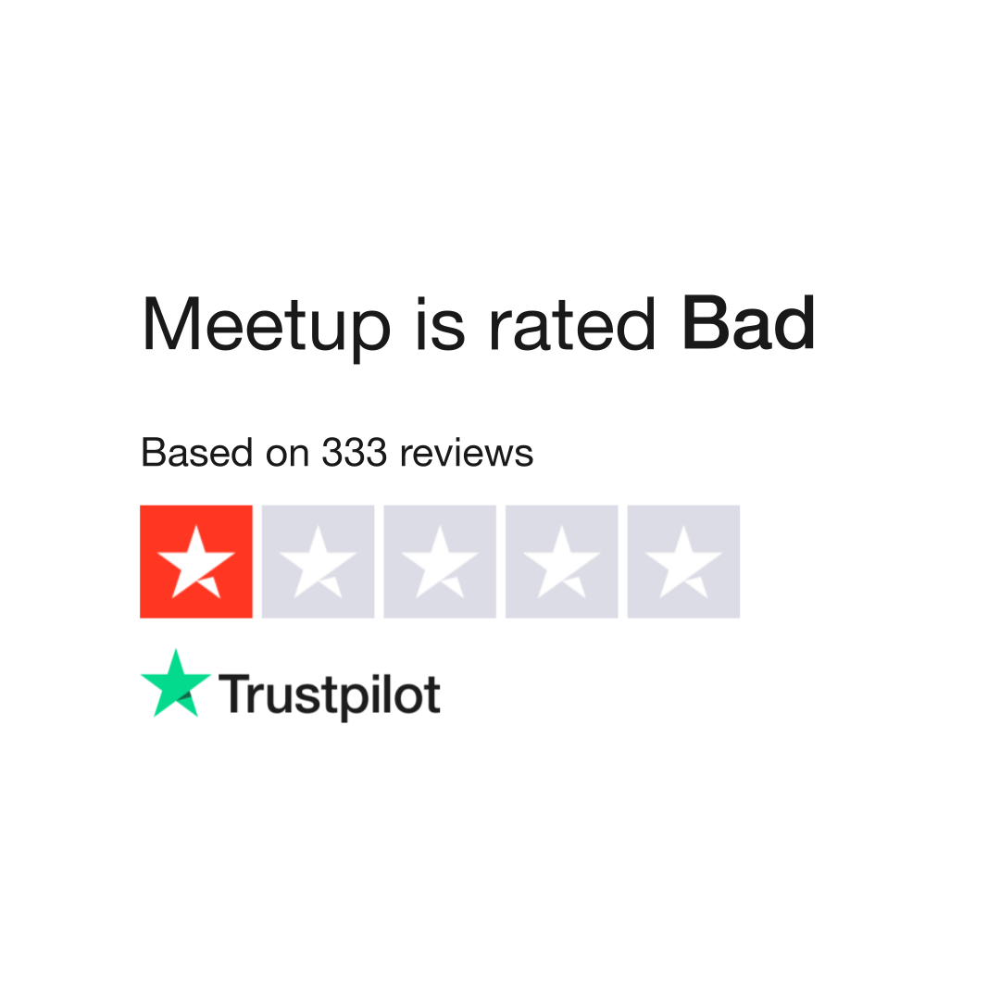

Meetup has disappointed me one too many times! Anyone have any good
alternatives?

---

#### MicroMac

The MicroMac is an old-school Macintosh for under £5! Built out of one of our
faves, the Raspberry Pi Pico.

---

#### How to train simple AIs to balance a double pendulum

An *excellent* video from [Pezzza's Work](https://www.youtube.com/@PezzzasWork)
that explains how to train a neural network to balance a double pendulum.

Although an ideal ML application, before I watched the video I wouldn't have
been *entirely* sure it would be *possible* to balance a double pendulum using
this method; they're inherently very chaotic! Spoiler alert: It is, and now I
can't help but wonder if a 3x (or 10x pendulum? 1000x??) is possible...

It would be *fascinating* trying to build this with MicroPython and seeing how
the real world would affect performance.

<iframe width="560" height="315" src="https://www.youtube.com/embed/9gQQAO4I1Ck?si=0ks7edmIY0es-A2H" title="YouTube video player" frameborder="0" allow="accelerometer; autoplay; clipboard-write; encrypted-media; gyroscope; picture-in-picture; web-share" referrerpolicy="strict-origin-when-cross-origin" allowfullscreen></iframe>

---

### Midjourney fun

