_Hans Marki talks to us about Octoprobe, Sean delivers the news_

## News Round-up

### Headlines

#### Tulip

We looked at Tulip a little while ago, ...but it's come a long way! It's got a MIDI interface, ADCs and DACs, 7 inch touchscreen, USB keyboard input support; but most importantly an extensive MicroPython API for doing things like making music and controlling audio equipment, as well as playing games.

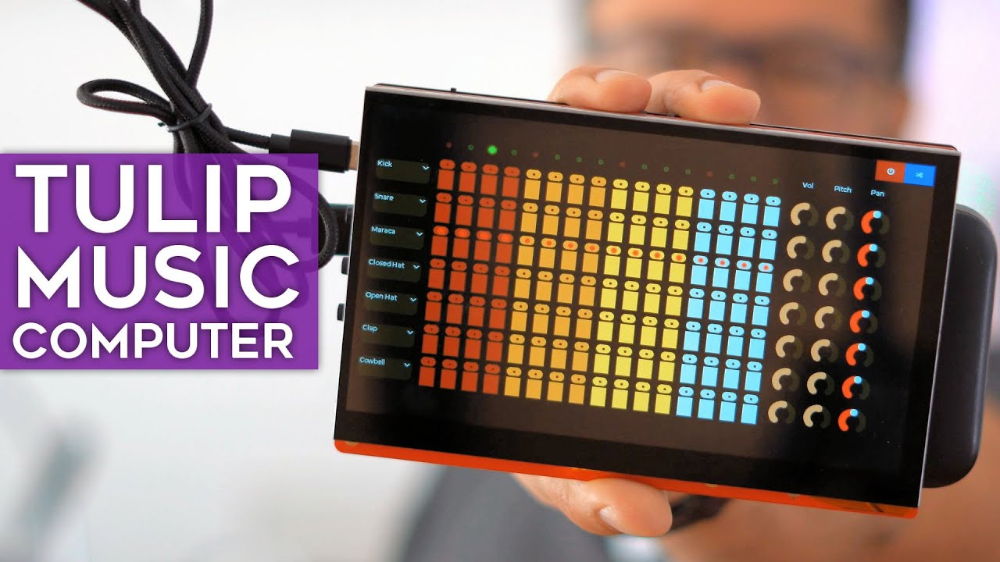

Check out [this video from Floyd Steinberg](https://www.matrixsynth.com/2024/07/tulip-musical-computer-based-on.html), where he goes through running a synth application on the Tulip.

---

#### ViperIDE

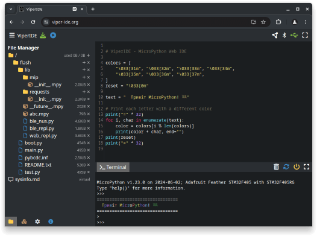

We looked at ViperIDE [last month](https://melbournemicropythonmeetup.github.io/June-2024-Meetup/) but the improvements continue!

One of the more recent noteworthy features is that there is now an [experimental version of ViperIDE](https://viper-ide.org/?vm=1) that simulates a device *inside the browser* using the MicroPython WASM build. The WASM build is then also used to do linting, live in the browser – I've tried it and it works quite well. Very neat! 

In my own brief testing since last month it seems other things like variable suggestions / autocompletion are much improved – although make sure you save regularly as it seems like auto-save still isn't implemented _(maybe I'll get around to opening a bug report...)_

---

#### PyCon AU: Call for proposals

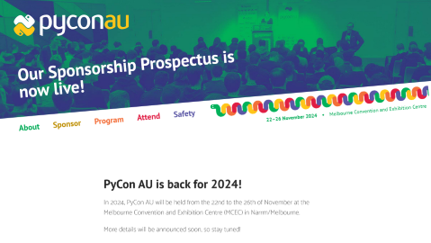

As noted [last month](https://melbournemicropythonmeetup.github.io/June-2024-Meetup/), PyCon AU's [call for proposals](https://2024.pycon.org.au/program/) closed last Sunday, the 21st. Good luck to those of you who submitted a proposal!

[PyCon AU 2024](https://2024.pycon.org.au/) will be held from the 22nd to the 26th of November at the Melbourne Convention and Exhibition Centre, tickets aren't on sale yet but more details are "coming soon"

---

#### Programming ESP32: Learn MicroPython Coding and Electronics [book]

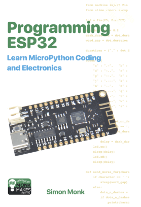

(Matt received the book, feel free to take a look! It's a really nice
introductory text.)

---

### Matt's New Hardware

Waveshare? Nope. Next month!

---

### Hardware News

#### Thumby Color

It's a Thumby… but with colour! And also it seems like a (very) slight size increase compared to the original, which for my big hands is certainly welcome.

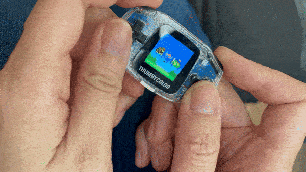

Apparently there will be a Kickstarter crowdfunding campaign later in the year, stay tuned

#### Inkplate 6 MOTION

The latest Inkplate incarnation hit its crowdfunding target this month, [orders can still be placed](https://www.crowdsupply.com/soldered/inkplate-6-motion) if you're interested and you missed it. 

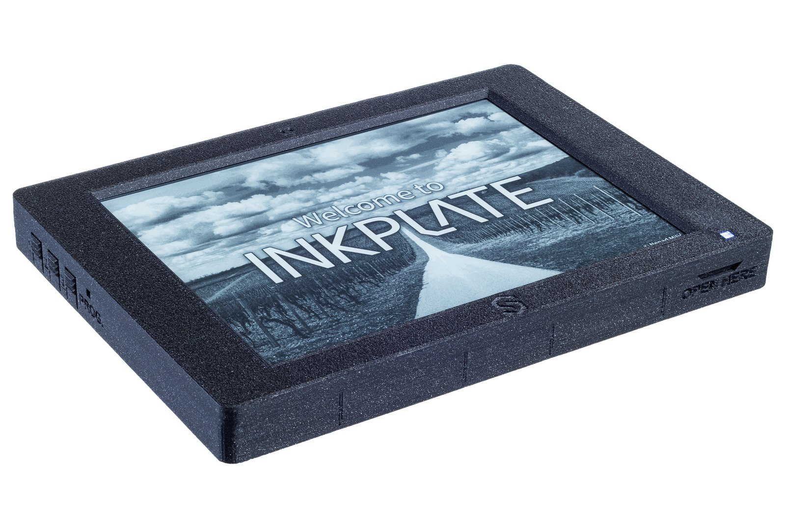

Features a 6-inch e-paper display with an 11 Hz refresh rate – making it suitable for things like animations, keyboard input, graphical UX elements, and scrolling text. Unlike some of the past Inkplate devices however it uses an STM32H743 microcontroller, presumably to help handle the much greater graphical demands, so I'd imagine there might be some work required to get an existing Inkplate application to use this new board.

#### WIZnet combines their W5500 Ethernet chip with an RP2040

WIZnet already sell a Raspberry Pi Pico-compatible board with the W5500 built-in, but now they're close to releasing [an IC which has both in the one package](https://www.hackster.io/news/wiznet-puts-the-raspberry-pi-rp2040-and-its-w5500-ethernet-chip-in-a-blender-pours-out-the-ionic-2ed85ad4015b). 

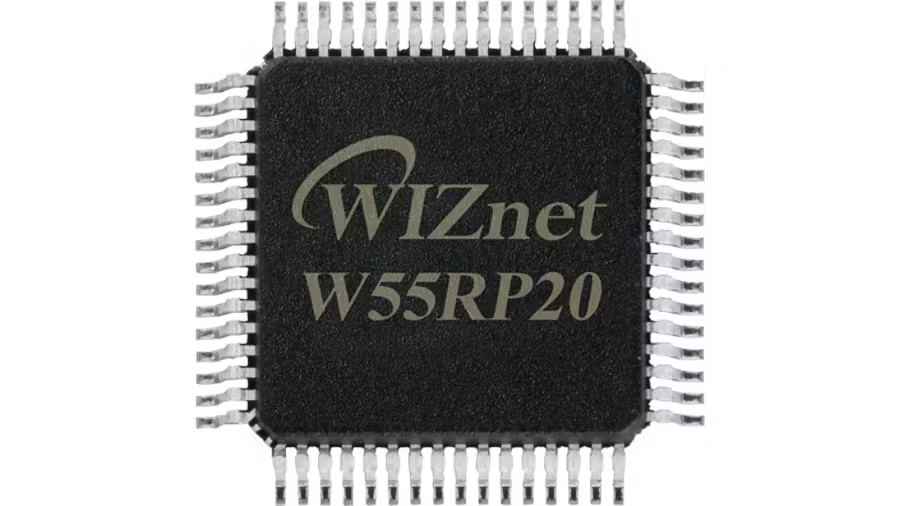

There's no release date yet, I'm sure we'll feature it here when it does finally come out.

#### OMGS3

Unexpected Maker, a.k.a. Seon, has teased a new board he's making – claiming to be the _"world's smallest fully-featured ESP32-S3 board"_. 

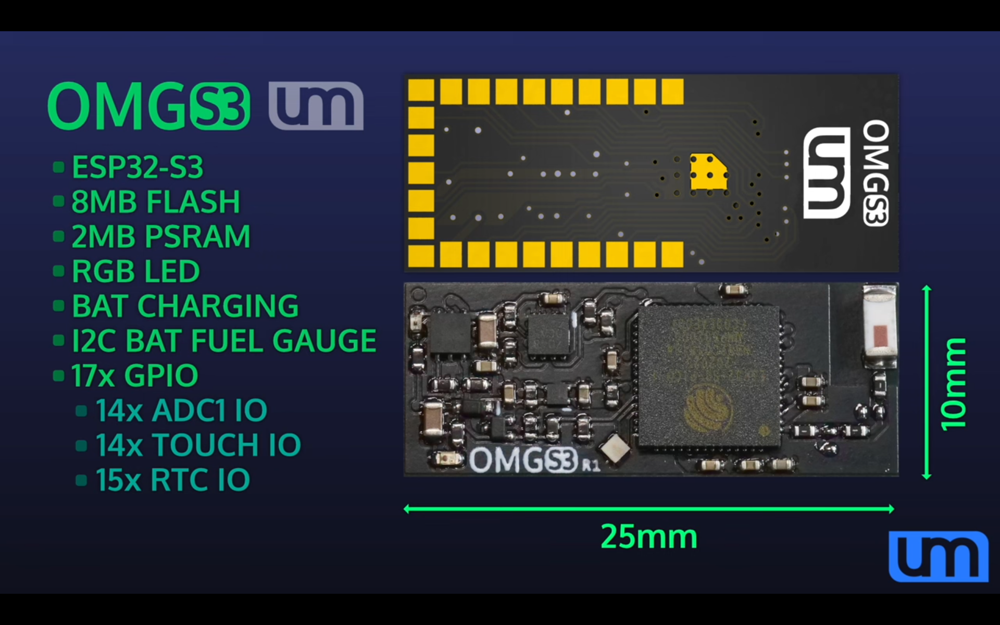

It's so small there's not your "normal" pins, instead it's got solder pads on the underside for integrating compactly into a larger design. [Check out his YouTube video for more info](https://www.youtube.com/watch?v=4-1lS4fGJ20).

#### LilyGo

[Lots more new LilyGo stuff!](https://www.lilygo.cc/collections/new) (Sorry, I ran out of time to list them here...)

---

### Software News

#### ESP32-C6, ESP32-C2 and ESP32-H2 port

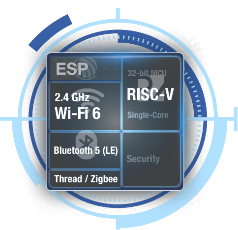

The [ESP32-C6 port](https://github.com/micropython/micropython/pull/11869) has been added to the [v1.24 milestone](https://github.com/micropython/micropython/milestone/7).

[TrekMax](https://github.com/TrekMax) has added a PR for [ESP32-C2
support](https://github.com/micropython/micropython/pull/15440). If anyone is interested in these devices, please build and test this PR.

ESP32-H2 support has not yet been added but all three of these device require
similar changes - using the C6 and C2 as guides should make it pretty
straightforward to add the H2.

#### ESP-File Manager

A browser-based file manager for ESP32, which runs directly on device

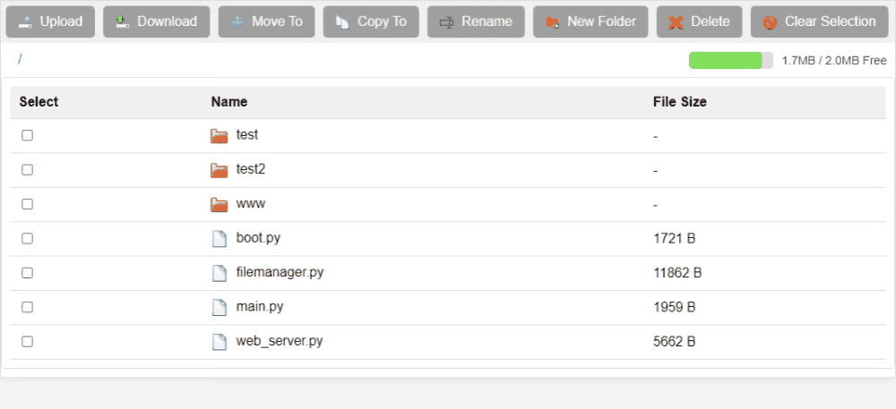

Very recent project (as in the first commit is last week), but already seems very feature-rich and useful. Check it out [on GitHub]( https://github.com/mispacek/ESP-File_manager), thanks to users _mispacek_ and _milikiller_ (sorry, I wasn't able to find actual names of the people, but thank you whoever you are!)

#### RP2040 PIO Emulator

Nathan Young has made some great progress on an [RP2040 PIO emulator, written in Python](https://github.com/NathanY3G/rp2040-pio-emulator). Useful for things like unit tests for PIO programs, stepping through PIO execution, plotting outputs, and debugging PIO code. There's also a repo of examples, including this one below using Jupyter for plotting the square wave output by a simple PIO program.

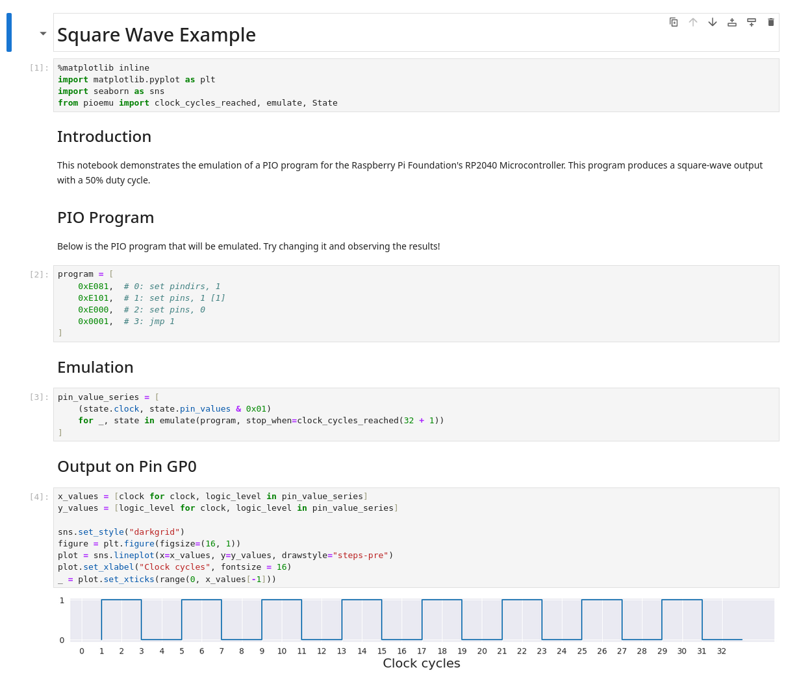

#### Get Started with MicroPython on Raspberry Pi Pico - 2nd Edition

Raspberry Pi Press have released an updated version of their [beginners introduction to the Pi Pico and MicroPython](https://store.rpipress.cc/products/get-started-with-micropython-on-raspberry-pi-pico-2nd-edition), now targeting the Pico W. 

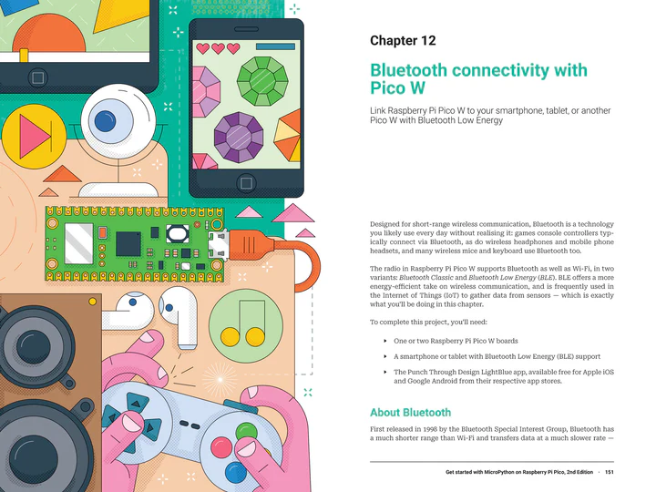

I haven't got a copy of it myself but the grabs I've seen from it look beautifully done, and it seems like it covers a wide breadth of subject material in a good level of detail. Seems ideal for beginners, or in educational settings.

---

### Projects

#### Look Mum No Pixels: a Mini Vector Display

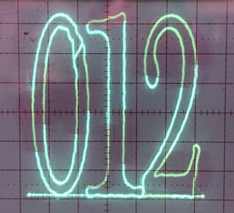

Nick Moore (founder of this meetup!) has started writing up his latest project:
Using MicroPython to control a Vector Display. [Look Mum No Pixels: a Mini Vector Display](https://nick.zoic.org/art/mini-vector-display/)

#### MicroPython Smartwatch with WASP-OS

In a similar theme to some of the links [from last month](https://melbournemicropythonmeetup.github.io/June-2024-Meetup/), we've got another MicroPython smartwatch!

Shawn Tolidano has a neat guide on [getting MicroPython running](https://www.tolidano.com/micropython-smartwatch.html) on a very cheap (as in ≈AU$30) smartwatch, the Colmi P8 (he has links through to TVC Mall to buy one). The MicroPython support comes [via WASP-OS](https://wasp-os.readthedocs.io/en/latest/install.html#colmi-p8), which is _"...is a firmware for smart watches that are based on the nRF52 family of microcontrollers."_

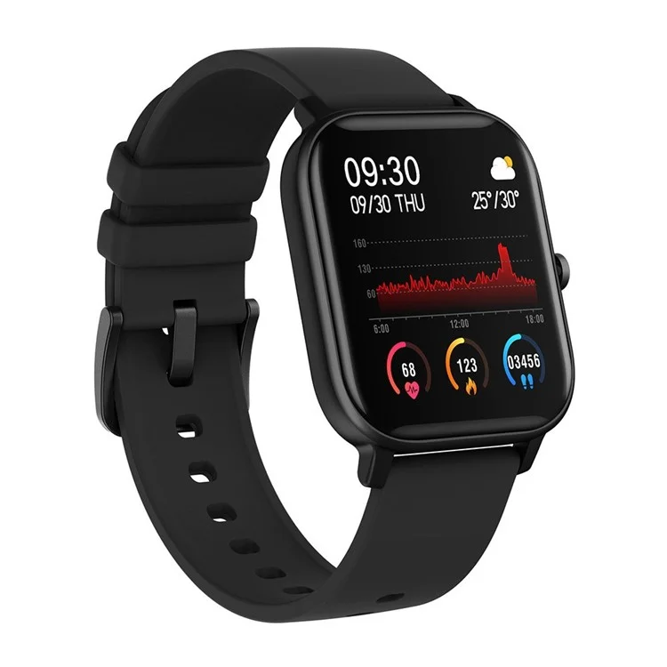

I haven't had a chance to try it, but I'd love to get one to play with and give it a go!

#### Exploring Microphone Magic with I²S and Micropython

Hardware company Infineon have published a fairly detailed [blog post on using one of their I²S microphone devices with MicroPython](https://www.hackster.io/Infineon_Team/exploring-microphone-magic-with-i2s-and-micropython-8e9ae9), running on a Cyprus PSoC board (although the Pi Pico / RP2040 should also be possible as well). 

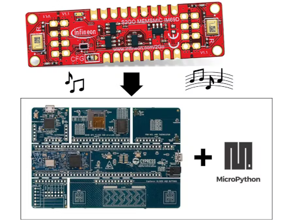

#### Pixel Art with no code

Core Electronics have written up an extensive [guide on using the WLED app to drive an ESP8266 or ESP32 connected to an array of addressable LEDs](https://core-electronics.com.au/guides/wireless/glowbit-matrix-control-no-code/) (i.e. the ubiquitous WS2812B). They use their own GlowBit Matrix, but they stress it's just as easy to use any compatible addressable LEDs. 

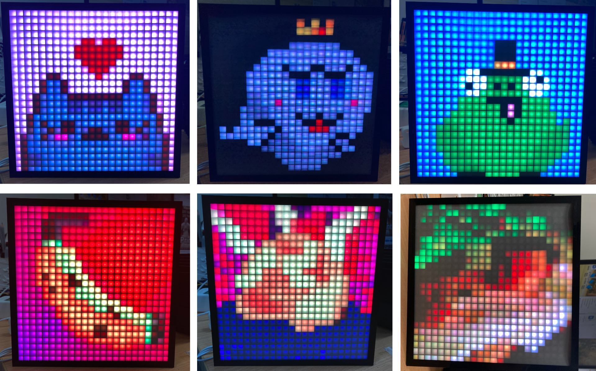

The WLED app provides a no-code way to show complex patterns or even basic images onto a configurable number of LEDs – obviously results will vary depending on how many LEDs you have! 

---

### Quick Bytes

* **[Getting Started with HTTP GET Requests](https://randomnerdtutorials.com/raspberry-pi-pico-w-http-requests-micropython/)**: a good beginners introduction to GET requests, from Random Nerd Tutorials, using MicroPython on a Pi Pico W
* **[Getting Started with Bluetooth Low Energy](https://randomnerdtutorials.com/micropython-esp32-bluetooth-low-energy-ble/)**: also from Random Nerd Tutorials, using MicroPython on an ESP32, another good beginners introduction
* **[Don't let MicroPython's garbage collector ruin your program](https://www.youtube.com/watch?v=Mk-F-4YAsdQ)**: a deeper look at what garbage collection is and how to avoid some common issues it can cause in MicroPython, from the Making Stuff with Chris DeHut YouTube channel

---

### Final Thoughts

#### Always consider...

...that your threat model might be incomplete

---

### Midjourney fun

