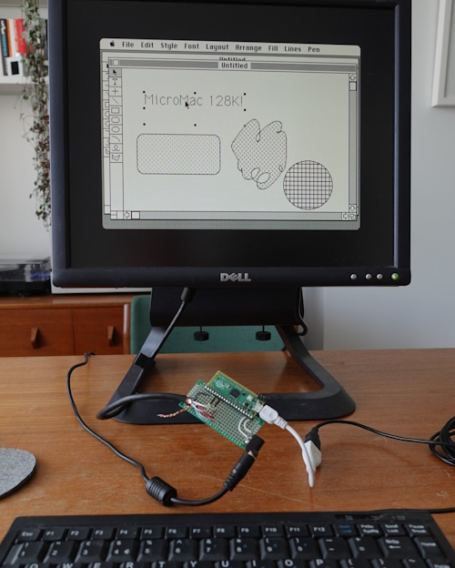

^Sean* delivers the News.

## News Round-up

### Headlines

#### Tulip

We looked at Tulip back in...but it's come a long way.

#### ViperIDE

We looked at ViperIDE [last
month](https://melbournemicropythonmeetup.github.io/June-2024-Meetup/) but the
improvements continue!

One of the more recent noteworthy features is that there is now an [experimental
version of ViperIDE](https://viper-ide.org/?vm=1) that simulates a device
*inside the browser* using the MicroPython WASM build. Very neat!

---

#### PyCon AU: Call for proposals

As noted [last
month](https://melbournemicropythonmeetup.github.io/June-2024-Meetup/), PyCon
AU's [call for proposals](https://2024.pycon.org.au/program/) closed last
Sunday, the 21st. Good luck to those of you who submitted a proposal!

---

#### Programming ESP32: Learn MicroPython Coding and Electronics [book]

(Matt received the book, feel free to take a look! It's a really nice
introductory text.)

---

### Matt's New Hardware

Waveshare? Nope. Next month!

---

### Hardware News

#### LilyGo

[Could add the new LilyGo devices]

---

### Software News

#### ESP32-C6, ESP32-C2 and ESP32-H2 port

The [ESP32-C6 port](https://github.com/micropython/micropython/pull/11869) has
been added to the [v1.24
milestone](https://github.com/micropython/micropython/milestone/7).

[TrekMax](https://github.com/TrekMax) has added a PR for [ESP32-C2
support](https://github.com/micropython/micropython/pull/15440). If anyone is interested in these devices, please build and test this PR.

ESP32-H2 support has not yet been added but all three of these device require
similar changes - using the C6 and C2 as guides should make it pretty
straightforward to add the H2.

#### ESP-File Manager

https://github.com/mispacek/ESP-File_manager

---

### Projects

#### Look Mum No Pixels: a Mini Vector Display

Nick Moore (founder of this meetup!) has started writing up his latest project:
Using MicroPython to control a Vector Display. [Look Mum No Pixels: a Mini Vector Display](https://nick.zoic.org/art/mini-vector-display/)

---

### Final Thoughts

#### Always consider...

...that your threat model might be incomplete

---

#### MicroMac

The MicroMac is an old-school Macintosh for under £5! Built out of one of our
faves, the Raspberry Pi Pico.

---

#### How to train simple AIs to balance a double pendulum

An *excellent* video from [Pezzza's Work](https://www.youtube.com/@PezzzasWork)
that explains how to train a neural network to balance a double pendulum.

Although an ideal ML application, before I watched the video I wouldn't have
been *entirely* sure it would be *possible* to balance a double pendulum using
this method; they're inherently very chaotic! Spoiler alert: It is, and now I
can't help but wonder if a 3x (or 10x pendulum? 1000x??) is possible...

It would be *fascinating* trying to build this with MicroPython and seeing how
the real world would affect performance.

<iframe width="560" height="315" src="https://www.youtube.com/embed/9gQQAO4I1Ck?si=0ks7edmIY0es-A2H" title="YouTube video player" frameborder="0" allow="accelerometer; autoplay; clipboard-write; encrypted-media; gyroscope; picture-in-picture; web-share" referrerpolicy="strict-origin-when-cross-origin" allowfullscreen></iframe>

---

### Midjourney fun

