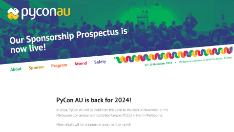
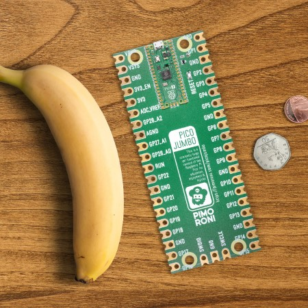
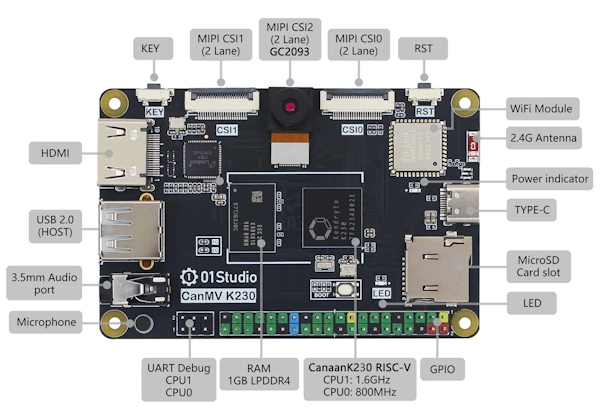

*Oliver* demos [mim](https://mim.oliverrobson.tech/), *Matt* gives the news
round-up and previews [mpbuild](https://github.com/mattytrentini/mpbuild)

## News Round-up

### Headlines

#### Raspberry Pi RP2350

The biggest news of the month is the announcement - at DEF CON 23 - of the
[RP2350](https://www.raspberrypi.com/products/rp2350/), Raspberry Pi's successor
to the wildy popular RP2040. They also announced the Pico 2 although we're going
to have to wait a few months for the Pico 2 W.

Big ticket items:

- Dual-core Cortex M33 @ 150MHz
  - Early perf measurements [suggest almost 2x faster](http://lucstechblog.blogspot.com/2024/08/first-look-at-raspberry-pi-pico2.html)
- **OR** Dual-core RISC-V [Hazard3](https://github.com/Wren6991/Hazard3) @ 150MHz
  - Unexpected surprise!
  - Both ARM/RISC-V are available but you *must choose one at boot*
- ARM TrustZone
  - Can deploy signed, encrypted firmware
- PSRAM support (up to 16MB, QSPI)
- 520KB SRAM, effectively double
- HSTX
  - High-speed transmit buffer
  - [A closer look at
    HSTX...](https://www.cnx-software.com/2024/08/15/raspberry-pi-rp2350-hstx-high-speed-serial-transmit-interface/)
    at CNX gives a good overview
- More GPIO
  - 2x packages, QFN-60 and QFN-80 with 30 and 48 GPIO respectively
- Onboard flash
  - Currently an option for 2MB, though yet to see any in the wild
- Better technical stuff (Dmitry's [Why you should fall in love with the RP2350](https://dmitry.gr/?r=06.+Thoughts&proj=11.+RP2350) is good for details)
  - 3 PIOs (one more), and some improvements to the PIO capabilities
  - Floating point support is HW accelerated and includes custom double-precision
  - DMA boost
- Improved low power; <10uA claimed
- Very overclockable, 300MHz seems common

As for the Pico 2 board; it's basically a drop-in for the original (yes, even
with micro-B USB) but replacing the RP2040 for the RP2350 and doubling
(external) flash to 4MB. For an extra (US) dollar.

All of this is *excellent* news and my entire wish-list for the RP2040 has been
granted!

There were [>30
boards](https://www.raspberrypi.com/for-industry/powered-by/product-catalogue/?category=RP2350)
announced at launch with partners that include Pimoroni (8x boards!), Adafruit,
WIZnet, Seeed, Sparkfun and others.

Damien announced MicroPython support on launch day; [pre-built firmware is
available](https://micropython.org/download/RPI_PICO2/) and the code is in PR
[#15619](https://github.com/micropython/micropython/pull/15619).

The RP2350 is affordable, available, well-documented and powerful.

And yes, it [runs Doom](https://github.com/kilograham/rp2040-doom)!

---

#### CircuitPython Day

August 16 was CircuitPython day, a day where our Adafruit 'cousins' celebrate
all things CircuitPython related!

There are a bunch of videos covering various topics, check out the [Adafruit
blog recap of the
day](https://blog.adafruit.com/2024/08/19/a-circuitpython-day-2024-recap-circuitpythonday2024-python-circuitpython/).

And congrats to Anne and the team on the *300th* Python on Hardware Newsletter!
The weekly newsletter is an invaluable resource and you can subscribe or browse
the archive at [Adafruit
Daily](https://www.adafruitdaily.com/category/circuitpython/).

Finally in Adafruit news, I'm closely watching Scott's work on
[CircuitMatter](https://github.com/adafruit/circuitmatter)...

---

#### PyCon AU

Matt and Damien both had talks accepted!

Matt's proposal: [MicroPython: The best
bits!](https://docs.google.com/document/d/19YFwEk8YMWUkbF_6RGXZG62cip_CQ4C57zGk2-78ExA/edit?usp=sharing)
is online, any feedback would be welcome.

---

#### PyCon US

All videos from PyCon US in May are [now
online](https://www.youtube.com/playlist?list=PL2Uw4_HvXqvYhjub9bw4uDAmNtprgAvlJ).

156 Pythontastic videos for your viewing pleasure!

---

#### Espressif DevCon 24

[Espressif DevCon](https://devcon.espressif.com/) is on from September 3-5 this
year. Talks will be from 13:00-18:00 CEST which is 21:00-02:00 AEST (so the end
of the days are going to be rough!). 

There are some interesting talks however, including Create Stunning UIs with
LVGL, Mastering the ESP-IDF Build System, ESP-NOW indoors and RMT encoding
details.

---

#### PySheets, now open-source

PySheets, previously closed-source, is now available under both the GPLv3 and a
commercial license.

When I asked creator Chris Laffra about the decision to open source
[PySheets](https://github.com/PySheets/pysheets), this was his response:

"It was always the plan. With PyScript applications, it is hard to hide the
source anyways, as they are downloaded by the browser. I had written an
obfuscator and a special build to hide the source, but in the end I just gave up
🤓."

"My goal is to make life for Data Scientists beter. So, I want to grow using
the same model Python, NumFocus, and Jupyter Notebooks used. Closed source is
more for Excel."

"Of course, I would love to make some money off PySheets, so I am
going for voluntary sponsoring, commercial license, and paid hosting. That
should pay the bills."

I hope your bills get paid, Chris!

---

#### Proteus VSM for MicroPython

I haven't used Proteus, but apparently it's Circuit Simulation Software - it
allows you to "...rapid prototype both hardware and firmware designs, in
software".

Proteus [recently announced](https://www.labcenter.com/buy-vsm/#micropython)
that they also support running MicroPython on their simulated microcontrollers.

---

#### ViperIDE

Volodymyr has continued work on [ViperIDE](https://viper-ide.org/)
([github](https://github.com/vshymanskyy/ViperIDE)), most recently adding the
ability to disassemble to bytecode - and also support minification using
[pyminifier](https://github.com/liftoff/pyminifier).

The implementation of these features is *very* interesting; for example
pyminifier is actually running *in the MicroPython (wasm) instance*!

Volodymyr is moving *swiftly* with ViperIDE and it's already become my
recommended way to start for beginners.

---

**Hot-off-the-press**! Volodymyr announced a successful [POC: Compiling WebAssembly
to MPY dynamic modules](https://github.com/orgs/micropython/discussions/15702).

If I understand correctly, this is *awesome*; Write software in *any* language
that can compile to WASM, compile that WASM to C and then build it into a native
MicroPython module. Close-to-native performance in a dynamically loadable
MicroPython module.

---

## Matt's New Hardware

It's been a big month...

### Waveshare

Waveshare have been churning out a bunch of interesting devices that run MicroPython very well!

- [3-button keyboard](https://www.waveshare.com/rp2040-keyboard-3.htm)
  - RP2040, 3x RGB LEDs, USB-C, nice housing
  - *Perfect* mini-demo for USB-HID
  - **US$8-12**
- [ESP32 S3 with CNC Metal
  Case](https://www.waveshare.com/product/esp32-s3-touch-lcd-1.28-b.htm)
  - ESP32-S3, 2MB PSRAM, 16MB flash
  - 240x240 1.28" round (GC9A01) display with touch driver
  - 6-axis IMU, battery charge circuit
  - **US$27**
- [ESP32-S3 8x8 RGB LED Matrix](https://www.waveshare.com/esp32-s3-matrix.htm)
  - ESP32-S3, 2MB PSRAM, 4MB flash
  - 8x8 RGB LED Matrix
  - 6-axis IMU
  - 25mm square
  - **US$9**
- [ESP32-C6 Zero](https://www.waveshare.com/esp32-c6-zero.htm)
  - Small C6 (RISC-V 160MHz, wifi/ble) board, 4MB flash, castellated
  - 18 pins
  - **US$5**
- [ESP32-C6 Pico](https://www.waveshare.com/esp32-c6-pico.htm)
  - Larger C6 (RISC-V 160MHz, wifi/ble) board, 4MB flash, castellated
  - GPIO expander (+7 pins)
  - 40 pins
  - **US$7**
- [ESP32-S3 Touch LCD](https://www.waveshare.com/esp32-s3-touch-lcd-1.69.htm) (watch)
  - S3, 8MB PSRAM, 16MB flash
  - 240x280 1.69" (ST7789V2) IPS touch display
  - 6-axis IMU
  - RTC
  - Battery charge circuit
  - **US$22**

### Seeed Studio

I wanted the new XIAO RP2350, but I picked up a few extras...

- [XIAO RP2350](https://www.seeedstudio.com/Seeed-XIAO-RP2350-p-5944.html)
  - 2MB flash
  - **US$5**
- [XIAO ESP32-C6](https://www.seeedstudio.com/Seeed-Studio-XIAO-ESP32C6-p-5884.html)
  - Dual-core RISC-V @ 160MHz
  - 4MB flash
  - Wifi/BLE/matter, oboard and ext antenna supported
  - **US$5.20**
- [XIAO ESP32-C3](https://www.seeedstudio.com/Seeed-XIAO-ESP32C3-p-5431.html)
  - RISC-V @ 160MHz
  - Wifi (no BLE), ext antenna
  - 4MB flash
  - **US$5**
- [XIAO ESO32-S3](https://www.seeedstudio.com/XIAO-ESP32S3-p-5627.html)
  - Dual-core LX7 @ 240MHz
  - Wifi/BLE, ext antenna
  - 8MB PSRAM, 8MB flash
  - Hi-density connector (camera available)
  - **US$7.50**
- [CAN Bus Breakout for
  XIAO](https://www.seeedstudio.com/Seeed-Studio-CAN-Bus-Breakout-Board-for-XIAO-and-QT-Py-p-5702.html)
  - MCP2515 CAN controller
  - SPI to CAN
  - **US$10**
- [6x10 RGB Matrix for
  XIAO](https://www.seeedstudio.com/6x10-RGB-MATRIX-for-XIAO-p-5771.html)
  - 60 Neopixels in a small (21x18mm) board
  - **US$5**

### Tulip

[The Tulip Creative Computer](https://tulip.computer/)

We've covered Tulip in the past but this thing is a beast! I'm hoping to have
Brian Whiteman, creator, present at a future meetup.

If you haven't seen [the video from Floyd
Steinberg](https://www.matrixsynth.com/2024/07/tulip-musical-computer-based-on.html)
it's a must-watch.

**US$60**

### Wemos

The S3 Mini Pro is the latest addition to the Wemos 'D1' range.

- ESP32-S3, 2MB PSRAM, 4MB flash
- 128x128 0.85" LCD (GC9107)
- 6-axis IMU
- 3x buttons, 1x RGB LED, 1xIR LED
- Colourful PCB!

**AUD$15**

Thanks to [scruss for the heads-up](https://fosstodon.org/@scruss@xoxo.zone/112872399818175602)!

### Pimoroni

A package from Pimoroni just snuck in! Shiny new RP2350 boards...

- [Tiny 2350](https://shop.pimoroni.com/products/tiny-2350)
  - RP2350, 4MB flash, Qw/ST, castellated
  - **AU$13**
- [Pico Plus 2](https://shop.pimoroni.com/products/pimoroni-pico-plus-2)
  - RP2350, 16MB flash, 8MB PSRAM, Qw/ST, Debug
  - Also an *intriguing* 'SP/CE' connector
  - **AU$20**
- [Display Pack 2.8"](https://shop.pimoroni.com/products/pico-display-pack-2-8)
  - 320x240 IPS LCD (ST7789V)
  - 4x buttons, RGB LED - and that SP/CE connector again
  - **AU$31**

---

## Hardware announcements

### Pimoroni Pico Jumbo

As I mentioned, Pimoroni have [8x RP2350
boards](https://shop.pimoroni.com/collections/rp2350) and I'm not going to cover
them all here (but you should!). 

One I must share is the [Pico
Jumbo](https://shop.pimoroni.com/products/pico-jumbo) *mega*controller!

See the real Pico 2 up there?!

"An hilariously oversized but fully functional Raspberry Pi Pico 2 for demos,
japes and shenanigans."

It's ridiculous and I love it.

**AU$26** (preorder)

---

### Espressif ESP32-P4

ESP32-P4 is in limited availability as the [ESP32-P4 Function EV
Board](https://docs.espressif.com/projects/esp-dev-kits/en/latest/esp32p4/esp32-p4-function-ev-board/index.html)

Available (or not! Seems to be no longer for sale) [at the official Aliexpress
store](https://vi.aliexpress.com/item/1005007259059322.html).

- ESP32-P4: Dual-core 400MHz RISC-V
- ESP32-C6 for wifi/ble
- AI acceleration with 32MB PSRAM and 16MB flash
- Optional camera
- Optional display

Espressif have been promoting the P4 *heavily* so it'll be an important micro to
watch.

**~AUD$100**

(Brian of Tulip fame, has a CircuitPython port WIP and I have a
MicroPython port WIP. We'll get there!)

---

### M5Stack

M5Stack have released a cute drone combo, the *Fly* and *Joystick*! The provided
software uses ESP-NOW to communicate and, despite the tiny size, looks pretty
impressive.

<iframe width="560" height="315" src="https://www.youtube.com/embed/cSGi8gdll2o?si=X9H5qAYIxf4UWVIG" title="YouTube video player" frameborder="0" allow="accelerometer; autoplay; clipboard-write; encrypted-media; gyroscope; picture-in-picture; web-share" referrerpolicy="strict-origin-when-cross-origin" allowfullscreen></iframe>

#### M5Stamp Fly

It's about 80mm square (!).

Bunch of sensors!

- StampS3 (8MB flash)
- BMP280 barometric
- VL53L3 distance sensors
- PWM3901MB-TXQT optical flow
- BMM150 magnetometer
- BMI270 6-axis IMU

**US$50**

#### M5Atom Joystick

- Left/Right Joysticks, with buttons
- STM32F030F4P6 provides I2C interface to Atom
- Buzzer, RGB LEDs
- 300mAh Battery
- (Doesn't come with the M5AtomS3)

**US$30**

---

### LilyGo T-Deck Plus

An update to their earlier model, the [T-Deck
Plus](https://www.lilygo.cc/products/t-deck-plus) adds GPS, a 2,000mAh battery
and a case. Their [original
T-Deck](https://www.lilygo.cc/products/t-deck?variant=42877714268341) was
definitely more DIY.

- ESP32-S3, 8MB PSRAM, 16MB flash
- 320x240 2.8" (ST7789) IPS LCD
- SX1262 LoRa radio
- GPS
- Mic, speaker, Blackberry-style keyboard, trackball
- 2,000mAh battery

**US$72** (original model starts at US$43)

---

### 01Studio K230 Dev Board

[Kendryte K230 AI Development Board](https://vi.aliexpress.com/item/1005007573129445.html) (01Studio AliExpress)

One of the more powerful microcontroller platforms!

- Kendryte K230: Dual-core RISC-V 1.6GHz/800MHz
- 1GB LPDDR4 RAM
- Optional 800x480 3.5" display (cap touch also optional)
- 1080P/60fps camera (up to 3x 1080P camera inputs)
- Wired Eth & Wifi
- 5xUART, 5xI2C, 6xPWM, 64xGPIO, 3xSPI
- 1080P HDMI output
- 4 lane 1080P MIPI display output
- 40 pin RPi header
- MicroPython port with OpenMV support
  - Many computer vision examples (Face recognition, Barcode/QR code, YOLO object detection)

The Kendryte K210 made a splash a few years ago but didn't quite catch on, maybe
the K230 will have more success?

**AUD$~80-120**

---

### Seeed Studio XIAO RA4M1

Just when I thought I had the XIAO box set...

- Renesas RA4M1 48MHz M4
  - Same as Arduino Uno R4
- 256KB flash, 32KB SRAM, 8KB EEPROM
- 3 LEDs, 14bit ADC, 12bit DAC, CAN
- Standard 14 pin XIAO
  - Plus 8 additional GPIO pads on rear

**US$4.99**

---

## Projects

### "4wins" by @legion

<iframe width="560" height="505" src="../images/2024-08/legion-connect4.mp4"></iframe>

In preparation for a workshop at [Hackzogtum](https://wiki.hackerspaces.org/Hackzogtum), a hackerspace in Germany, Mastoden user @legion shared that they were [working on a "4wins" game](https://fosstodon.org/@legion@chaos.social/112984184091987552).

### Lumanoi light sculpture

<iframe width="560" height="315" src="https://www.youtube.com/embed/0XMRXqq4TC4?si=IogIAlshZdeUycX0" title="YouTube video player" frameborder="0" allow="accelerometer; autoplay; clipboard-write; encrypted-media; gyroscope; picture-in-picture; web-share" referrerpolicy="strict-origin-when-cross-origin" allowfullscreen></iframe>

Voria Labs have created the beautiful [Lumanoi](https://lumanoi.com/)
wall-mounted light sculpture. They're looking to secure crowdfunding in early
2025.

Creator of the device, @darco, shared this in the Discord #showcase-and-projects
channel, explaining that it was powered by MicroPython. It's also worth noting
that the [test rig also employs
MicroPython](https://www.youtube.com/watch?v=3PBDW2ZYL3w).

### Dr John

### Mike Bell, ports MicroPython for Tiny Tapeout

Mike designed the [RISC-V "Nano V" processor](https://tinytapeout.com/runs/tt04/tt_um_MichaelBell_nanoV) for Tiny Tapeout 4 and ported a minimal variant of MicroPython to run on it. And it all *works*!

### Will Whang's array of IMUs

Based on some [compelling
research](https://x.com/will_whang/status/1807299074049372190), Will Whang has
[built a 32x IMU array](https://x.com/will_whang/status/1817701413587415202) all
connected to an iCE40 FPGA that collects and processes the data. A connected RPi
Pico [running
MicroPython](https://github.com/will127534/IMU_Array/tree/main/MicroPythonCode)
deploys the gateware to the FPGA and grabs the summary results as the FPGA spits
them out.

The whole project is a fascinating investigation to see how well accuracy can be
improved by using a low-cost array of IMUs to minimise interference and
outliers - and allow a purely inertial system to be used for guidance.

### Dave Bell's MicroPython-powered retro-style incandescent light

<iframe width="560" height="315" src="https://www.youtube.com/embed/rMnOpAb6xs8?si=NCif5WQMIS3R6mN5" title="YouTube video player" frameborder="0" allow="accelerometer; autoplay; clipboard-write; encrypted-media; gyroscope; picture-in-picture; web-share" referrerpolicy="strict-origin-when-cross-origin" allowfullscreen></iframe>

A beautiful incandescent light powered by MicroPython. Created by Raspberry Pi engineer, Dave Bell, who gave a great explanation of how it was made: [Retro Pico-powered incandescent lamp](https://www.raspberrypi.com/news/retro-pico-powered-incandescent-lamp/).

### Hackaday articles

Hackaday's [Arya Voronova](https://hackaday.com/author/aryavoronova/) seems to be a fan of MicroPython; she's recently published a couple of articles on our favourite embedded language:

- [Embedded Python: MicroPython is
  amazing](https://hackaday.com/2024/07/11/embedded-python-micropython-is-amazing/)
- [Embedded Python: MicroPython
  Toolkits](https://hackaday.com/2024/08/05/embedded-python-micropython-toolkits/)

### MicroPython on the Amiga

The Amiga has a soft-spot in my heart. So I'm delighted to hear that [a
port](https://github.com/jyoberle/micropython-amiga) of MicroPython is [now
available on Aminet](https://aminet.net/package/dev/misc/AmigaMicropython).

This gives me even more motivation to fire up my Amige 4000/030...

### Eye-following portrait

<iframe width="560" height="315" src="https://www.youtube.com/embed/I-yaqUaYPAs?si=QNMUA9naz9EdfxOR" title="YouTube video player" frameborder="0" allow="accelerometer; autoplay; clipboard-write; encrypted-media; gyroscope; picture-in-picture; web-share" referrerpolicy="strict-origin-when-cross-origin" allowfullscreen></iframe>

[just_another_person](https://www.instructables.com/member/just_another_person/)
has a great Instructables write-up on how to create an [Eye-Following Portraint
With Raspberry Pi Pico](https://www.instructables.com/Eye-Following-Portrait/).
Uses ultrasonics and servos for the effect. [MicroPython code
available](https://github.com/just-another-person1/Projects-/blob/main/Object%20Following%20Portrait).

### HiVolt badge

With 1,984 LEDs, the [HiVolt
badge](https://www.bensbadges.com/store/p/hivolt-badge) is pretty bad-ass.
Powered by an RP2040, including a joystick, accelerometer and an 1100mAh battery
it appears to be *impeccably* built and looks great! MicroPython code (and
schematic) available at
[Ben-s-Badges/hivolt](https://github.com/Ben-s-Badges/hivolt).

Unfortunately (for us) the US$120 board seems to have been popular at DEF CON
and is currently sold out.

### Picotamachibi 2

[Kevin McAleer](https://www.kevsrobots.com/) is at it again, publishing a ton of
detail on his [Picotamachibi
2](https://www.kevsrobots.com/blog/picotamachibi2.html) project. It'a a virtual
pet running on a RPi Pico 2 with a 1.3" display. As usual, Kevin explains things
clearly and with exceptional quality - this is a *fantastic* beginner project.

---

### Final Thoughts

#### Community "Legend Award"

Shout-out to Jon *@jonnor* Nordby!

Jon has triaged *hundreds* of MicroPython issues over the past couple of months,
taking a chunk of time out of his weekends to identify issues that can be
progressed...or closed. It's a big effort and greatly appreciated, thanks Jon!

If you're interested in Machine Learning, you should also check out Jon's
MicroPython library
[emlearn-micropython](https://github.com/emlearn/emlearn-micropython) that
enables MicroPython applications to run efficient ML models.

#### Who's going to be #1000?

**Hot-off-the-press**! User #1000 is
[Eon](https://www.meetup.com/members/112665052/).

...and yes, I still want to move away from Meetup. I just received an invoice
for US$220 for *six months* use of Meetup. For a system that is buggy and pretty
simple.

#### Favicon

Sparing you folks no effort!

#### Docker

#### Pro-tip: Relate to the juniors

---

### Thanks folks

