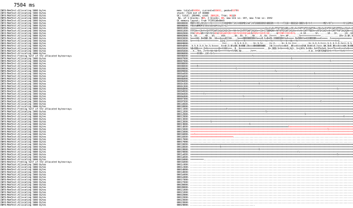
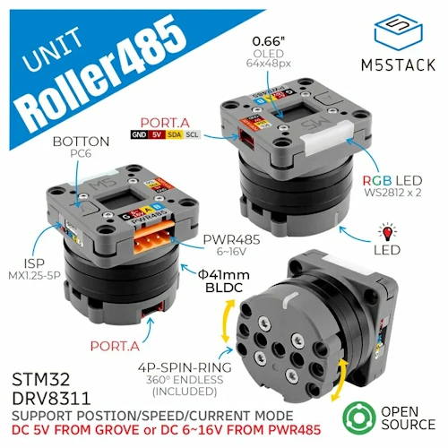
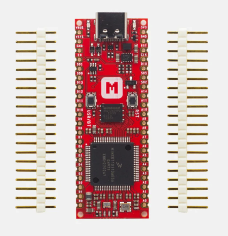

*Volodymyr* explains how to embed any language (that compiles to wasm) into a native module, *Matt* gives the news round-up.

## Volodymyr's native module work

[Compiling Rust, GoLang, Zig, WebAssembly to MicroPython
modules](https://github.com/orgs/micropython/discussions/15702)

## News Round-up

### Updates

#### Moving away from Meetup.com


Despite the 1000-odd users, this will be the last gathering organised with
meeetup.com. The service has become *very* expensive and doesn't warrant the
cost.

I'll share what we'll use in the future via all the regular channels (including
meetup before we leave).

#### mpbuild


[mpbuild](https://github.com/mattytrentini/mpbuild) has been overhauled with a
much clearer 'board database'. Further, a request has been made to provide
access to the features as a Python module, not just as a CLI app, someething
like this:

```python
import mpbuild

mpbuild.build("RPI_PICO2")
# Or build the variant
mpbuild.build("RPI_PICO2", "RISCV")

# Alternatively...
db = mpbuild.database()
db.boards["RPI_PICO2"].build()
db.boards["RPI_PICO2"].variants["RISCV"].build()
```

That's not ready yet, but isn't far away - and will make integration into other
tools much easier.

mpbuild is still not *quite* ready for widespread release...but getting very
close! Special thanks to Oliver, Andrew, Jos and Hans for their early
contributions.

#### Hans and his Tentacles


I've just received the prototype *Tentacles* from Hans! If anyone would like to
help progress automated HIL testing on MicroPython please get in contact with
me; we're looking for folks that could help run tests on devices using the
Tentacles.

#### MicroPython Memory Profiler



[Planet Innovation](https://planetinnovation.com/) - the company that employs
Andrew and I - have agreed to release the [MicroPython Memory
Profiler](https://github.com/pi-mst/micropython-memory-profiler). It's an
in-house tool originally written mostly by Damien for a project where fragmented
memory was an issue when running a device for many hours/days.

*Quick demo!*

### Headlines

#### Raspberry Pi RP2350 Errata 9

After all the excitement of the RP2350 announcement, unfortunately a fairly
nasty hardware issue has been discovered. Errata 9 or E9 affects all GPIOs when
in input mode - it seems like this means that internal pull-downs can't be used
when the pin is in input mode.

Details are still emerging. Hackaday have been reporting on the issue pretty
clearly, take a look at [Raspberry Pi RP2350-E9 Erratum Redefined As Input Mode
Leakage
Current](https://hackaday.com/2024/09/20/raspberry-pi-rp2350-e9-erratum-redefined-as-input-mode-leakage-current/)

---

#### PyCon AU


Would folks be interested in attending a sprint day or two after the main event?

---

#### Espressif DevCon 24


As mentioned last month, [Espressif DevCon](https://devcon.espressif.com/) was
on from September 3-5. The 28 talks are [now available on
YouTube](https://www.youtube.com/playlist?list=PLOzvoM7_KnrdtDvNgN6b-GQ-kLppmNxab).

---

## Matt's New Hardware

Not many, but some grunty little 'toys', both discussed last month but are now
here *in the flesh*. Haven't had a chance to use them yet but they sure are
pretty.

### ESP32-P4


Specs:

- ESP32-P4: Dual-core 400MHz RISC-V
- ESP32-C6 for wifi/ble
- AI acceleration with 32MB PSRAM and 16MB flash
- Optional camera
- Optional display

---

### 01Studio K230 Dev Board


Specs: 

- Kendryte K230: Dual-core RISC-V 1.6GHz/800MHz
- 1GB LPDDR4 RAM
- Optional 800x480 3.5" display (cap touch also optional)
- 1080P/60fps camera (up to 3x 1080P camera inputs)
- Wired Eth & Wifi
- 5xUART, 5xI2C, 6xPWM, 64xGPIO, 3xSPI
- 1080P HDMI output
- 4 lane 1080P MIPI display output
- 40 pin RPi header
- MicroPython port with OpenMV support
  - Many computer vision examples (Face recognition, Barcode/QR code, YOLO object detection)

---

## Hardware News

### M5Stack

#### AtomS3R


M5Stack have release a second S3-based Atom, the
[AtomS3R](https://shop.m5stack.com/products/atoms3r-dev-kit). The improvements
over the original
[AtomS3](https://shop.m5stack.com/products/atoms3-dev-kit-w-0-85-inch-screen) is
that this has 8MB of PSRAM, a more powerful IMU system and a better antenna
arrangement.

**US$17.50** (US$2 more expensive than the original)

#### AtomS3R Cam


There's a new camera too, the [Atom S3R-Cam](https://shop.m5stack.com/products/atoms3r-camera-kit), the first in the Atom form factor. Take the AtomS3R,
remove the display and replace it with a 0.3MP camera.

**US$20**

#### Roller485 [Lite]



Two new interesting brushless DC motors were released. The
[Roller485](https://shop.m5stack.com/products/roller485-lite-unit-without-slip-ring-stm32)
and [Roller485
Lite](https://shop.m5stack.com/products/roller485-lite-unit-without-slip-ring-stm32)
are 5/6-16V-powered motors. They have encoders, a built-in STM micro for control
and RS-485 or I2C interfaces. There's even a small display on the rear for
configuration.

There's a Grove port, connected via a slip-ring, on the non-Lite version (to connect Grove to the )

**US$37** or **$30** for the Lite

### Makerdiary i.MX RT1011 Nano Kit



The [i.MX RT1011 Nano Kit](https://makerdiary.com/products/imxrt1011-nanokit) is
a new board for sale at Makerdiary. I'm becoming quite a fan of the RT range
from NXP! If you want to try one out, this is a great board to start with.

- NXP i.MX RT1011 500MHz Cortex M7
- 128KB RAM, 16MB flash

**US$15**

### Cytron IRIV IO Controller


Cytron have released the [Cytron IRIV IO
Controller](https://www.cytron.io/p-iriv-io-controller?r=1), an RP2350-based
industrial controller.

Control isolated IO (11 input, 4 output, 2 analog in) up to 50V over Ethernet
with RS485 thrown in for good measure.

Looks like good documentation and they advertise MicroPython support.

**US$65**

---

## Other news

### C++ vs MicroPython


Kevin McAleer dons the fireproof suit and asks [which language is
best](https://www.youtube.com/watch?v=MS_BM-bJnds)?

### Design an RP2040 board with KiCad (and a handy humble bundle)


Raspberry Pi released a new book: [Design an RP2040 board with
KiCad](https://www.humblebundle.com/books/raspberry-pi-and-retro-gaming-by-raspberry-pi-press-books).
It's a really clear guide on how to lay out a PCB using KiCAD for the RP2040.
It's £14.99 or you can purchase the [Raspberry Pi and Retro Gaming Book
Bundle](https://www.humblebundle.com/books/raspberry-pi-and-retro-gaming-by-raspberry-pi-press-books)
from Humble Bundle for AU$35 until Oct 5.


### MicroPython on the Flipper Zero


MicroPython is now available on Flipper Zero [via Flipper
Labs](https://lab.flipper.net/apps/upython).

[Docs are available](https://ofabel.github.io/mp-flipper/) as is the [full
source code](https://github.com/ofabel/mp-flipper).

Just take care if you're in Canada!

---

### Final Thoughts

#### ABENICS joint

<iframe width="560" height="315" src="https://www.youtube.com/embed/hhDdfiRCQS4?si=l9xxYeQG-nuiLnSo" title="YouTube video player" frameborder="0" allow="accelerometer; autoplay; clipboard-write; encrypted-media; gyroscope; picture-in-picture; web-share" referrerpolicy="strict-origin-when-cross-origin" allowfullscreen></iframe>

I can't stop thinking about this amazing spherical joint.

If you're interested in reading more, it's published on IEEE: [ABENICS: Active
Ball Joint Mechanism With Three-DoF Based on Spherical Gear
Meshings](https://ieeexplore.ieee.org/document/9415699).

### Thanks folks


