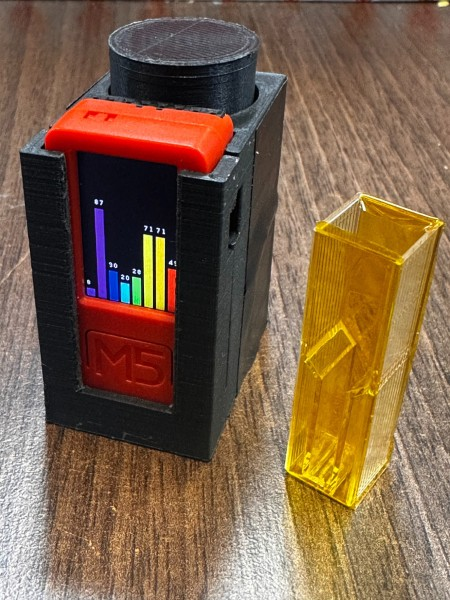

*Damien* covers the latest v1.24[.1] and upcoming v1.25 releases. *Matt* delivers the news roundup.

## Release milestones

- [v1.24.0](https://github.com/micropython/micropython/milestone/7)
- [v1.24.1](https://github.com/micropython/micropython/milestone/9)
- [v1.25.0](https://github.com/micropython/micropython/milestone/8)

## News Round-up

### Big ticket items

#### PyCon AU

[PyCon AU 2024](https://2024.pycon.org.au/) was held at the end of November and,
as usual it was a big event!

The videos are now [all
available](https://www.youtube.com/playlist?list=PLs4CJRBY5F1Jn7fWZyMgogpPsu1vAZKB2).
88 of them for your viewing pleasure!

- Anthony Joseph: [from seeds import plants: using IoT to grow healthy
herbs](https://www.youtube.com/watch?v=tgdo0b7h15c)
- Damien George, Julian Dinsdale: [Teaching Digital Technologies in Australian
schools with Python and the
Kookaberry](https://www.youtube.com/watch?v=eK2YIHYDbG8)
- Matt Trentini: [MicroPython: The best
  bits!](https://www.youtube.com/watch?v=EVRDuu-Sez0)

Sprint day: HIL testing, board definitions...

#### Hans and Octoprobe

(Damien to discuss)

#### Reverse Engineering MicroPython Frozen Modules

From DEF CON 32, you can now check out [Wesley McGrew's Reverse Engineering
MicroPython Frozen Modules](https://www.youtube.com/watch?v=QXa29AJqdRc) talk.

> In this talk, Wesley will walk the audience through the process of identifying
> "frozen"/compiled modules in a firmware image without debug symbols using the
> Ghidra disassembler. The relevant module, string, object, and raw code data
> structures will be detailed, so that everything required to rebuild a
> non-frozen module can recovered. Once a compiled module is reconstructed,
> Wesley will present a detailed example of reading and understanding
> MicroPython compiled bytecode, for the purpose of reverse engineering the
> purpose and implementation of the module.

#### Paused: Moving away from Meetup.com

Meetup.com has had a reprieve! The PSF have reached out and have indicated that
we may be eligible for a grant to cover the meetup costs. Seems like it's a
common issue...

I did look at other options but none were particularly compelling.

## Matt's New Hardware

Quite lately during the PyCon craziness!

### Makerdiary i.MX RT1011 Nano Kit

(Covered in [September](https://melbournemicropythonmeetup.github.io/September-2024-Meetup/))

The [i.MX RT1011 Nano Kit](https://makerdiary.com/products/imxrt1011-nanokit) is
a new board for sale at Makerdiary. 

- NXP i.MX RT1011 500MHz Cortex M7
- 128KB RAM, 16MB flash

**US$15**

---

### nRF54L15 DK

Specs: 

- 128MHz Cortex M33
- 256KB RAM, 1.5MB flash
- RISC-V 128MHz co-processor
- BLE 6.0

---

## Hardware News

### Waveshare ESP32-P4-NANO

As reported by [CNX
Software](https://www.cnx-software.com/2024/11/06/waveshare-esp32-p4-nano-board-offers-ethernet-wifi-6-bluetooth-5-mipi-display-and-camera-interfaces-gpio-headers/),
Waveshare have released a small ESP32-P4 dev board.

- ESP32-P4 dual-core 400MHz RISC-V
  - 768KB RAM/32MB PSRAM
  - 128KB flash + 16MB flash
- Wifi (via ESP32-C6-MINI)
- 50mm square

**AU$32**

### LilyGO T-Keyboard S3 Pro

- ESP32-S3, 8MB PSRAM, 16MB flash
- STM32G0 co-processor, 8KB RAM, 64KB flash
- 0.85" 128x128 RGB LCD on each button
- 1x optional rotary encoder (instead of fifth button)
- Up to 6x units magnetically "stackable" on all four sides (via I2C)

**US$62** (US$51 for slave devices, no ESP32-S3)

---

## Other news

### MicroPython in Orbit (podcast)

[MicroPython in Orbit: Filip's Story of Satellite Innovation](https://www.buzzsprout.com/2107763/episodes/16050934)

>In this episode of Inspiring Computing, I chat with  Filip Rak, the team leader
>at the Czech Aerospace Research Center. Filip tells me about his journey from
>engineering to leading the development of attitude and orbit control systems
>for satellites. We talk about the technical challenges and triumphs, like
>launching satellites and using  MATLAB and MicroPython. Filip also shares how
>they took a selfie from space at their facility and how this achievement
>inspired future projects. He also talks about the complexity of late attitude
>control, using cube sats with limited resources, and their agile risk tolerance
>approach. The conversation highlights how advanced computing is used in
>aerospace and emphasizes the importance of balancing innovation with practical
>constraints.

### Sand drawing robot

Travis Howse, over the past few years, has built an amazing [sand
drawing](https://github.com/tjhowse/sand_drawing) device!

He's
[documented](https://wiki.tjhowse.com/doku.php?id=projects:sand_drawing:overview)
the whole process _thoroughly_ and there are some [great
videos](https://www.youtube.com/playlist?list=PLT7ckgz8vcoY2YFqqQTA0kUofwehtqQul)
too. 

### T-Watch 2020 Camera Remote

Dave Wickam, aka
[turmoni](https://fosstodon.org/@turmoni@treehouse.systems/113545067642996589),
wanted to control and monitor the recording and
battery status of his two cameras while riding his bike. So he wrote some
MicroPython to implement the appropriate protocols to connect to his TomTom
Bandit and GoPro camera. A little UI and voila,
[t-watch-2020-camera-remote](https://github.com/turmoni/t-watch-2020-camera-remote)!

### Tempe: Efficient Purely-MicroPython Graphics

Corran Webster [has
announced](https://github.com/orgs/micropython/discussions/16105) 
[Tempe](https://github.com/unital/tempe); a pure MicroPython library
built on framebuf for rendering data visualizations.

A key feature of the library is to use _partial updates_ - render to small
framebuffers that represent a portion of the physical display. Using this
technique it's possible to conserve memory and still be fast.

It's looking great! It's early days and Corran has requested assistance with
testing and feedback - if you're at all interested in this domain please check
it out!

### Pocket Spectrometer

Chinna Devarapu published a [BlueSky
thread](https://bsky.app/profile/chinnadevarapu.bsky.social/post/3lbsotrhi5s2p)
about his [Pocket
Spectrometer](https://github.com/scientistnobee/Pocket-Spectrometer).

> I'm building what might be the smallest opensource spectrometer with an easy to
use UI! I call it a pocket spectrometer. Combining #M5StickC (~$20) with AS7341
sensor (~$16). My goal? A complete spectrometer that is barely larger than a
sample cuvette itself.

---

## Quick bytes

### ulab is looking for help

As reported in the recent [OpenMV
news](https://mailchi.mp/d4b56fce2072/7f6kh54q7k-10340647?e=91a7329bf2),
[ulab](https://github.com/v923z/micropython-ulab/) is looking for assistance to
improve performance, particularly on micros that support ARM's Helium
instruction set. If that's you, get in touch with lead dev, Zoltán Vörös.

### Bad Apple at 480x480 via RP2350 PIO

Mike Bell invested some time in making a PIO-powered driver for his 480x480
display and [played Bad Apple with
it](https://bsky.app/profile/rebelmike.bsky.social/post/3lbpftyec3s25);
including PWM audio! Result looks smooth (helped by a 240MHz overclock).

---

## Final Thoughts

### Hacking Robot Vacuums

The fascinating ABC article [We hacked a robot vacuum — and could watch live
through its
camera](https://www.abc.net.au/news/2024-10-04/robot-vacuum-hacked-photos-camera-audio/104414020)
should make you feel nervous.

### BlueSky

BlueSky - worth a look! A lot of MicroPython news appearing there, particularly
in the wake of Twitter/X's continuing decline.

### Thanks folks!

