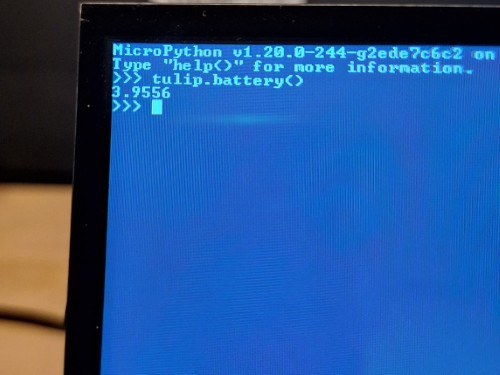

*Hank* shows off his latest doohickey. *Matt* delivers the news roundup.

## News Round-up

### Big ticket items

#### New OpenMV Kickstarter: Two new cameras!

OpenMV has announced a new [Kickstarter for the OpenMV N6 and
AE3](https://www.kickstarter.com/projects/openmv/openmv-n6-and-ae3-low-power-python-programmable-ai-cameras)!
These are both exciting upgrades to the previous generation of OpenMV cams,
using the new
[STM32N6](https://www.st.com/en/microcontrollers-microprocessors/stm32n6-series.html)
and [Alif Ensemble E3](https://alifsemi.com/ensemble-e3-series/), both are
powerful micros and include support for HW accelerated ML - very useful for
image processing!

There is a lot to talk about with these cameras and co-founder Kwabena Agyeman
has been in many interviews - see the [March OpenMV
newsletter](https://mailchi.mp/e3b7185b4604/7f6kh54q7k-10343192?e=91a7329bf2)
for a list of his appearances, including this interview with Damien:

<iframe width="560" height="315" src="https://www.youtube.com/embed/8sFRK_JXFv8?si=1wG-WipsNsrRZhje" title="YouTube video player" frameborder="0" allow="accelerometer; autoplay; clipboard-write; encrypted-media; gyroscope; picture-in-picture; web-share" referrerpolicy="strict-origin-when-cross-origin" allowfullscreen></iframe>

*Update*: The Kickstarter was fully funded (AU$80K goal) in a couple of days.

**AU$~130** and **AU$~190** (AE and N6 respectively)

---

#### SparkFun <3 Python & MicroPython

SparkFun [recently annouced](https://news.sparkfun.com/13407) two new IoT RedBoards and a bunch of other hardware. More notably - for us at least! - is that they also announced a significant expansion of their software support...[47 new Python libraries that support Python and MicroPython](https://github.com/topics/sparkfun-python)!

The libraries look to be quite high-quality and are all mip-installable. Great support from SparkFun!

It's also worth noting that there have been some recent PRs for SparkFun boards...

## Matt's New Hardware

None this month (!).

## Hardware News

### STM32U3 series

ST [announced](https://newsroom.st.com/media-center/press-item.html/p4678.html)
the new
[STM32U3](https://www.st.com/en/microcontrollers-microprocessors/stm32u3-series.html)
range of microcontrollers. Super low-power (10μA/MHz, twice the efficiency of
the U5) but also powerful - a 96MHz Cortex-M33 core with 256KB RAM and up to 1MB
flash. Throw in a couple of I3C interfaces low-power comparators, ULP timers and
up to 82 GPIO and these are amazingly *meaty* for the power they consume.

### Seeed Studio XIAO 6-Channel Wifi DC Relay

Seeed Studio released a [6-channel
Relay](https://www.seeedstudio.com/6-Channel-Wi-Fi-5V-DC-Relay-p-6373.html?goal=0_4b071a49e3-d3d210d176-49049373)
powered by an ESP32-C6 XIAO. Handy piece of kit!

**US$20**

### Silicon Labs announces tiny BG29 microcontroller

For "Smart Teeth"!

[Silicon Labs
reveal](https://www.hackster.io/news/silicon-labs-unveils-the-tiny-bg29-bluetooth-low-energy-microcontrollers-for-smart-teeth-and-more-ad5a9b640c37)
their **very** small (2.6x2.8mm) BLE-capable Cortex-M33 BG29. And it packs a
punch, 77MHz, 256KB RAM, 1MB flash. They seem to be aiming it at medical
applications but it looks generally useful to me!

No pricing yet.

---

## Other news

### You Should Build a Robot (MicroPython and MicroProcessors)

[Sage Elliott](https://x.com/sagecodes) presented a compelling argument as to
why you should build your own robot at PyCascades in Portland. With MicroPython,
naturally!

<iframe width="560" height="315" src="https://www.youtube.com/embed/UygK5W3txTM?si=VusEXJo8YAHDIRJe" title="YouTube video player" frameborder="0" allow="accelerometer; autoplay; clipboard-write; encrypted-media; gyroscope; picture-in-picture; web-share" referrerpolicy="strict-origin-when-cross-origin" allowfullscreen></iframe>

### Pin IO performance - for Retro Computing goodness

[XSK](https://fosstodon.org/@xsk@treehouse.systems) started investigating Pin IO performance, trying to figure out how to optimise code in MicroPython for bitbanging. Turns out he was trying to create a reader for SNES cartridge ROMs - so IO perf was important! I pointed him toward Damien's [Writing fast and efficient MicroPython](https://www.youtube.com/watch?v=hHec4qL00x0) and threw in a couple of other suggestions and off XSK went, delving into using mem32, thumb assembly and a few other methods. 

Long story short, the time to read a 4MB cartridge was reduced from >2 *hours* to under 10 *minutes*. And it's [likely that it could be improved further](https://fosstodon.org/@xsk@treehouse.systems/114172059737285778).

Fast transfers using Dupont wires and breadboards rarely end well - and so signal integrity also needed to be resolved:

Really interesting project!

### Important LVGL bindings MR merged

The long-standing [!341
MR](https://github.com/lvgl/lv_binding_micropython/pull/341) in the LVGL
Bindings repository was merged recently! Although deep in the weeds, this MR
lays the foundation for an easier integration of LVGL and MicroPython by
allowing the bindings to co-exist more smoothly as a standard C user module.

It's still challenging to build MicroPython with LVGL support but this is a huge
step in the right direction to simplifying the process. Stay tuned!

### Pocket Spectrometer Update

Chinna Devarapu updated - v2 - his excellent [Pocket
Spectrometer](https://bsky.app/profile/chinnadevarapu.bsky.social/post/3ljy7a3es2c2t).

The update makes it *much* easier to assemble the device with refined 3D prints
and better connections between the parts.

### Adding a battery to my Tulip

[Andy](https://fosstodon.org/@ely_peddler@hachyderm.io) has a neat write-up on
how he [added a battery to his
Tulip](https://elypeddler.wordpress.com/2025/03/11/adding-a-battery-to-my-tulip/).

An easy hardware mod - and the software already accommodates the feature!

### Carlos Escobar Brings MicroPython to the MSX Family

Carlos Escobar [replaced the Z80 of the retro Japanese computer MSX with an
RP2040](https://www.hackster.io/news/carlos-escobar-brings-micropython-to-the-msx-family-by-swapping-the-z80-for-a-raspberry-pi-pico-118f8f1a968b).
It's a lovely - and technically *very* interesting! - update to the ye olde
computer.

---

## Final Thoughts

### Animation vs. Coding

<iframe width="560" height="315" src="https://www.youtube.com/embed/EFmxPMdBqmU?si=RIdeSu2aMDEYlgN7" title="YouTube video player" frameborder="0" allow="accelerometer; autoplay; clipboard-write; encrypted-media; gyroscope; picture-in-picture; web-share" referrerpolicy="strict-origin-when-cross-origin" allowfullscreen></iframe>

### DeepSeek hallucinates about Peter Hinch

In a [Github
Discussion](https://github.com/peterhinch/micropython-samples/issues/46),
MichaelMuckKremtz notes that his recent interaction with the LLM DeepSeek
informed him all about a stepper motor driver that long-time MicroPython
contributor Peter Hinch wrote. Which doesn't exist and never happened!

### Intellisense Knows What We Need

### Thanks folks!

