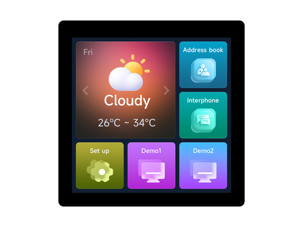

*Matt* delivers the news roundup. *Oliver* demos updates to mim. *Hans* gives an Octoprobe update.

## News Round-up

### Big ticket items

#### MicroPython v1.25.0 Released


MicroPython v1.25.0 brings several exciting new features:

**ROMFS (Read-Only Memory Filesystem)**
- All the benefits of frozen code
  - Without the inconvenience of building it in with your firmware!

**New Alif Ensemble Port**
- Dual-core support with OpenAMP
- WiFi and Bluetooth connectivity
- USB support via TinyUSB

**RISC-V Inline Assembler**
- New `@micropython.asm_rv32` decorator
- Write RISC-V machine code snippets callable from Python
- Available on rp2 port when running in RISC-V mode

The release also includes improved mpremote tool (recursive rm!), enhanced
ESP-IDF support (v5.3/v5.4), and a host of improvements and performance
optimizations across platforms.

And *so much* more...see the [full release
notes](https://github.com/micropython/micropython/releases/tag/v1.25.0).

[v1.26](https://github.com/micropython/micropython/milestone/10) is already well
underway, currently targeting an August 1st release date.

---

#### mip-ifying the Amazing List - with Claude's help


- Oliver and I decided to have a *hack session*
- Goal: Go through the [Awesome List](https://awesome-micropython.com/) and add
  `mip` support to as many libraries as possible!
  - \>1K URLs (~800 Github/Gitlab links, not all libraries)
- Used [Claude Code](https://docs.anthropic.com/en/docs/claude-code) to assist
  - Help select candidate libraries
  - Fork the repos
  - Add an appropriate `package.json`
  - Raise PRs

There were **~120 PRs raised**, ~20 have been accepted. There's another batch of
Gitlab PRs to come, too.

Claude wasn't perfect, there were a few mistakes, it required some
back-and-forth and it *wasn't free*. The session, including 5-ish hours of
compute cost ~AU$65.

But it would have been a very, *very* tedious task - I'm convinced I wouldn't
have completed it. 

---

#### PyCon AU


[PyCon AU 2025](https://2025.pycon.org.au/) has been announced - for here in
Melbourne - and the [Call for Proposals](https://2025.pycon.org.au/program/) is
open! It closes on the 15th June so do consider presenting a talk (particularly
if it's MicroPython-related!). 

---

### Improving Garbage Collection Time


CircuitPython lead dev, Scott Shawcroft, published a [blog post on improving
garbage collection time in
CircuitPython](https://blog.adafruit.com/2025/04/28/improving-garbage-collection-time-in-circuitpython/).
Scott had observed that GC collection times could blow out, particularly with
the larger memory available on newer micros. Digging further, Scott discovered
some worst-case scenarios where the `gc.collect()` could take almost 20 seconds! 

The workaround implemented in CircuitPython is to use [selective
collect](https://github.com/adafruit/circuitpython/pull/10264), effectively
informing the gc to ignore certain allocations. It can dramatically improve gc
collections for some scenarios.

Scott has been in touch with Damien since the same gc is present in MicroPython.

--- 

### MIDI Controlled Acoustic Crank Organ


This [MIDI controlled acoustic crank
organ](https://github.com/orgs/micropython/discussions/17278) by bixb922 is
absolutely delightful! And the more you dig into this project, the more it
reveals...

The crank inflates bellow to maintains a reservoir of air - and the rotation
determines the playback speed. Solenoids control the air flowing into the pipes,
carefully timed by MicroPython software running on an ESP32-S3. The tunes are
defined by MIDI files and a playlist can be managed with app rendered in a
browser. 

*Favourite feature*: A microphone is used to automatically iterate through the
solenoids and play each pipe to detect the note and use it for configuration.

*Everything* - hardware, mechanics, software - is available on the
[crank-organ](https://github.com/bixb922/crank-organ) repo and the software
[design and
development](https://github.com/bixb922/crank-organ/blob/main/design_and_development/design_and_development.md)
write-up is full of gems.

<iframe width="560" height="315" src="https://www.youtube.com/embed/-ndxGBfa8TQ?si=WieVNVhdS15xww1m" title="YouTube video player" frameborder="0" allow="accelerometer; autoplay; clipboard-write; encrypted-media; gyroscope; picture-in-picture; web-share" referrerpolicy="strict-origin-when-cross-origin" allowfullscreen></iframe>

---

## Matt's New Hardware

### M5Stack Tab5


The [M5Stack
Tab5](https://shop.m5stack.com/products/m5stack-tab5-iot-development-kit-esp32-p4)
is M5Stack's first tablet-like IoT development kit, featuring:

- ESP32-P4 (400MHz RISC-V dual-core) + ESP32-C6-MINI for connectivity
- 5-inch IPS touchscreen (1280×720), 2MP front camera
- 16MB Flash, 32MB PSRAM
- Wi-Fi 6, Bluetooth 5.2, USB-A/C, RS-485
- Industrial-grade design with removable battery

**US$60** (with battery)

*Note: MicroPython support pending (but underway)*

---

### ESP32-C5 Development Board


Espressif recently announced that the [ESP32-C5 is in Mass
Production](https://www.espressif.com/en/news/ESP32-C5_Mass_Production).

The [ESP32-C5](https://www.espressif.com/en/products/socs/esp32-c5) represents a
major connectivity advancement:

- **Industry's first RISC-V MCU with dual-band Wi-Fi 6 (2.4/5GHz)**
- 32-bit single-core RISC-V up to 240MHz
- Bluetooth 5 LE, IEEE 802.15.4


**AU$30**

*Note: MicroPython support pending*

---

### Thumby Color


The [Thumby Color](https://color.thumby.us) is the world's smallest color gaming handheld:

- Raspberry Pi RP2350 processor
- 0.85" 128×128 pixel 16-bit color display
- 51.6 × 30.0 × 11.6mm (smallest horizontal handheld)
- 9 buttons, vibration motor, 110mAh battery
- [Many games](https://color.thumby.us/code/arcade/?platform=ThumbyColor), [web IDE support](https://color.thumby.us/code/)

**US$50**

✅ MicroPython support

---

### STM32-U385 Nucleo


The [STM32-U385RG-Q Nucleo](https://www.st.com/en/evaluation-tools/nucleo-u385rg-q.html) features ST's newest ultra-low-power MCU:

- STM32U385RG with 96MHz Arm Cortex-M33 core
- Ultra-low-power design with SMPS
- U385RG: 1MB flash, 256K RAM
- 3x I2C, 2x I3C, 3x SPI, 1x OCTOSPI, UARTs, CAN, USB
- Analog: 2x 12bit ADC, 2x comparators, 2x op-amps, 2x DAC
- No external clocks required
- Integrated ST-LINK debugger/programmer

**~AU$40** (AU$5-10 for the micro)

*Note: MicroPython support not yet available*

---

### Waveshare ESP32-P4-Nano


The [Waveshare ESP32-P4-Nano](https://www.waveshare.com/esp32-p4-nano.htm) packs impressive features in 50×50mm:

- ESP32-P4 (400MHz RISC-V dual-core) + ESP32-C6-MINI
- 32MB PSRAM, 16MB Flash
- Wi-Fi 6, Bluetooth 5, 10/100 Ethernet
- MIPI DSI/CSI support for displays and cameras
- USB-C/USB-A ports

**US$20** (various configurations)

*Note: MicroPython support pending*

---

### Waveshare ESP32-S3 4inch Display



The [Waveshare ESP32-S3 4inch Display](https://www.waveshare.com/esp32-s3-touch-lcd-4.htm) is an all-in-one development solution:

- ESP32-S3 dual-core up to 240MHz
- 4-inch LCD (480×480), 5-point capacitive touch
- 16MB Flash, 8MB PSRAM
- CAN, RS485, I2C interfaces, TF card slot

**US$33**

✅ MicroPython support

---

### Waveshare RP2350 1.47inch Display


The [Waveshare RP2350 1.47inch Display](https://www.waveshare.com/rp2350-lcd-1.47-a.htm) showcases dual-architecture flexibility:

- Raspberry Pi RP2350A (Cortex-M33 + RISC-V cores)
- 1.47-inch LCD (172×320 pixels), 262K colors
- 520KB SRAM, up to 16MB Flash
- TF card slot, RGB LED, battery header

**US$10**

✅ MicroPython support

---

## Hardware News

### Unexpected Maker SQUiXL


Unexpected Maker's [SQUiXL](https://squixl.io/) is a lovely device that packs a
heck of a punch!

- High-resolution 480x480 capacitive touch display
- ESP32-S3, 16MB QSPI flash, 8MB Octal PSRAM
- Battery charging for the included 1500mAh battery, with a fuel gauge
- Haptics, I2S audio, uSD, STEMMA/QT
- Arduino IDE, PlatformIO, and MicroPython support
  - See [SQUiXL-DevOS](https://github.com/UnexpectedMaker/SQUiXL-DevOS)

**US$99**

---

### RePebble: SiFli SF32LB52J MCU


Eric Migicovsky is part of the team bringing back the Pebble Watch (see
[RePebble](https://repebble.com/)!).

Although their first watch will use the venerable nRF52840, they are looking to
the future and Eric wrote up how they selected their next-gen micro: [How To
Build A Smartwatch: Picking A
Chip](https://ericmigi.com/blog/how-to-build-a-smartwatch-picking-a-chip). 

They arrived at the [SiFli
SF32LB52J](https://www.cnx-software.com/2025/05/14/sifli-sf32lb52j-big-little-arm-cortex-m33-bluetooth-mcu-powers-the-core-time-2-smartwatch/)
which is a *super* interesting little micro!

- Arm Cortex-M33 cores 
  - HCPU: Up to 240MHz, 512KB SRAM (high performance)
  - LCPU: Up to 24MHz, 64KB SRAM (ultra-low-power)
- Bluetooth 5.3 dual-mode, BLE audio support
- 2D/2.5D GPU with hardware acceleration, LCD controller
- 24-bit DAC/ADC, I2S interfaces
- 45 GPIOs, USB 2.0 Full Speed
- Open-source sw support was a *huge* consideration

The HAL looks reasonably well documented...and this micro *appears designed to
run MicroPython*!

A dev board - with 16MB flash and 8MB PSRAM - is available from AliExpress for
**~AU$40**.

---

### M5Stack PLC Controller


M5Stack have released the [M5Stack PLC Controller with
M5StampS3](https://shop.m5stack.com/products/m5stamp-plc-controller-with-m5stamps3),
an industrial-grade development platform featuring:

- ESP32-S3FN8 with 8MB Flash, Wi-Fi 2.4GHz
- Industrial I/O: 8 opto-isolated digital inputs (5-36V), 4 relay outputs (5A),
  CAN and RS-485
- 1.14" color LCD (135×240), 3 user buttons, buzzer
- Wide voltage input DC 6-36V
- Temperature (LM75), voltage/current (INA226), RTC

**US$43** 

---
### pico2-ice


[TinyVision](https://tinyvision.ai/) have released the
[pico2-ice](https://pico2-ice.tinyvision.ai/), an open-source hardware platform
combining an RP2350B with an FPGA:

- Raspberry Pi RP2350B (2x Cortex-M33 @ 150MHz)
- Lattice iCE40UP5K UltraPlus (5.3K LUTs, 8 DSP multipliers)
- 8MB qSPI SRAM, 4MB FPGA Flash, 1Mb SPRAM, 120Kb DPRAM
- All RP2350 pins + 32 FPGA GPIO pins exposed via Pmod headers
- 2x RGB LEDs, 2x pushbuttons, USB-C, 4-layer PCB design

✅ MicroPython support, including a [well-documented MicroPython
library](https://pico2-ice.tinyvision.ai/md_mpy.html) to program the FPGA from
the RP2350B.

**AU$79**. The catch? Shipping to Australia almost doubles the cost...

---

### Clockwork PicoCalc


The [PicoCalc](https://www.clockworkpi.com/product-page/picocalc) is very neat
portable device built around a decent display and qwerty tactile keyboard. 

- ClockworkPi v2.0 mainboard
- Raspberry Pi Pico 1 H Core module (replaceable!)
- 320x320 4-inch IPS screen (SPI interface)
- Ultra-portable QWERTY Backlit keyboard on board (I2C)
- Dual speaker
- ABS plastic shell, tempered glass cover
- 32GB high-speed SD-card with optimized BASIC firmware

**US$75**

#### MicroPython on the PicoCalc


Lofi Fren released [PicoCalc MicroPython](https://github.com/LofiFren/PicoCalc),
MicroPython firmware and script collection for the PicoCalc. It was, in turn,
built on top of
[PicoCalc-micropython-driver](https://github.com/zenodante/PicoCalc-micropython-driver)
by Zenodante. Both of these projects - and the community in general - seem to be
very active!

---

### Seeed Studio Minichord Synthesizer


A "co-create collaboration" with Seeed Studio, the [Minichord
Synthesizer](https://www.seeedstudio.com/Minichord-Synthesizer-p-6414.html) is a
fascinating open source (HW too!) device designed to help create music. Chord
buttons, Harp Touch Zone and MIDI support via Platform IO. Built around the
Teensy 4.0.

**US$170**

---

### Seeed Studio XIAO 7.5" ePaper Panel


Seeed
[announced](https://www.seeedstudio.com/blog/2025/04/03/xiao-7-5inch-epaper-display/)
the [XIAO 7.5 Inch ePaper
Panel](https://www.seeedstudio.com/XIAO-7-5-ePaper-Panel-p-6416.html), an
attractive 800x480 ePaper display powered by a XIAO ESP32-C3. They advertise
that it works with ESPHome in Home Assistant. 

If you're looking for an ePaper Panel this is a neat option.

**US$70**

---

### T-Pico2350 Development Kit


The [LilyGo T-Pico-2350](https://lilygo.cc/products/t-pico) is an update to
their earlier T-Picos which have been a combination of an RP and ESP32 micros.
This one is an RP2350+ESP32-C6. 

While the RP2350 drives most of the peripherals, the ESP32-C6 handles radio
comms but also has pins broken out. It's an interesting combination!

[CNX](https://www.cnx-software.com/2025/04/11/t-pico-2350-is-a-fully-integrated-devkit-with-raspberry-pi-rp2350-esp32-c6-2-33-inch-color-touchscreen-display-and-hdmi-video-output/)
have a detailed review but these are the main specs:

- Raspberry Pi RP2350A (dual-core Arm Cortex-M33/RISC-V @ 150 MHz)
  - 520KB SRAM, 16MB SPI flash
  - MicroSD card slot
  - 2.33" color IPS LCD (SPI ST7796S), 480x222 resolution, capative touch (I2C)
  - HDMI out up to 480p60 (via HSTX)
- ESP32-C6-MINI-1U-N4 (RISC-V @ 160MHz)
  - 512KB RAM, 4MB flash
  - 2.4 GHz WiFi 6, Bluetooth 5.0, and 802.15.4 (Thread/Zigbee)
  - Evil reversible USB port

Relevant software and docs in the [Lilygo-T-Pico2
repo](https://github.com/Xinyuan-LilyGO/Lilygo-T-Pico2).

**US$40**

---

## Other news

### Conference Talks & Education


**PyCon Italia 2025**  
[Marc-André Lemburg will
speak](https://x.com/malemburg/status/1922223713451196653) at PyCon Italia 2025
in Bologna (May 30). *"Programming hardware displays the easy way - using
MicroPython and LVGL"*

**PyCon Austria 2025**  
[Alexander Fomin presented](https://www.youtube.com/watch?v=5MgIrMw1vzE)
*"Python Beyond the Usual: Building an RC Car with MicroPython"* demonstrating
robotics applications.

---

### I2CTargetMemory


Damien recently raised a PR for an implementation of
[I2CTargetMemory](https://github.com/micropython/micropython/pull/17365).
Appears simple and easy-to-use:

```python
from machine import I2CTargetMemory

mem = bytearray(8)
i2c = I2CTargetMemory(addr=67, mem=mem)
```

Currently available for the RP2 and STM32 ports.

---

### Self-Charging Arduino Alvik Robot


[Roni Bandini modified](https://x.com/RoniBandini/status/1919869688948953511)
the Arduino Alvik robot to be self-charging, with an excellent [detailed
tutorial](https://www.hackster.io/roni-bandini/building-a-self-charging-alvik-6daed7)
of the build on Hackster.io. 

Full [MicroPython
code](https://github.com/ronibandini/Alvik/tree/main/autocharge) available!

<iframe width="560" height="315" src="https://www.youtube.com/embed/xNq258OvDLs?si=7ka-7eFQzPLFN47F" title="YouTube video player" frameborder="0" allow="accelerometer; autoplay; clipboard-write; encrypted-media; gyroscope; picture-in-picture; web-share" referrerpolicy="strict-origin-when-cross-origin" allowfullscreen></iframe>

---

### RISC-V Emulator in Python


Ciro Cattuto released a RISC-V emulator in pure Python! Further, with emulated peripherals, even MicroPython can be run under the emulator:

```bash
$ ./riscv-emu.py --raw-tty --ram-size=4096 prebuilt/micropython.elf 
Welcome to MicroPython on RISC-V!
MicroPython v1.25.0 on 2025-05-01; emulated with risc-emu.py
Type "help()" for more information.
>>> 
```

This looks like an *amazing* well-supported emulator and, if you're interested in
RISC-V, this is a must-look-at project.

---

### PYPER2, Electric Rover


One of (previous speaker!) Tim Hanewich's recent projects is [PYPER 2:
Python-Based 3D-Printed Electric Rover](https://github.com/TimHanewich/pyper2).

PYPER2 is "a fully 3D-printed electric rover that uses common inexpensive
components, is powered by a Raspberry Pi Pico, and programmed in MicroPython."

All design files and software are available - and clearly Tim has had some fun
with PYPER2!

<iframe width="560" height="315" src="https://www.youtube.com/embed/lZBzH99BloM?si=bgZj5WGDg4WFyJjU" title="YouTube video player" frameborder="0" allow="accelerometer; autoplay; clipboard-write; encrypted-media; gyroscope; picture-in-picture; web-share" referrerpolicy="strict-origin-when-cross-origin" allowfullscreen></iframe>

---

### PrestoDeck, a DIY Spotify Music Player


Fatih Ak created the [PrestoDeck](https://github.com/fatihak/PrestoDeck), a DIY
Spotify music controller built for the Pimoroni Presto. "It displays the album
cover art, name, and artist of the currently playing track and provides basic
controls for playback."

<iframe width="560" height="315" src="https://www.youtube.com/embed/iOz5XUVkFkY?si=6KdNpeK50QiZrJl4" title="YouTube video player" frameborder="0" allow="accelerometer; autoplay; clipboard-write; encrypted-media; gyroscope; picture-in-picture; web-share" referrerpolicy="strict-origin-when-cross-origin" allowfullscreen></iframe>

---

### Super Famicom Cartridge Reader


xsk's [sfc-cartridge-pico](https://codeberg.org/xsk/sfc-cartridge-pico) project
implements a Super Famicom cartridge reader in MicroPython using an RPi Pico and
shift registers.

This was the motivation behind the
[rp_blink_faster](https://codeberg.org/xsk/rp_blink_faster) investigation
(covered in the [March
Meetup](https://melbournemicropythonmeetup.github.io/March-2025-Meetup/)) to
determine the most efficient way to toggle a pin.

---

### TV-B-Gone


Ned Konz [announced](https://github.com/orgs/micropython/discussions/17326) that
he's created a (improved!) clone of the popular ol' [TV-B-Gone using
MicroPython](https://github.com/bikeNomad/micropython-tv-b-gone). 

The TV-B-Gone emits a whole bunch of TV infrared signals to turn off many TV's.
The old project no longer worked for many modern TVs and was built around the
aging ATTiny. Ned has updated it to run on MicroPython, on an ESP32-S3, and has
updated the TV support.

Apart from being a cool project, there's also a detailed README explaining how
it works and how to construct your own.

---

### Remote Soil Monitoring


If you've ever wanted to remotely monitor the moisture in your soil you have to
check out Brian (and brother Andrew) Dorey's excellent project: [Raspberry Pi
Pico, LoRa & Home Assistant remote soil
monitoring](https://www.briandorey.com/post/pi-pico-lora-remote-soil-monitor). 

Brian's polytunnel is a kilometer from their house so they need to remotely
monitor the state of the soil. They employ soil moisture sensing, LoRa, humidity
sensing, e-ink, solar power and battery charging, orchestrating it all with
MicroPython. Back at home they tie it in to a Home Assistant system to display
the information.

It's a *brilliant* write-up on the design of the project and includes many
crucial details. The code and hardware designs are available at
[pi-pico-lora-soil-monitor](https://github.com/briandorey/pi-pico-lora-soil-monitor).

---

### SAM


Quan Lin has done a superb job of porting the old SAM (Software Automatic Mouth)
Text-To-Speech program to pure Python:
[micropython-smatts](https://github.com/jacklinquan/micropython-samtts).

SAM was cutting-edge 40 years ago so [calibrate your
enthusiasm](https://www.youtube.com/watch?v=elD4RoNKWXM&t=28s) (any Andor
fans?), this won't compete with modern LLM TTS. I remember being *astonished* by
it when using it on my Commodore64 back in the day and to see it running on
microcontrollers filled me with nostalgic joy. 

You can try [SAM in the
browser](https://jacklinquan.github.io/micropython-samtts/) to get a feel for
the results.

--- 

### HUB75 MicroPython LED Matrix Driver


Excellent work from Andy Crook with his
[Hub75-24bit](https://github.com/andycrook/Hub75-24bit/) RP2 driver. Hub75's are
the large, cheap LED panels, in this case a 64x64 matrix. His driver provides
24-bit colour, HW accelerated drawing (via PIO), BMP loading, font support and
3D textured model support (!). There's even a particle system. 

Andy has also published a [bunch of examples on reddit](https://www.reddit.com/user/CMDR_Crook/submitted/).

<iframe width="500" height="500" src="https://packaged-media.redd.it/u1j016zw550f1/pb/m2-res_492p.mp4?m=DASHPlaylist.mpd&v=1&e=1748419200&s=437f39be1a61c247e7da82142a3667e2f695e499" frameborder="0" allowfullscreen></iframe>

---

### Spectrum Analyzer


Dan McCreary has been building on top of Peter Hinch's [assumbler-in-MicroPython
FFT
library](https://github.com/peterhinch/micropython-fourier/blob/master/dft.py),
creating a toolkit of scripts that apply an FFT in various ways. Check out his
code at
[dmccreary/spectrum-analyzer](https://github.com/dmccreary/spectrum-analyzer)
and his [Course on Spectrum
Analyzers](https://dmccreary.github.io/spectrum-analyzer/) and [Advanced
MicroPython
Lab](https://dmccreary.github.io/learning-micropython/advanced-labs/30-spectrum-analyzer/)
on the topic. There's a ton of detail! 

Or watch the video for a taster:


<iframe width="560" height="315" src="https://www.youtube.com/embed/mszrdmg-LGs?si=rrIbWBP7J36S71Pw" title="YouTube video player" frameborder="0" allow="accelerometer; autoplay; clipboard-write; encrypted-media; gyroscope; picture-in-picture; web-share" referrerpolicy="strict-origin-when-cross-origin" allowfullscreen></iframe>

---

## Quick bytes

### mpremote

Thanks to Jos Verlinde, `mpremote` now has a [`tree`
command](https://github.com/micropython/micropython/pull/17112)

### utop

Daniël van de Giessen wrote an implementation of top,
[utop](https://github.com/micropython/micropython-lib/pull/822), which was
recently merged into micropython-lib. Currently ESP32-only but the API is
designed to be consistent across all ports.

### YAML Parser for MicroPython

[mpy-yaml](https://github.com/Carglglz/mpy-yaml) provides YAML parsing and
writing capabilities for MicroPython. From Carlglglz.

### RP2350 UART Bootloader

One improvement of the RP2350 is that the bootloader can be controlled - and
firmware updated - over a UART connection. Thomas Pfister has a great blog post,
[Booting the RP2350 from
UART](https://pfister.dev/blog/2025/rp2350-uart-bl.html) and an accompanying
[video](https://www.youtube.com/watch?v=eno0hiFSr18).

### Olimex RT1010Py TinyUF2 Support

[Olimex adds TinyUF2
support](https://www.hackster.io/news/olimex-brings-tinyuf2-support-to-the-speedy-rt1010py-micropython-development-board-6979055a9293)
to their RT1010Py MicroPython board.

### Olimex ESP32-EVB Relay Web Interface

[Olimex
demonstrates](https://olimex.wordpress.com/2025/04/28/esp32-evb-relays-driven-by-web-interface-with-micropython-so-you-can-switch-on-and-off-loads-from-anywhere-with-internet-connection/)
driving relays via web interface with MicroPython for remote load control.

### Sparkfun Free Sensor offer

[SparkFun is
offering](https://info.sparkfun.com/upgrade-your-projects-with-new-sparkfun-imaging-solutions)
free sensors with MicroPython board purchases.

### PicoShell

[PicoShell](https://github.com/patrickp02/PicoShell) is a lightweight, real-time CLI written in
MicroPython for the Raspberry Pi Pico.

### Pico 2 Getting Started Guide

Random Nerd Tutorials has published a comprehensive [getting started
guide](https://randomnerdtutorials.com/getting-started-raspberry-pi-pico-2-w/)
for Raspberry Pi Pico 2, covering both MicroPython and Arduino IDE.

### ESP-NOW MIDI Library

Thomas Geissl wrote
[ESP-NOW-MIDI](https://github.com/thomasgeissl/ESP-NOW-MIDI), an Arduino library
that enables wireless MIDI communication between ESP devices. A very cool idea!
There's a CircuitPython lib - that ought to be *very* similar to a MicroPython
implementation. 

### Casio fx-CG100 ClassWiz Calculator

[Casio's fx-CG100
ClassWiz](https://www.notebookcheck.net/Casio-launches-its-best-fx-CG100-ClassWiz-graphing-calculator-with-MicroPython-programming-in-America.1004479.0.html)
graphing calculator now includes MicroPython programming capabilities.

### Digital Dice

An excellent beginner project, *Gary Explains* how to build a [Nerdy Digital
Dice](https://www.youtube.com/watch?v=95XQGXdYqRI). Covers D4 to D20 dice and is
a great intro to microcontroller development with MicroPython.

### Short Tutorial on Writing an I2C Device Driver

Dave Horton [shared](https://github.com/orgs/micropython/discussions/17087) that
he'd written an - excellent! - [tutorial on writing an I2C Device
Driver](https://github.com/DavesCodeMusings/BH1750-MicroPython) for the BH1750
light sensor).

---

## Final Thoughts

Midjourney visualising Oliver and I coding, with Claude (note that beards are
*necessary* if you ask for a 'developer'!):

