*Sean* delivers the news roundup

## News Round-up

### MicroPythonOS

> "...a lightweight and versatile operating system built entirely in MicroPython. Designed for microcontrollers like the ESP32 and desktop systems, MicroPythonOS offers a modern, Android-inspired interface with an app ecosystem, App Store, and Over-The-Air (OTA) updates."

Initially with out-of-the-box support for Waveshare's [ESP32-S3-Touch-LCD-2](https://www.waveshare.com/wiki/ESP32-S3-Touch-LCD-2) dev kit, or also desktop Linux using SDL for graphics. It even has a WebSerial installer, making installation a breeze.

I haven't played with it yet, but it looks like it's very well thought out and I think has some huge potential.

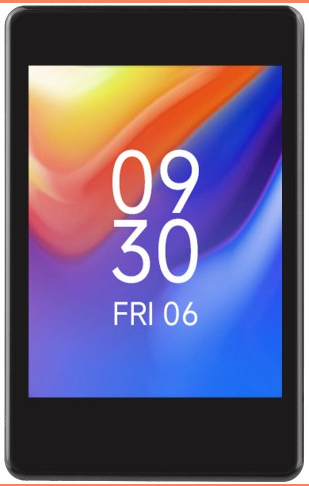

Take a look at the [source code](https://github.com/MicroPythonOS/MicroPythonOS) here, or the [docs](https://docs.micropythonos.com/) here.

---

### PyCon AU

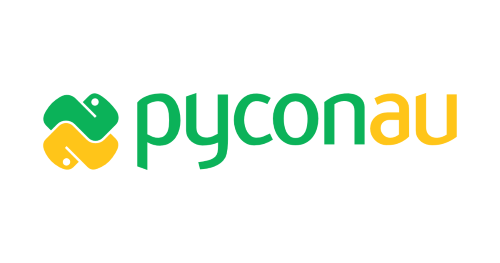

Tickets for [PyCon AU 2025](https://2025.pycon.org.au/) are on sale now!

The event will be held from Friday the 12th to Tuesday the 16th of September at Pullman Melbourne On The Park.

Early Bird tickets have already sold out, "Enthusiast" tickets for the full three days are $550, or $220 for a single day. Tickets include full catering, and a t-shirt.

I'm not sure specifically if there's any MicroPython talks this year, check out the program though to see if there's anything that interests you.

---

## Hardware News

### Silicon Labs SiWx917Y

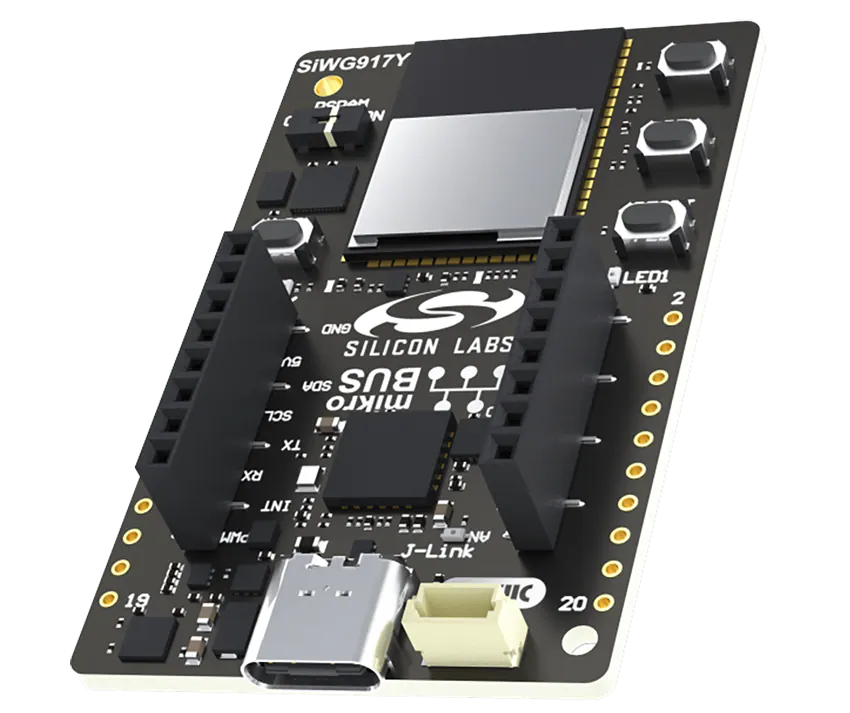

New from SiLabs, no MicroPython port just yet but it's got lots of memory and flash, and has built-in Wi-Fi. Always good to have options from different vendors.

Mouser have the [development kit here](https://au.mouser.com/new/silicon-labs/silicon-labs-siwx917y-explorer-kit/?subid=bfeee514f8d742659a14f39bb7448abe), **AU$64**.

---

### Waveshare ESP32-S3 1.8inch Knob Display Development Board

Waveshare have been releasing a bunch of interesting hardware lately. But this is one of the picks; a 1.8" 320x320 round display with a rotary encoder surrounding it. Of particular note is that it's anodised and looks stunning. Volos did [a video on it](https://www.youtube.com/watch?v=5G4W3irHkks), definitely looks pretty cool.

**US$46** [directly from Waveshare](https://www.waveshare.com/esp32-s3-knob-touch-lcd-1.8.htm).

---

### Shrike

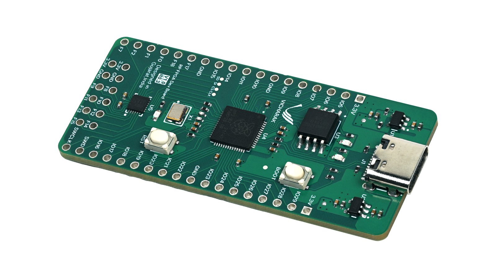

A compact, open-source development board that pairs the RP2040 microcontroller with the Renesas ForgeFPGA.

Launching soon [on CrowdSupply](https://www.crowdsupply.com/vicharak/shrike).

---

### Cygnet

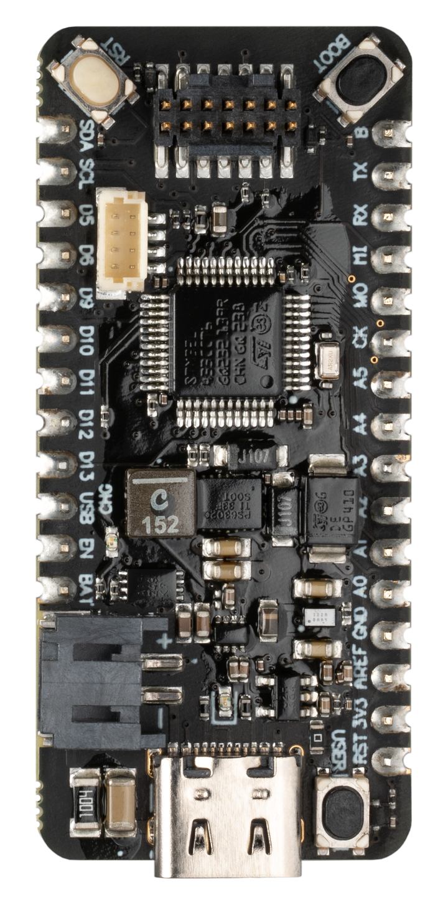

Cygnet is a Feather-compatible STM32-based MCU, and a lower-cost alternative to the Swan MCU. Like the Swan, Cygnet is offered in a Feather standard form factor and uses a STM32L4 part while still providing plenty of flash and RAM to run the majority of your Notecard-powered applications.

The Cygnet (and Swan) allow you to easily use their Notecarrier and Notecards that allow simple wireless comms over various protocols - wifi, cellular and LoRa. Their library to access their Notecards - note-python - is open source and supported on MicroPython: https://github.com/blues/note-python

Only **US$15**, pretty good value for a pretty powerful board. On sale [directly from Blues](https://shop.blues.com/products/cygnet).

---

### Lilygo T-Display Bar

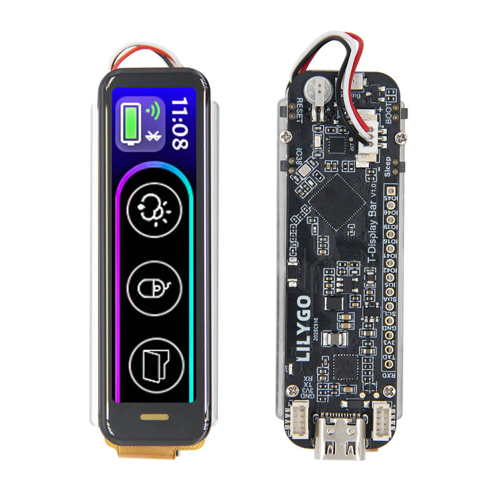

Another cute little display from Lilygo, with an ESP32-S3 MCU and the ST7789 TFT display driver. I haven't seen a specific example of MicroPython running on it, but the ST7789 should be well supported.

**US$27** [from Lilygo](https://lilygo.cc/en-pl/products/t-display-bar)

---

### Lilygo T-Mini Epaper S3

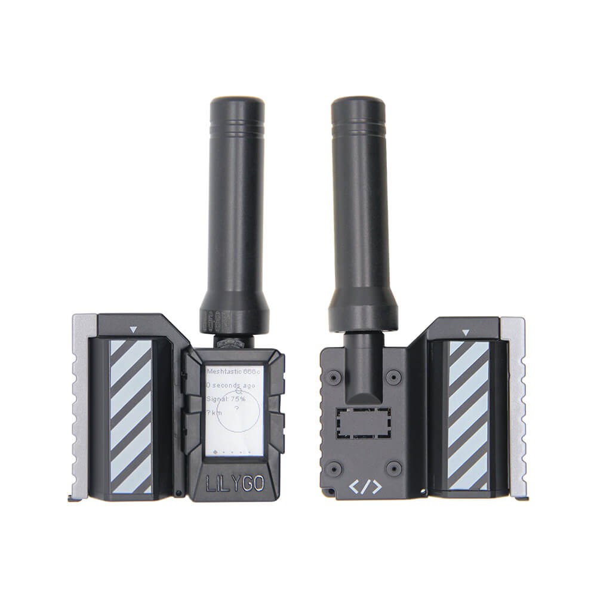

This is quite an interesting little product, an e-paper display combined with an ESP32-S3 and an SX1262 LoRa transceiver. LoRa has good support in MicroPython, since about 2023 – check out [micropython-lib](https://github.com/micropython/micropython-lib/tree/master/micropython/lora). 

**US$41** [from Lilygo](https://lilygo.cc/en-pl/products/t-mini-epaper-s3)

## Fun Projects

### The 2025 Hackaday One Hertz Challenge

If you're looking for a fun project idea, not necessarily MicroPython-related – although using MicroPython would certainly be handy, Hackaday have announced a new competition: the One Hertz Challenge. To enter all you need is a project that does _something_ exactly once per second, doesn't matter what. 

Check out [the announcement page](https://hackaday.com/2025/06/26/announcing-the-2025-hackaday-one-hertz-challenge/) for more info. They've got some "honourable mention" categories, to spark some creative thinking:

> * **Timelords:** How precisely can you get that heartbeat? This category is for those who prefer to see a lot of zeroes after the decimal point.
> * **Ridiculous:** This category is for the least likely thing to do once per second. Accuracy is great, but absurdity is king here. Have Rube Goldberg dreams? Now you get to live them out.
> * **Clockwork:** It’s hard to mention time without thinking of timepieces. This category is for the clockmakers among you. If your clock ticks at a rate of one hertz, and you’re willing to show us the mechanism, you’re in.
> * **Could Have Used a 555:** We knew you were going to say it anyway, so we made it an honorable mention category. If your One Hertz project gets its timing from the venerable triple-five, it belongs here.

 The top three winners will each receive a US$150 gift certificate from the contest’s sponsor, DigiKey.

#### metronalmost?

Mike Coats has a [fun write-up of his entry](https://mikecoats.com/metronalmost/), a MicroPython-based metronome that not only _doesn't_ keep a steady beat… it actually **never** ticks once per second. I'm not sure if Hackaday are doing a wooden spoon prize for last place, but Mike would surely be in pole position for it!

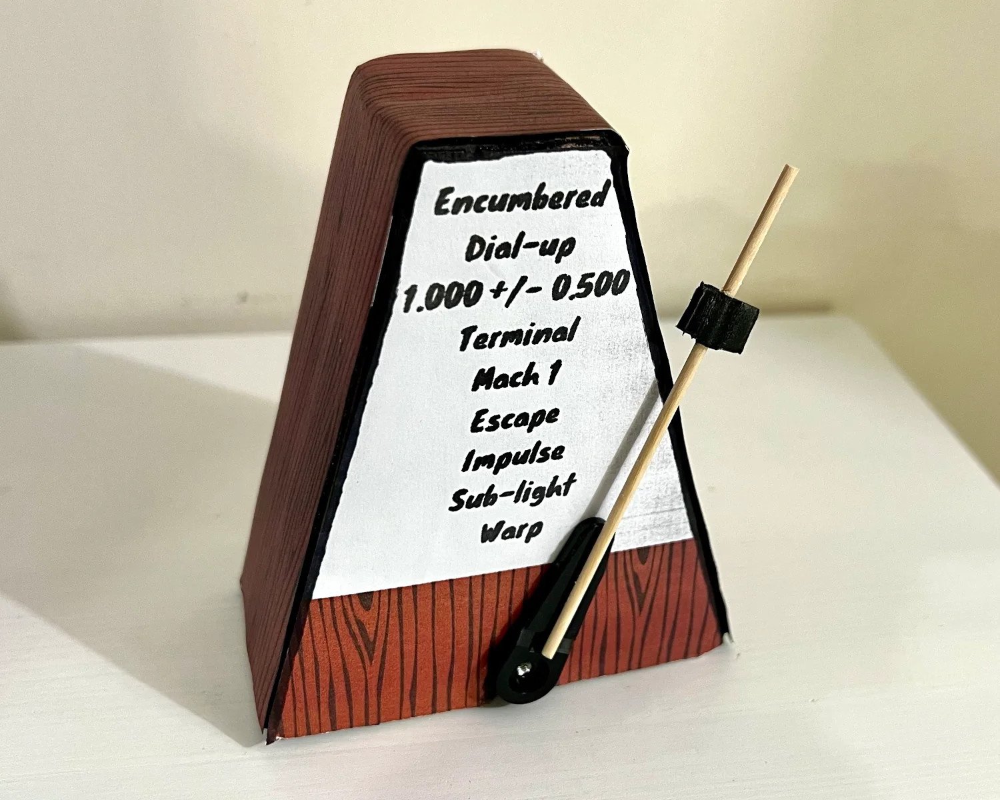

---

### Satellites and Atomic Time

Do you need very precise timekeeping in a remote location? The Network Time Protocol (NTP) is highly effective and accurate, but has one obvious drawback – it needs a network connection, to a server with a precise clock. Turns out though that MicroPython can help! As [Simon Quellen Field writes](https://medium.com/radio-hackers/python-radio-46-satellites-and-atomic-time-93387c99ba3f) it's actually pretty easy to use the GPS receiver in a [LilyGo T-Beam](https://lilygo.cc/products/t-beam) to act as an NTP server using the local Wi-Fi network hotspot feature. [Check it out](https://medium.com/radio-hackers/python-radio-46-satellites-and-atomic-time-93387c99ba3f)!

---

### DIY Animatronic Endoskeleton

"Subhash" has a pretty [detailed write-up](https://github.com/urnormalcoderbb/DIY-Animatronic-Endoskeleton) of a project he's been working on to create an animatronic endoskeleton, controlled wirelessly by a pair of ESP32s. It's open source on GitHub, and seems like it could be a good example for teaching not just code but project planning and development. The creator says he's just 13!

Sadly I couldn't find any pictures, but we'll check back in if there's an update.

---

### Amazing Hand

Another robotics project, and I've got photos of this one!

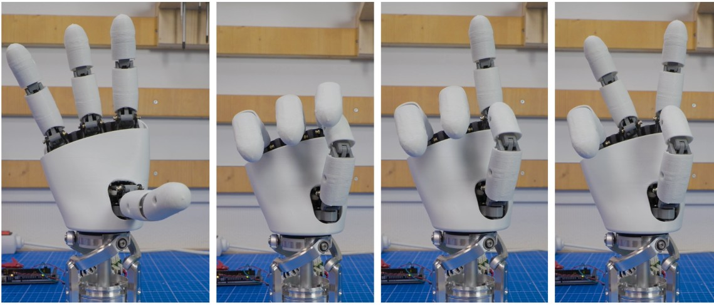

From Pollen Robotics, located in Bordeaux, France. The idea is to create an open source 3D printable humanoid hand.

They note:

> Amazing Hand is :
> 
> * 8 dofs humanoid hand with 4 fingers
> * 2 phalanxes per finger articulated together
> * flexible shells allmost everywhere
> * All actuators inside the hand, without any cables
> * 3D printable
> * 400g weight
> * low-cost (<200€)
> * open-source

They have code for driving it with Python (that is, "big" Python on a computer via a serial interface), or from an Arduino. I wonder if Subhash, from the previous project, could integrate his ESP32 MicroPython code to drive the Amazing Hand??

[Check it out](https://github.com/pollen-robotics/AmazingHand)! 

---

### PyDrone

For those that prefer their robots to be airborne, there's PyDrone – a quadcopter kit, complete with ESP32-S3 running MicroPython.

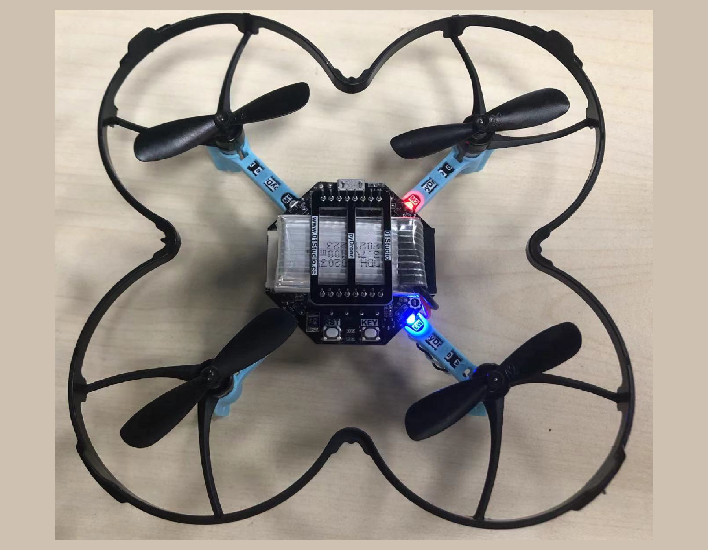

It uses a pyController remote to fly with:

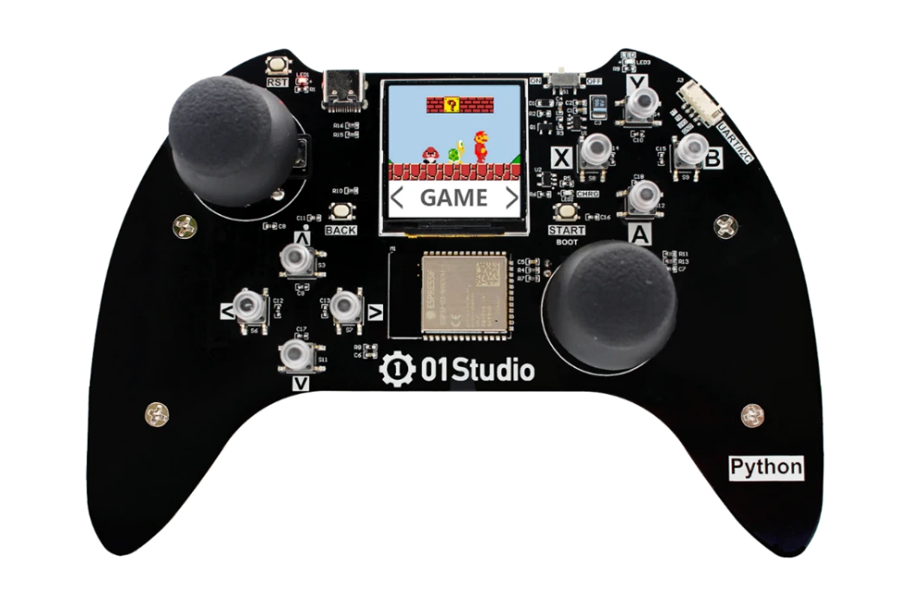

CNX Software has a write-up on it, [check it out](https://www.cnx-software.com/2025/07/02/pydrone-an-esp32-s3-drone-programmable-with-micropython/).

## Other news

### Interactive pinouts!

There's a good chance you've used the Raspberry Pi pinout map at [pinout.xyz](https://pinout.xyz/) before – but did you know there's also a whole bunch more, for MicroPython supported boards? In particular, RP2 and ESP32 boards.

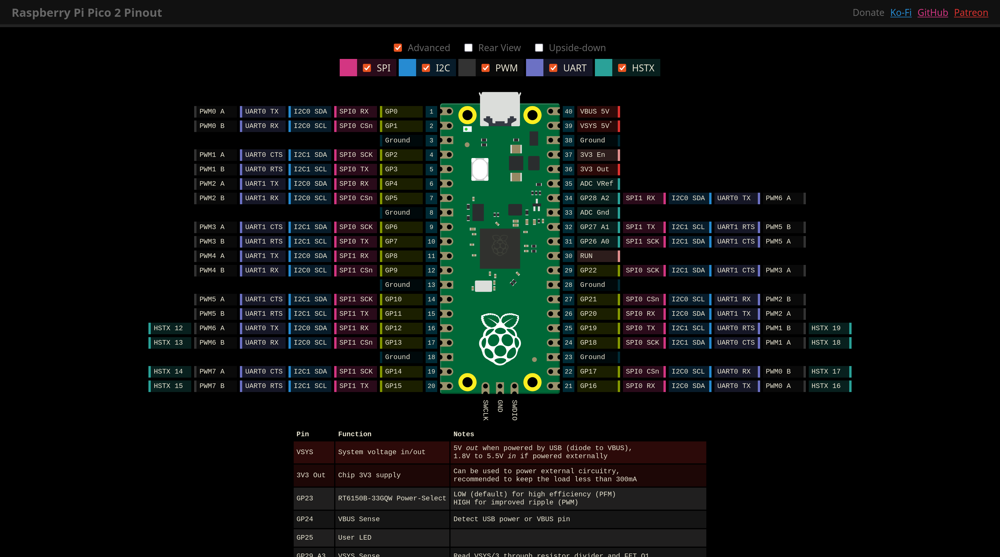

[Take a look](https://github.com/orgs/micropython/discussions/17677)!

---

### MicroPython on Mac System6

Have you got an old Mac lying around, with a Motorola 68k series CPU? You know, the cool ones from the late 80s and early 90s? And if so, have you considered MicroPython for your application development needs?

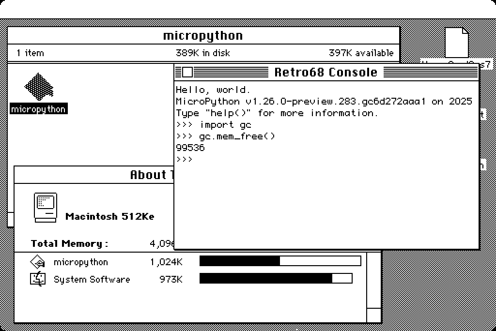

Jeff "jepler" Epler has been working on a Mac `m68k` port - to run MicroPython on a _retro cool_ Mac. Jeff was a core dev on CircuitPython so he knows his stuff, and needs to for this port! It's a 16bit architecture which required a number of changes. But if you read through his Mastodon posts he's come a long way!

[See his updates here](https://social.afront.org/@stylus/114749858767978151).

## Final Thoughts

Midjourney visualising Oliver and Matt coding, with Claude (note that beards are
*necessary* if you ask for a 'developer'!):

