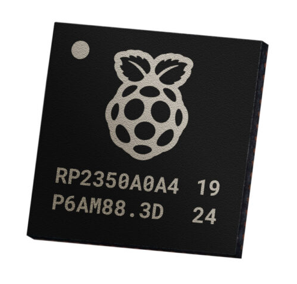
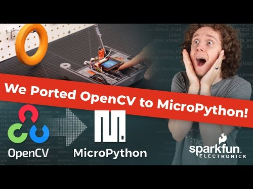
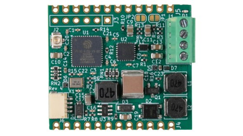
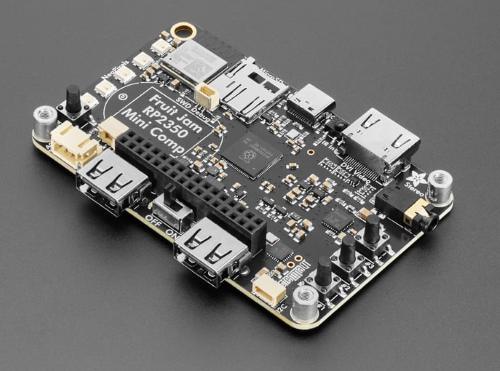
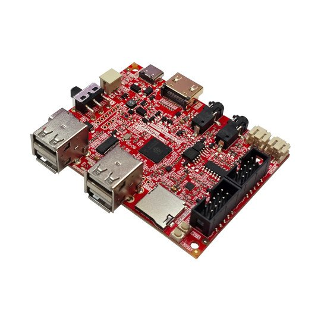
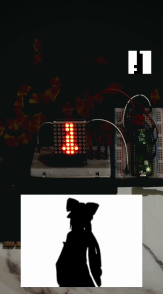

*Damien* talks v1.26, *Matt* delivers the news roundup

# News Round-up

### Housekeeping

Proposed changes to the Meetup format!

Feedback/issues

- The news roundup is valuable to some people but tough for newcomers
- Would like more time to work on projects during the meetup
- The news roundup takes a lot of effort

One suggestion: Only do a news roundup every quarter and host it online-only.
Meetups would focus on projects.

Another: No news roundups. Record them straight to YouTube when we can get
around to them.

Also: Meetup is horrendously expensive and PSF grants have been used up.

---

### Big Ticket Items

#### Raspberry Pi addresses erratum

[Raspberry Pi RP2350 A4 stepping fixes E9 GPIO Erratum, glitching bugs,
introduces 2MB flash
variants](https://www.cnx-software.com/2025/07/29/raspberry-pi-rp2350-a4-stepping-fixes-e9-gpio-erratum-9-glitching-bugs-introduces-2mb-flash-variants/)

---

#### Sparkfun ported OpenCV to MicroPython

Sparkfun released a video: [We ported OpenCV to
MicroPython!](https://www.youtube.com/watch?v=GmIq753MlGQ)

Always great to see manufacturers contributing! Also, their recent [Experiential
Robotics
Platform](https://www.sparkfun.com/experiential-robotics-platform-xrp-kit.html)
(XRP) is a pretty neat starting point for a simple, affordable robot platform.

No, I'm not sure why they didn't start with [OpenMV](https://openmv.io/) either.

---

#### PyCon AU

A reminder that [PyCon AU 2025](https://2025.pycon.org.au/) is only a few weeks away!

---

## Hardware News

### ManT1S

Patrick Van Oosterwijck is [gathering support for the
ManT1S](https://www.crowdsupply.com/silicognition/mant1s), a small board
featuring an ESP32 (2MB/8MB) and support for Single Pair Ethernet. With
out-of-the-box support for MicroPython.

Hackster.io covered the announcement: [Silicognition's ManT1S Is a
MicroPython-Powered Gadget for Easy Single-Pair Ethernet
Projects](https://www.hackster.io/news/silicognition-s-mant1s-is-a-micropython-powered-gadget-for-easy-single-pair-ethernet-projects-da6d866c0f83)

Powerful, good Single Pair Ethernet T1S support (including PoE), castellated -
and there's a bridge board that allows connection to regular Ethernet. Looks
great!

Patrick knows what he's doing; he previously developed the
[wESP32](https://silicognition.com/Products/wesp32/), one of the best PoE
Ethernet devlopment boards. 

---

### Fruit Jam

Adafruit have a new, exciting board out - the [Fruit Jam Mini RP2350
Computer](https://www.adafruit.com/product/6200).

Specs:
- Raspberry Pi RP2350B, 16MB flash, 8MB PSRAM
- DVI output (HSTX port)
- MicroSD
- I2S headphone
- USB type C and 2x USB type A (via hub)
- ESP32-C6 for radio comms
- NeoPixels, buttons, expansion ports

**US$40**

### Olimex RP2350PC

Olimex released a similar-in-concept board, the
[RP2350PC](https://www.olimex.com/Products/RaspberryPi/PICO/RP2350pc/).

Specs:

Very similar! 

**25€**

### ESP32-P4's out the wazoo

**Waveshare (many!)**

- [ESP32-P4-Pico](https://www.waveshare.com/esp32-p4-pico.htm?sku=32101)
- [ESP32-P4-WIFI6](https://www.waveshare.com/esp32-p4-wifi6.htm)
- [ESP32-P4-ETH](https://www.waveshare.com/esp32-p4-eth.htm?sku=32090)
- [ESP32-P4 Smart 86 Box](https://www.waveshare.com/esp32-p4-wifi6-touch-lcd-4b.htm)
- [ESP32-P4 3.4 / 4 Inch Round Touch Display](https://www.waveshare.com/esp32-p4-wifi6-touch-lcd-3.4c.htm)

**DFRobot**

[FireBeetle 2 ESP32-P4](https://www.dfrobot.com/product-2915.html)

**GUITION**

- [GUITION JC4880P433](https://www.cnx-software.com/2025/08/12/4-3-inch-touch-display-board-features-single-esp32-p4-esp32-c6-module-supports-camera-and-speakers/)
- [GUITION ESP32-P4 + ESP32-C6
module](https://www.cnx-software.com/2025/07/18/14-development-board-features-guition-esp32-p4-esp32-c6-module/)

**M5Stack**

[M5Stack Core teaser](https://x.com/M5Stack/status/1959969004225007723).

---

## Other news

### Pocket Deck

This device changed my life: Introducing Pocket Deck:

<iframe width="560" height="315" src="https://www.youtube.com/embed/t5U8vJeiXoE?si=xng9g5p2HSXHgoc2" title="YouTube video player" frameborder="0" allow="accelerometer; autoplay; clipboard-write; encrypted-media; gyroscope; picture-in-picture; web-share" referrerpolicy="strict-origin-when-cross-origin" allowfullscreen></iframe>

"Recently I created a kind of generic computer, specialized for productivity.
It can do life tracking, journaling, task management, and some fun.
Micropython enables standalone application development."

[Preorder the Pocket Deck](https://shop.nunomo.net/products/pocket-deck-pre-order-status) 

**US$360** (shipping estimated for October)

---

### RobotWar

<iframe width="560" height="315" src="https://www.youtube.com/embed/ZVNXHe6i0LU?si=b0dp8Dn3-7f6C3U0" title="YouTube video player" frameborder="0" allow="accelerometer; autoplay; clipboard-write; encrypted-media; gyroscope; picture-in-picture; web-share" referrerpolicy="strict-origin-when-cross-origin" allowfullscreen></iframe>

Sam Neggs, with the help of Claude Sonnet 4, created a clone of the old classic
Apple II game/simulator, _RobotWar_, in MicroPython. 

The aim of the game is to write a computer program to operate a robot. Sam's
application implements an interpreter for the original language, renders to a
display and uses multithreading and viper for better performance. 

---

### 8x8 Bad Apple

"This was a dumb idea"

Avimanyu Dutta released [Bad Apple on 64
pixels](https://github.com/Abhimanyu8/Bad-Apple-on-64-pixels). Best described
with the animated gif!

Via [Reddit](https://www.reddit.com/r/touhou/comments/1n0q3or/bad_apple_but_on_64_pixels/).

---

### Kevin McAleer: Pico Drone

Kevin works on the Pico Drone, implementation is all MicroPython.

**Pico Drone - can we build a drone using a Raspberry Pi Pico?**

<iframe width="560" height="315" src="https://www.youtube.com/embed/Us0bSUX9UkQ?si=KPYp-XQv1wu-hM4F" title="YouTube video player" frameborder="0" allow="accelerometer; autoplay; clipboard-write; encrypted-media; gyroscope; picture-in-picture; web-share" referrerpolicy="strict-origin-when-cross-origin" allowfullscreen></iframe>

---

## Quick Bytes

### Kiwi PyCon 2025

This year, Kiwi PyCon 2025 has a couple of [MicroPython
Workshops](https://kiwipycon.nz/programme/friday-workshops). One Beginner and an
Advanced session. If anyone can help review material - or even better attend! - please reach out.

### Core Elec: Ultra-Wideband

[Getting Started With Ultra-Wideband & Measuring
Distances](https://core-electronics.com.au/guides/sensors/getting-started-with-ultra-wideband-and-measuring-distances-arduino-and-pico-guide/)

### Clockwork PicoCalc: Perf comparison

A video from the Clockwork PicoCalc folks, comparing the perf of some calculator platforms. 

[Clockwork PicoCalc: Performance comparison between Rasp pico, pico2W and
MMBASIC on the PicoCalc](https://www.youtube.com/watch?v=BP6YqF62IoA)

### Random Nerd Tutorials: BLE with MicroPython

Random Nerd Tutorials have an excellent tutorial: [Raspberry Pi Pico W: Bluetooth Low Energy (BLE) with
MicroPython](https://randomnerdtutorials.com/raspberry-pi-pico-w-bluetooth-low-energy-micropython/)

## Final Thoughts

### MicroPython Contributors World Map for v1.26

Have you ever noticed that Damien posts the timezones of the folks that have
contributed to a release?

### Candle Clock

One of the more interesting reads in the past month...

[Candle Flame Oscillations as a
Clock](https://cpldcpu.com/2025/08/13/candle-flame-oscillations-as-a-clock/)

### Midjourney fun

Midjourney showing us diversity in developers (?)

