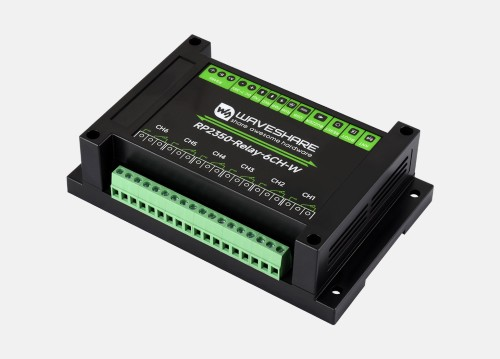
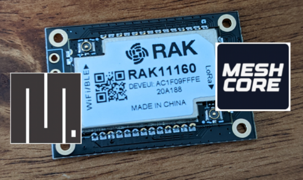
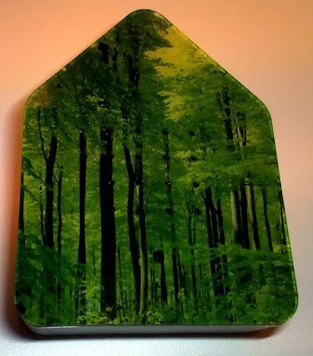
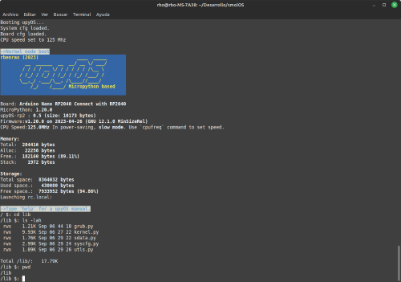
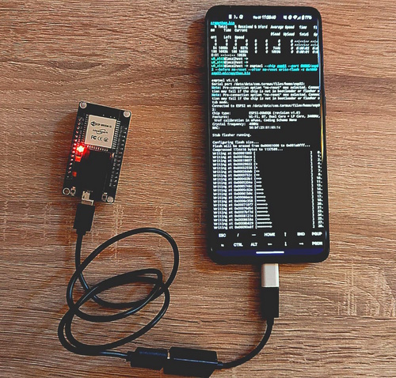
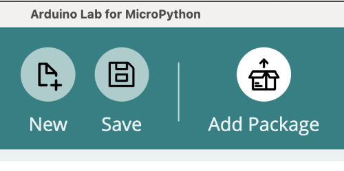
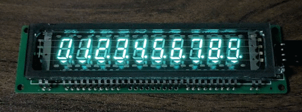
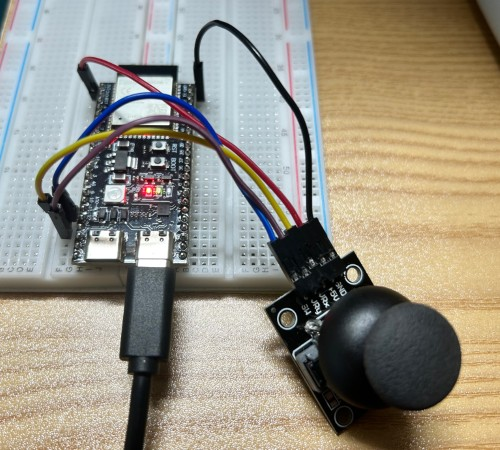
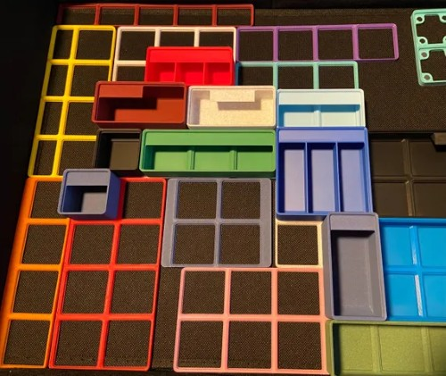

*Matt* delivers the news roundup, *Damien* talks about the weather

# News Round-up

### Housekeeping

First Luma-scheduled meeting!

---

### Big Ticket Items

#### Qualcom acquires Arduino 

Big news!

UNO Q also announced.

Specs:

* Qualcomm Dragonwing QRB2210 microprocessor
* STM32U585

AUD$180

#### v1.27 coming soon

MicroPython v1.27 is [currently scheduled for November
14th](https://github.com/micropython/micropython/milestone/11). 

It's easy to highlight new ESP32P4 and STM32U5 support but I'm always impressed
at the large swathe of improvements!

---

## Hardware News

### Nordic quietly releases bare metal HAL

---

### PocketPD

---

### Raspberry Pi 500+

---

### Waveshare Industrial 6CH RP2350 Relay Module

Waveshare continue to release interesting, affordable devices targeting
industrial use. 

This [Industrial 6-Ch RP2350 Relay
Module](https://www.waveshare.com/rp2350-relay-6ch.htm) has the following specs:

* RP2350B
* Optional wifi (via RPi Radio Module 2)
* 520KB RAM, 16MB flash
* 6x 10A 250VAC/30VDC relays
* Isolated RS485
* 7-36V input
* Onboard 40pin RPi Pico header
  * Use Pi Pico HATs!

**US$27-32**

---

## Other news

### MicroPython on the RAK11160

The
[RAK11160](https://store.rakwireless.com/products/rak11160-lorawan-module-esp32-stm32wl-wifi-ble?variant=44702007656646)
is a dual-core module that smooshes together an STM32WLE5 and an ESP32-C2 so you
get a LoRaWAN, Wifi and BLE device all in one small package. They're cheap too,
at ~US$6.50 for single units.

User [fdlamotte](https://github.com/fdlamotte) is involved in MeshCore, one of
the handful of LoRa-based off-line/off-grid mesh systems and has been using the
module - but is unimpressed with RAK's RUI3 firmware. He replaced the STM32WLE5
firmware with MeshCore and,  interestingly for us, he [walks
through](https://digitalsober.wordpress.com/2025/09/28/rak11160-running-micropython-on-the-esp-core/)
how to get MicroPython running on the ESP32-C2 - which you can then use to
control the STM32 core. It's a neat solution!

Now, if we could _also_ replace the platformio-based MeshCore stack running on
the STM32 side with MicroPython we'd be off to the races...

---

### Build a Zwitscherbox

A Zwitscherbox is a box that plays audio when someone is nearby. Traditionally
it's a birdsong, for relaxation.

Luc Volders describes how to [Build a
Zwitscherbox](https://lucstechblog.blogspot.com/2025/09/pico-audio-7-build-zwitscherbox.html)
using MicroPython on a Pico with a PIR
sensor and a wav library.

---

### Gauges and Grafana

<video controls>
  <source src="../images/2025-10/gauges_grafana.mp4" type="video/mp4">
Your browser does not support the video tag.
</video>

Simon Prickett [presented at a meetup in
London](https://x.com/simon_prickett/status/1978072997660377158). Simon showed
how to display a value on both a gauge and an LCD display - the data was pulled
from Grafana. He used CircuitPython to control the gauge, MicroPython for the
display.

---

### Star Raiders

<iframe width="560" height="315" src="https://www.youtube.com/embed/gRaXqXx_vzc?si=QCemfe44zWIbJUBA" title="YouTube video player" frameborder="0" allow="accelerometer; autoplay; clipboard-write; encrypted-media; gyroscope; picture-in-picture; web-share" referrerpolicy="strict-origin-when-cross-origin" allowfullscreen></iframe>

Sam Neggs with another retro game; a tribute to the classic _Star
Raiders_ on the Atari 800! Running MicroPython on a Pi Pico 2. 

This one looks _super_ responsive!

Hot-off-the-press: Sam has [just released the 1500-line source
code](https://gist.github.com/samneggs/813f37f6773493a7fbbcb371f71fe39d). Thanks
Sam!

---

### upyOS

(Note that Sean covered MicroPythonOS back in the [July
Meetup](https://melbournemicropythonmeetup.github.io/July-2025-Meetup/). This is
not that!)

[upyOS](https://github.com/rbenrax/upyOS) is an OS for embedded devices based on
MicroPython. It provides the user with a POSIX-like environment.

Many
[commands](https://github.com/rbenrax/upyOS?tab=readme-ov-file#actual-external-commands)
have been implemented (cat, mkdir, mv etc) and there's even [shell
scripting](https://github.com/rbenrax/upyOS?tab=readme-ov-file#shell-scripting)
support.

---

### ESP32 and Termux

Davide Galilei has a great walk-through on how to do MicroPython development
using an Android phone. It even shows how to deploy ESP32 firmware using
`esptool` and interact with the REPL using `mpremote`. 

---

### Framework laptops and expansion cards

---

### Arduino Tools for MicroPython

ubidefeo, from Arduino, posted to the MicroPython discord that he'd released
[arduino-tools-mpy](https://github.com/arduino/arduino-tools-mpy). It provides a
way to host multiple MicroPythyon apps on the filesystem and select which one to
run. Looks shiny!

---

## Quick Bytes

### Micropython on the PS5

[Tibor: Tale of a Kind
Vampire](https://store.playstation.com/en-hr/concept/10015598/)

Discussion: [Micropython used in a PlayStation
game](https://github.com/orgs/micropython/discussions/18291)

---

### Decimal Library update

Stewart _Scruss_ Russell [updated the excellent
micropython-decimal-number](https://github.com/scruss/micropython-decimal-number)
library so it now works on CircuitPython as well as MicroPython. 

---

### VFD driver

Salvatore La Bua released
[micropython-lgl-10digits-vfd-driver](https://github.com/slabua/micropython-lgl-10digits-vfd-driver),
a MicroPython driver to control the _retro cool_ serial VFD displays. If you
have one - or can find a source for them - you can now easily control 'em. 

---

### HW-504 Joystick driver

Park Kuyeon [announced](https://github.com/orgs/micropython/discussions/18152)
[esp32_joystick_micropython](https://github.com/kuyeon/esp32_joystick_micropython)
a driver for the popular HW-504 joysticks.

Documentation is in Japanese but the code and examples are clear even without
translation.

---

### Final thoughts

#### Gridfinity

<iframe width="560" height="315" src="https://www.youtube.com/embed/ra_9zU-mnl8?si=qkdjMOAvZN2BK_sF" title="YouTube video player" frameborder="0" allow="accelerometer; autoplay; clipboard-write; encrypted-media; gyroscope; picture-in-picture; web-share" referrerpolicy="strict-origin-when-cross-origin" allowfullscreen></iframe>

Gridfinity is neat!

If you have a 3D printer, check it out.

### Midjourney fun

Might as well code when the weather is like this!

