*Matt* delivers the news roundup

# News Round-up

## Headlines

### MicroPython v1.27 released

[Damien spoke last month](https://www.youtube.com/watch?v=TZWLRNahxHk) about the
release but, for reference, some of the highlights:

- Suppor for new micros: ESP32-C5, ESP32-P4 and STM32U5
- Huge improvements to the hw test suite
- Significant improvements to the Zephyr port
- 'Tier' levels introduced, categorising the maturity of the various ports
  - One benefit: Reduces the barrier to entry for new microcontroller families
- Updates to key dependencies (LittleFS, TinyUSB, stm32lib, ESP-IDF)
- A vast array of 'small' improvements, bugfixes, optimisations

Read the offical, _very_ detailed [v1.27.0 release
notes](https://github.com/micropython/micropython/releases/tag/v1.27.0).

---

### The Agile Embedded Podcast: MicroPython with Matt

I had the pleasure of speaking with Luca and Jeff about using MicroPython
professionally on The Agile Embedded Podcast. We covered a lot of ground in the
hour-long discussion. 

[MicroPython with Matt
Trentini](https://agileembeddedpodcast.com/episodes/micropython-with-matt-trentini)

---

### DDD Melbourne Community Booth

[DDD Melbourne](https://www.dddmelbourne.com/) is a non-profit conference for
the software community which is being held on Saturday the 21st Feb at the
Melbourne Town Hall. Check out the [Agenda](https://www.dddmelbourne.com/agenda)
and, if you're interested, get an A$89 (cheap!)
[ticket](https://www.dddmelbourne.com/tickets).

This year, we were granted a Community Booth for MicroPython! I'll be attending
the conference and hosting at the booth but could really use some help:

- If you could help provide a demo
- Help host the booth (if you're coming)

There'll be ~600 folks attending so it'll be a great chance to introduce a wide
variety of devs to the fun of MicroPython!

---

### Teenage Engineering: Ting

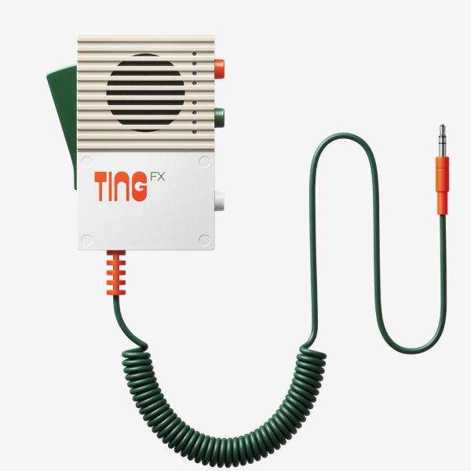

Teenage Engineering makes some of the *coolest* music gear around. You might
also remember that the Swedish electronic manufacturers are also responsible for
the industrial design of the _uber cute_ Playdate. 

TE recently released a new sampler and sequencer called RIDDIM and it has an
optional stand-alone handheld mic - TING - with built-in effects and samples.
Riddim and Ting (get it?) are inspired by the Reggae, Dub and Dancehall movement
and is designed for live music creation.

The cool part is that **Ting is created with MicroPython**! There are not a lot
of details yet, but the RP2350 is at the heart of the device (the part number
for the Ting is 'EP-2350') and MicroPython is listed in the [Software
Licenses](https://teenage.engineering/guides/ep-2350/software-licenses). The
[EP-2350 Guide](https://teenage.engineering/guides/ep-2350) is also suggestive
that this is a MicroPython device. Will be interesting to see if anyone tries to
get the firmware running on their own device!

<iframe width="560" height="315" src="https://www.youtube.com/embed/IV6G0I_VBCk?si=x9xUn9cXvig8QYVt" title="YouTube video player" frameborder="0" allow="accelerometer; autoplay; clipboard-write; encrypted-media; gyroscope; picture-in-picture; web-share" referrerpolicy="strict-origin-when-cross-origin" allowfullscreen></iframe>

<iframe width="560" height="315" src="https://www.youtube.com/embed/PiUUNNa33f8?si=Yg81fvEZ8X1Fm1qe" title="YouTube video player" frameborder="0" allow="accelerometer; autoplay; clipboard-write; encrypted-media; gyroscope; picture-in-picture; web-share" referrerpolicy="strict-origin-when-cross-origin" allowfullscreen></iframe>

(via [ptorrone@blueksky](https://bsky.app/profile/ptorrone.bsky.social/post/3mciarwlvec2k))

---

### Compiler Explorer now supports MicroPython

[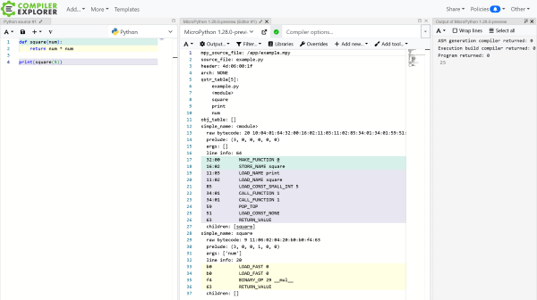](../images/2026-01/compiler_explorer_large.png)

Thanks to [Anson Mansfield's excellent
work](https://github.com/compiler-explorer/compiler-explorer/pull/8256), the
invaluable tool [Compiler Explorer](https://godbolt.org/) now supports
MicroPython. This means you can have the tool compile code and quickly see the
disassembly, all from the comfort of a browser window.

Versions v1.20 right up to the latest v1.28 preview builds are supported!

---

### MicroPython Mock Machine library

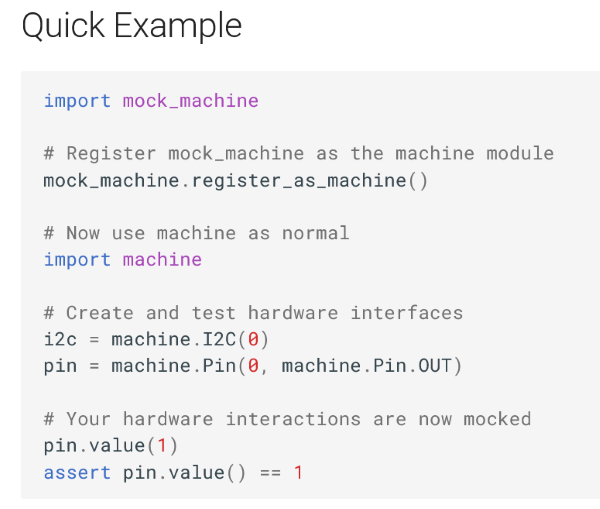

*Very* hot off the press! 🔥

[Planet Innovation](https://planetinnovation.com/) has been developing and using
[micropython-mock-machine](https://github.com/planetinnovation/micropython-mock-machine)
for a few years now; it provides an easy way to mock out the machine module and
create unit tests that would otherwise require hardware.

We've been pushing to make this open-source for a *very* long time and I'm happy
to say that it's now available to the coomunity! We'd also love to see
contributions and feedback so please give it a go.

[Documentation](https://planetinnovation.github.io/micropython-mock-machine/)

---

### Meetup 🡆 Luma

Just a quick note to mention that our Meetup subscription runs out before the
February meetup - so this is the last time we'll be using the service! It's Luma
from now on.

---

## Hardware News

### ManT1S

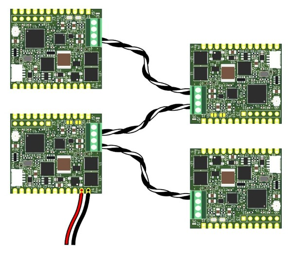

We featured ManT1S back [in
August](https://melbournemicropythonmeetup.github.io/August-2025-Meetup/) but, since
then, Patrick Van Oosterwijck's [Crowd Supply campaign has been
successful](https://melbournemicropythonmeetup.github.io/August-2025-Meetup/)! 

Patrick has also written a few posts about his board, of particular interest for
us: [Getting Started With the Preinstalled MicroPython
Firmware](https://www.crowdsupply.com/silicognition/mant1s/updates/getting-started-with-the-preinstalled-micropython-firmware). 

As a quick refresher, ManT1S is an implementation of 10BASE-T1S, a relatively
new Ethernet standard that only uses a single twisted pair for comms _and_
power. At 10Mb/sec it's not as fast as some Ethernet variants but makes up for
it in installation convenience.

---

### M5Stack Nano H2

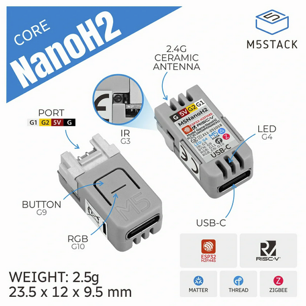

I ❤️ the *tiny* Nano form factor by M5Stack, kicked off with their
[NanoC6](https://shop.m5stack.com/products/m5stack-nanoc6-dev-kit). Now the
ESP32-H2 joins the C6 with the
[NanoH2](https://shop.m5stack.com/products/m5stack-nanoh2-dev-kit-esp32-h2).

This 96MHz ESP32-H2 has 320KB RAM, 4MB flash, a button, an RGB LED, an IR blaster and
a grove socket. No wifi but BLE, Matter, Thread and Zigbee - should make it
useful for low-power applications.

Note that MicroPython doesn't yet support the H2. 

**US$7**

---

### M5Stack M5StickS3

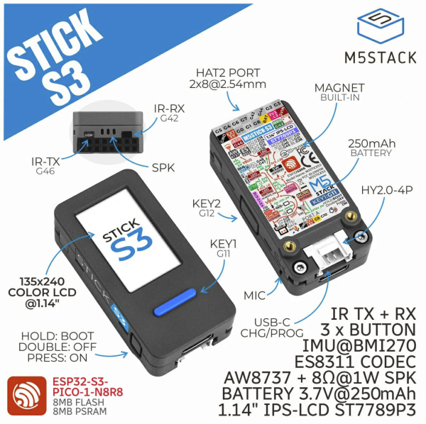

Another fave from M5Stack, the "Sticks" are all pretty great, particularly if
you want a little more than the Nano's provide. Their latest, the
[M5StickS3](https://shop.m5stack.com/products/m5sticks3-esp32s3-mini-iot-dev-kit),
integrates the ESP32-S3 and has the following specs:

- 8MB PSRAM, 8MB Flash
- 1.14" 135x240 LCD display (ST7789P3)
- Mic & speaker (I2S)
- 6-axis IMU
- IR transmitter & receiver
- 250mAh battery
- Grove, button, WiFi, BLE

**US$21.50**

---

### EBYTE18 ECM50-A Industrial Controller

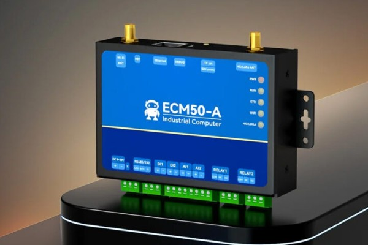

The
[ECM50-A](https://ebyteiot.com/products/ebyte-ecm50-series-programmable-industrial-computer-convenient-debugging-operation-esp32-python-gateway-rtu-modbus-network-port)
is an(other) industrial controller with an ESP32-S3 at it's heart. It supports
RS485/232, WiFi, BLE, has 2x relays and accepts 8-28V input - and there are options for LoRa
and 4G cellular. Wide temperature support too: −40°C to +85°C. The micro has 8MB
PSRAM, 16MB NOR flash and there's a slot for a microSD card.

CNX has a [good
write-up](https://www.cnx-software.com/2025/11/28/ebyte-ecm50-a-industrial-esp32-s3-controller-offers-rs232-rs485-di-do-ethernet-and-4g-lte-or-lora-connectivity/).

There are a bunch of MicroPython examples in a public
[GoogleDrive](https://drive.google.com/drive/folders/1re8_s5b_aYJRX2JCocJvN8VO6b9KduVX)
(!).

**US$35** (extra for additional options)

---

### Pololu Motoron

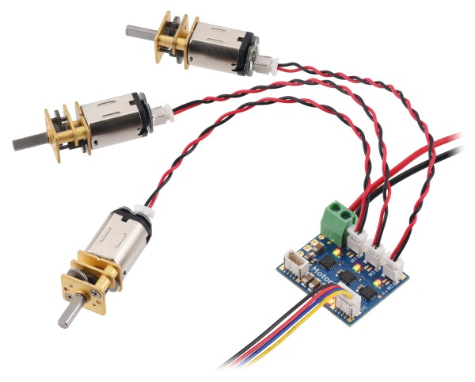

Pololu recently announced updates to their [Motoron
range](https://www.pololu.com/category/289/motoron-motor-controllers) of motor
drivers.

Pretty neat! They provide an I2C (some are UART) interface that allows you to
control motors. Some even have STEMMA/QT sockets to make it super-easy to
connect.

**US$20+** (depending how many motors, current limit etc)

---

### Lilygo T-Display P4

Lilygo, as usual, have been churning out products! The feature-rich [T-Display
P4](https://lilygo.cc/products/t-display-p4) is an update to their T-Display
line (think: chunky phone form-factor).

Specs:

- ESP32-P4, 32MB RAM, 16MB PSRAM
  - ESP32-C6 onboard for WiFi/BLE
- 4.05" TFT or 4.1" AMOLED cap-touch display
- LoRa SX1262
- GPS module
- 2MP OV2710 Camera
- 9-axis IMU
- microSD slot
- I2S audio
- USB-A, 2xUSB-C
- Ethernet 

[via [lilygo9@X.com](https://x.com/lilygo9/status/1999684753851842805)]

**US$97/$120** TFT/AMOLED

---

### Espressif announces ESP32-E22

Espressif have announced the
[ESP32-E22](https://www.espressif.com/en/news/ESP32_E22_Announcement). In a
departure from the rest of their product line this is *not* a general purpose
micro with radio, it's a *radio module*.

But it's a heck of a radio module! Tri-band WiFi, Bluetooth Classic and BLE 5.4.

No pricing or availability information yet but engineering samples are available
now. If you're lucky.

---

### Pixlpal

There's a new project on Crowd Supply: [Pixlpal](https://www.crowdsupply.com/meterbit-cybernetics/pixlpal). It's "...a customizable RGB LED display for information, entertainment, and more.". 

Specs:

- ESP32-S3, 8MB PSRAM, 16MB Flash
- 11.25" 128x64 RGB LED
- Rotary encoder
- Audio in/out

Custom firmware for now (with some pretty neat examples!) but, given the micro,
MicroPython support should be a doddle. I've reached out on their discord
server, we'll see if there's any interest in folks collaborating.

**US$150**

### ACEBOTT QD023

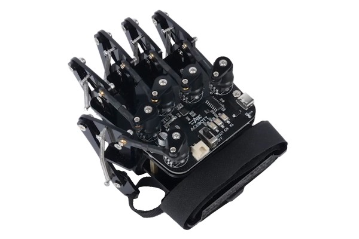

CNX wrote up about the [Acebot Control
Glove](https://www.cnx-software.com/2026/01/26/acebott-qd023-esp32-based-gesture-control-glove-tracks-finger-movements-with-potentiometers/). 

I haven't read too much about it yet but MicroPython is supported and it was too
cool *not* to feature

## Other news

### Pixel Pump 2 Announced

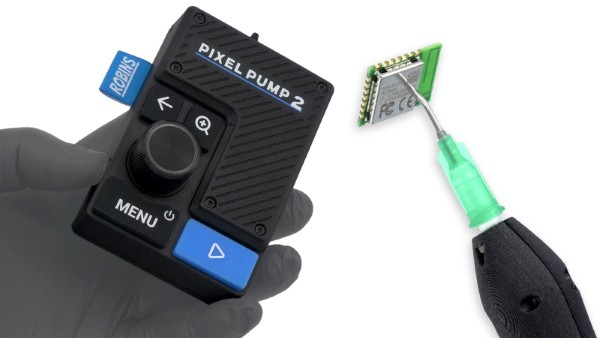

Robin Reiter [recently
announced](https://www.crowdsupply.com/robins-tools/pixel-pump-2) the update to
his popular elec manufacturing tool: Pixel Pump 2.

Taking feedback from the [first-gen
model](https://www.crowdsupply.com/robins-tools/pixel-pump), it improves many
features; notably housing the device in a smaller, slicker package. One thing
that hasn't changed: MicroPython will continue to be used for the firmware.

---

### Kevin McAleer has been busy!

Friend of our meetup, Kevin McAleer has been busy on a number of fronts:

He created [TinyWiki](https://github.com/kevinmcaleer/tiny_wiki), a lightweight,
self-hosted wiki system for MicroPython.

He's teased the [SMARS Mini](https://x.com/kevsmac/status/1616727857534746624)
rover.

And he's released a couple of popular videos:

Why is everyone switching to MicroPython
<iframe width="560" height="315" src="https://www.youtube.com/embed/6cjYMklEsbk?si=o3nsrj3HHMSVOiON" title="YouTube video player" frameborder="0" allow="accelerometer; autoplay; clipboard-write; encrypted-media; gyroscope; picture-in-picture; web-share" referrerpolicy="strict-origin-when-cross-origin" allowfullscreen></iframe>

Build this next (I2C)
<iframe width="560" height="315" src="https://www.youtube.com/embed/lthSloWM3Fk?si=LilxOBL7c6CigGcS" title="YouTube video player" frameborder="0" allow="accelerometer; autoplay; clipboard-write; encrypted-media; gyroscope; picture-in-picture; web-share" referrerpolicy="strict-origin-when-cross-origin" allowfullscreen></iframe>

---

### FOSDEM '26: "MicroPythonOS: Best of Android Now on MCUs"

Thomas Farstrike will be talking about his
[MicroPythonOS](https://fosdem.org/2026/schedule/event/9GGXNF-micropythonos-best-of-android-now-on-mcus/)
at FOSDEM '26.

(via
[LightningPiggy@X](https://x.com/LightningPiggy/status/2011090768510009565))

---

### Pac-Main on Pi Pico2 in MicroPython

Sam Neggs, at it again with an authentic implementation of Pac-Man! 1200 lines
of pure MicroPython using Viper optimisations. Includes audio!

<iframe width="560" height="315" src="https://www.youtube.com/embed/RfpIE6cYvNI?si=U8oaWVmD5Oa9TUlI" title="YouTube video player" frameborder="0" allow="accelerometer; autoplay; clipboard-write; encrypted-media; gyroscope; picture-in-picture; web-share" referrerpolicy="strict-origin-when-cross-origin" allowfullscreen></iframe>

---

### emlearn-micropython in JOSS 

Congrats to Jon "jonnor" Nordby for his published paper in the Journal of Open
Source Software! 

[emlearn-micropython: Machine Learning and Digital Signal Processing for
MicroPython](https://joss.theoj.org/papers/10.21105/joss.09093/)

His library,
[emlearn-micropython](https://github.com/emlearn/emlearn-micropython) is a great
way to get in to machine learning on resource-constrained devices, check it
out!.

[via [LinkedIn](https://www.linkedin.com/posts/jonnordby_i-published-my-first-paper-in-the-journal-activity-7408308334501609472-Nw7F/?rcm=ACoAAACvQxYBNn036A_J5ODQ3Vc4hYKrxn7Z1ro)]

---

### Magic Pages

[Magic
Pages](https://www.hackster.io/Infineon_Team/magic-pages-a-self-turning-book-with-audio-cf321f)

---

### Random Nerd Tutorials: ESP-NOW with ESP32

[MicroPython: ESP-NOW with ESP32 – Control Multiple Boards (One to
Many)](https://randomnerdtutorials.com/micropython-esp-now-esp32-one-to-many/)

Also see their [Year in Review 2025](https://randomnerdtutorials.com/year-in-review-2025/). Congrats to creators Rui and Sara Santos on their impending baby boy!

### Counter Strike 2 HUD (Galactic-CS2)

[Counter Strike 2 HUD: Galactic CS2](https://github.com/ChompLive/Galactic-CS2)

[Reddit Discussion](https://www.reddit.com/r/raspberrypipico/comments/1q3rl49/i_built_a_physical_kill_counter_for_cs2_python/)

---

### Inky Kitchen

[Inky Kitchen](https://gitlab.com/tangiblebytes/inky-kitchen)

---

### picotronix: Pico 2 based Logic Scope

[PicoTronix](https://picotronix.com/blog/an-introduction-to-picotronix/)

(via [picotronix@X.com](https://x.com/picotronix/status/2011639492260872507))

---

### TinyCity

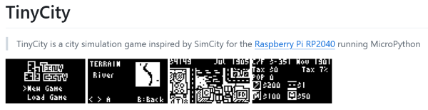

[TinyCity](https://github.com/chrisdiana/TinyCity) is a *very cool*
SimCity-inspired city simluation game that targets the Thumby (RP2040) with it's
_tiny_ 72x40 display. Despite the low-res images there's some sophistication
hidden in here! The code is an interesting read.

Author Chris Diana is looking to update the code to allow
for different (larger!) displays.

(via [HackerNews](https://news.ycombinator.com/item?id=46632768))

---

### WiFi Intrusion Detection System

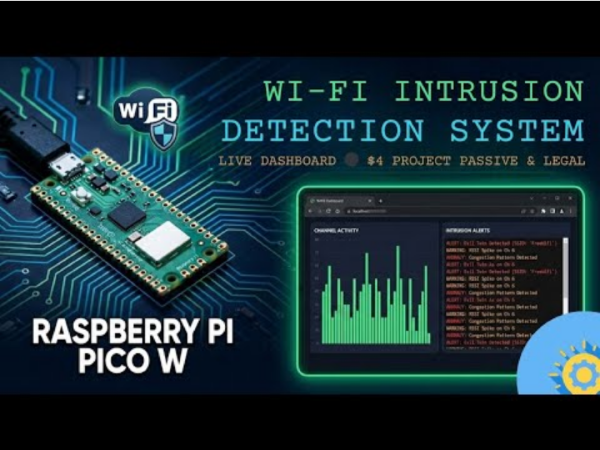

The [Wi-Fi Intrusion Detection System
(WIDS)](https://github.com/flatmarstheory/Wi-Fi-Intrusion-Detection-System) is
designed to run on a Raspberry Pi Pico W and monitors the local RF environment
to detect common wireless attacks, serving as a real-time security dashboard
accessible via any web browser. Algorithms all in MicroPython.

---

### Orbigator

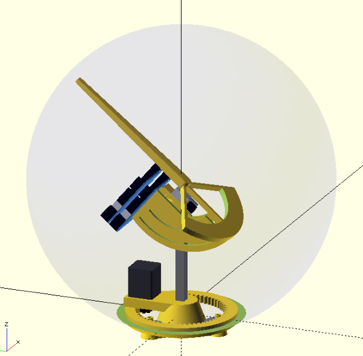

From the repo:

[Orbigator](https://github.com/wyolum/orbigator) is an open‑source mechanical
model that physically demonstrates how a satellite orbits the Earth. It uses a
Raspberry Pi Pico 2 and precision DYNAMIXEL servo motors to move a pointer
around a real globe, tracking a satellite's ground track in real-time.

The system computes complex orbital mechanics—including Kepler's laws and J2
perturbation effects—to determine the satellite's instantaneous position
relative to the Earth's surface. 

---

### CircuitPython IDE adds a debugger

<iframe width="560" height="315" src="https://www.youtube.com/embed/etOBbmExZmM?si=NIDl2oR_JL6iECu-" title="YouTube video player" frameborder="0" allow="accelerometer; autoplay; clipboard-write; encrypted-media; gyroscope; picture-in-picture; web-share" referrerpolicy="strict-origin-when-cross-origin" allowfullscreen></iframe>

---

### RGB-LED-Ring-Clock-Pico

Great beginner project!

[RGB-LED-Ring-Clock-Pico](https://github.com/TellinStories/RGB-LED-Ring-Clock-Pico)

[Instructables](https://www.instructables.com/RGB-LED-Ring-Clock/)

## Quick Bytes

### 100 Days, 100 IoT projects

Kritish Mohapatra has set himself a [100 day
challenge](https://github.com/kritishmohapatra/100_Days_100_IoT_Projects): A
MicroPython project every day for 100 days.

### micropython-buzzer

[MicroPython Buzzer](https://github.com/fruch/micropython-buzzer)

### micropython-worldtimeapi

Synchronising time to a device can be *challenging*. NTP is one solution but
using the [WorldTimeAPI](https://worldtimeapi.org/) is a good alternative,
particularly if you need to use local time including daylight savings time.

I wrote
[micropython-worldtimeapi](https://github.com/mattytrentini/micropython-worldtimeapi)
to make it easy to sync your device to the local time provided by the
WorldTimeAPI.

### Particle is being acquired by Digi...

Hot-off-the-press: 🔥

[Particle is being acquired by Digi to power the next 40 years of IoT
innovation](https://www.particle.io/blog/particle-is-being-acquired-by-digi-to-power-the-next-40-years-of-iot-innovation/)

### OpenMV Update: Production Underway!

The new OpenMV N6 and AE3 cameras are [now in
production](https://www.kickstarter.com/projects/openmv/openmv-n6-and-ae3-low-power-python-programmable-ai-cameras/posts/4577797)!

(Follow the link to see a most excellent image with Damien!)

### I put an ESP32 in My Stationary Bike

Kyle Husman had a staionary (training) bike and wanted to measure cadence; slap in an ESP32 and watch the reed switch, voila! His [write-up](https://bsky.app/profile/kylehusmann.bsky.social/post/3m6wxwysd4c24) is well worth a read.

[via [Bluesky](https://bsky.app/profile/kylehusmann.bsky.social/post/3m6wxwysd4c24)]

### PIC32MX port

It's rough..but it's a start! If you're interested in the PIC32MX platform go check out iruka's efforts:

https://github.com/iruka-git/micropython/tree/master/pic32mx

I'm not a huge fan of the PIC32 platform but these come in a DIP which is fairly novel these days.

([via iruka3@X.com](https://x.com/iruka3/status/2002924839989071873))

### IndyPy: Python Meets MicroControllers

Drew Westrick presented on using MicroPython to the IndyPy Meetup group. I
listened in; great talk!

IndyPy: [MicroPython with Drew](https://www.meetup.com/indypy/events/311854930/)

---

## Final Thoughts

### KiDoom

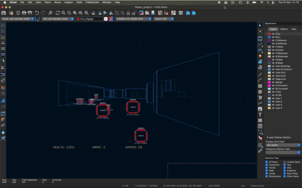

For those that use KiCAD, you now have one of the coolest extesions:
[KiDoom](https://www.mikeayles.com/#kidoom)!

### The Mythical Man-Month at 50

One of the most influential software engineering books, the Fred Brooks classic
*The Mythical Man-Month* turns 50 this year. Among many pearls of widom, it also
contains one of my favourite quotes:

> The bearing of a child takes nine months, no matter how many women are assigned.

[Kieran Potts revisited the book](https://kieranpotts.com/mythical-man-month-50)
to see if the guidance was still valid. 

TL/DR: It holds up well.

### Midjourney fun

Reggae mon!

