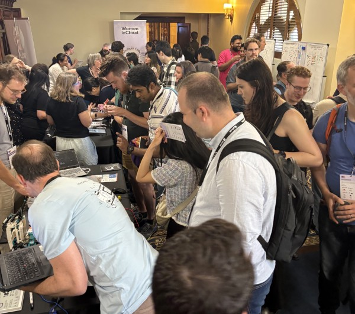
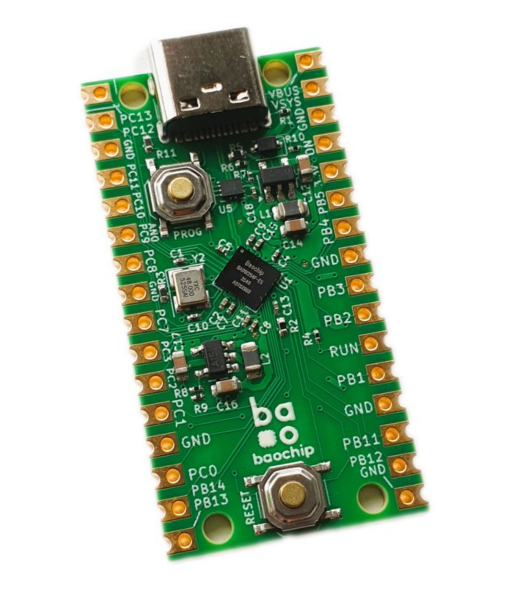
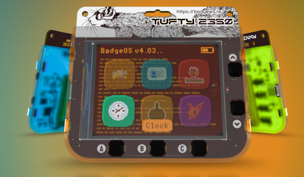
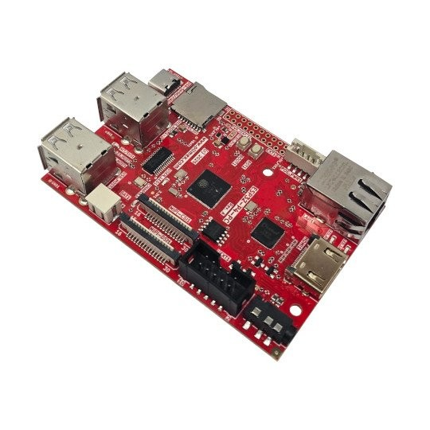
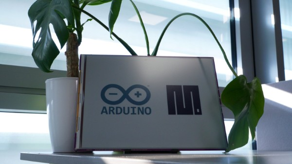
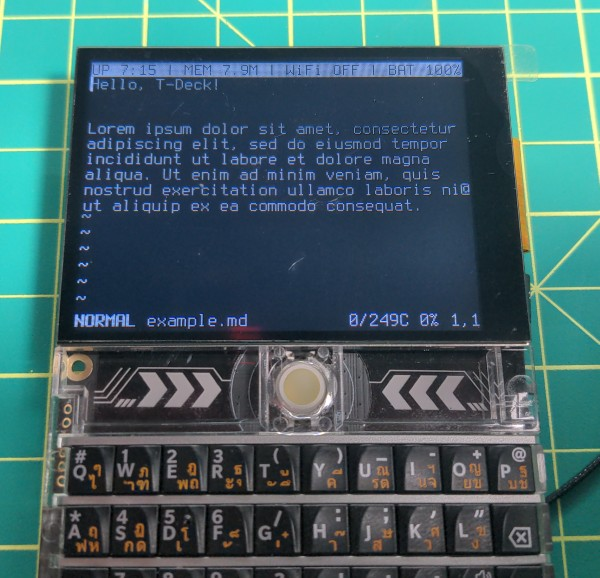
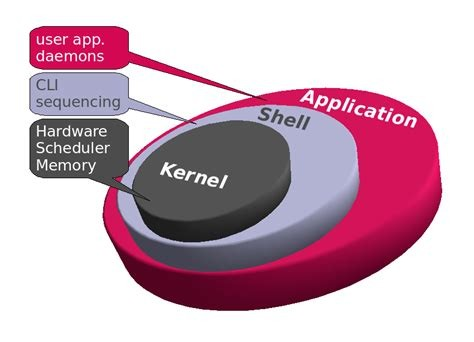
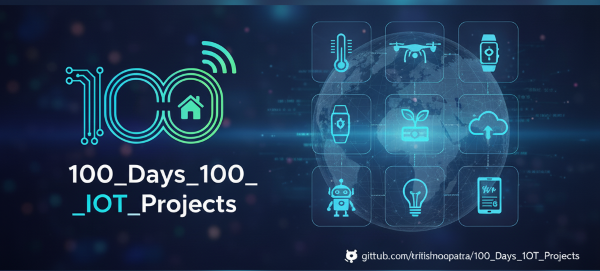
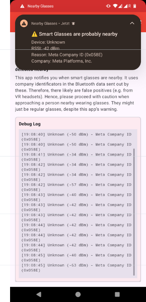

*Matt* delivers the news roundup

# News Round-up

## Headlines

### DDD: MicroPython Community Booth

As mentioned last month, a few of us (Damien, Raf, Sean and I) attended [DDD
Melbourne](https://www.dddmelbourne.com/) and hosted a MicroPython Community
Booth.

DDD was held at the Melbourne Town Hall and had around 600 attendees. The
'booth' was *super* busy, we had a steady stream of people coming through the
entire day - and it felt like we spoke to a significant percentage of those 600
attendees!

We'd hastily pulled together some demos so there was plenty of flashing LEDs,
eye-catching displays and cute gadgets on display to draw people in. 

A huge thanks to everyone who helped out and to the DDD organisers that supported
our attendance.

And welcome to those of you present today that we met at DDD!

---

### Meetup 🡆 Luma

...aaaand that's that! I've now cancelled the Meetup subscription.

Scummy: When you start the cancel process, *then* they offer a discount to stick around.

Also Scummy: They start asking other members to host/pay the subscription.

---

### Housekeeping

Publishing the videos often occurs after this [Melbourne MicroPython Meetup
blog](https://melbournemicropythonmeetup.github.io/) is updated. So the videos
have traditionally *not* been included. Mostly because I'm lazy and don't update
the blog after the initial post.

However! I was recently inspired and revised the previous year or two of posts,
updating them with links to the published videos. So they're now at the top of
the blog post

As always, thanks to Barry for processing and publishing the vids!

---

## Hardware News

### Dabao

Andrew "bunnie" Huang is - via Crowd Supply - bringing the
[Dabao](https://www.crowdsupply.com/baochip/dabao) board to market with the help
of Sean "xobs" Cross. The Dabao is a fascinating board with some unique
properties:

* RISC-V Vexriscv Core @ 350MHz
* 2MB RAM, 4MB RRAM (Resistive RAM aka memresistor; like flash)
* USB HS
* Quad core IO accelerator (based on PicoRV32)
* 2x UART, 3x I2C, 2x SPI, 4x PWM

But the most notable parts for me are: 1) It's as open as possible, 2) there's
an MMU on a micro!

Bunnie and Xobs presented at last years' Chaos Communication Congress about
their work getting the micro built and creating the Rust-based OS, 'Xous', that
also has some interesting attributes, particularly how it takes advantage of the
MMU, the talk is well worth your time!

<iframe width="560" height="315" src="https://www.youtube.com/embed/DaWkfSmIgRs?si=ewbL2FsSzNMhfXzu" title="YouTube video player" frameborder="0" allow="accelerometer; autoplay; clipboard-write; encrypted-media; gyroscope; picture-in-picture; web-share" referrerpolicy="strict-origin-when-cross-origin" allowfullscreen></iframe>

---

### Pimoroni Badgeware: Badger, Tufty, Blinky

Pimoroni have updated some of their 'badge' boards and consolidated them into a
family: [Badgeware](https://badgewa.re)! There are three badges, Badger, Tufty
and Blinky - they're all based around the RP2350 with 8MB RAM and 16MB flash,
Wifi/BLE and an 1000mAh battery. The differences are in the displays: e-paper,
IPS and white LED.

Excellent products, all 'round!

**£49.50 ea (~A$95)**

---

### Olimex ESP32-P4-PC

Olimex released the
[ESP32-P4-PC](https://www.olimex.com/Products/IoT/ESP32-P4/ESP32-P4-PC/open-source-hardware),
another P4-based board that is like a little mini-PC. 

Big bang-for-buck!

- ESP32-P4, dual 400MHz RISC-V
- 768KB internal RAM, **32MB** PSRAM, 16MB flash
- Ethernet **with PoE**
- MIPI CSI and DSI
- HDMI
- Audio output jack
- Battery charge/sense circuit

**25€** (~A$42)

---

### Inkplate 13SPECTRA

[Soldered](https://soldered.com/) released the [Inkplate
13SPECTRA](https://www.crowdsupply.com/soldered/inkplate-13spectra):

- 13-inch 1600x1200 E-Ink SPECTRA color e-paper
  - Six colors: black, white, yellow, red, blue, green
- ESP32-S3, 32 MB flash, 16 MB PSRAM
- Ultra-Low Power: 14 µA deep-sleep current
- Wi-Fi, BLE, USB-C, 3x Qwiic
- Onboard microSD card slot and RTC w memory + battery
- JST connector for 3.7V Li-ion battery

And, sure enough, they've committed to continuing with [MicroPython
support](https://docs.soldered.com/micropython/install/).

**US$309** or US$349 with an enclosure and 3000mAh battery

---

## Other news

### mpytool

In [Discussion #18787](https://github.com/orgs/micropython/discussions/18787),
Pavel Revak announces that he's been working on
[mpytool](https://github.com/pavelrevak/mpytool), an alternative to mpremote. 

While I'd prefer people contribute to mpremote so everyone can benefit, there
are certainly some interesting ideas in mpytool! In particular, Pavel has
implemented a mount-like feature but compiles to bytecode transparently with
mpy-cross on the PC. There's also the ability to copy files with compression and
to symlink files into a mounted filesystem. 

I hope to see some of these features uplifted to mpremote at some point!

---

### mpy_vt: Optimized ANSI Terminal Engine for MicroPython

[mpy_vt](https://github.com/8bitmcu/mpy_vt) by Vincent M aims to get an ANSI
terminal running well on MicroPython. Wrapping the mature
[st](https://st.suckless.org/) (suckless terminal), vi, and providing solid
hardware support for the [LilyGo T-Deck](https://lilygo.cc/products/t-deck),
this is a powerful, portable little unit that can Telnet into whatever box you
like!

---

### Planet Innovation open-sources MicroPython hardware drivers

I'm happy to report that Planet Innovation have open-sourced five new
MicroPython hardware drivers:

* [NXP PCA9635](https://github.com/PlanetInnovation/pca9635-led-controller) LED
  Controller
* [NXP PCA9535](https://github.com/PlanetInnovation/pca9535-io-expander) GPIO
  Extender
* [FT24CXXA](https://github.com/PlanetInnovation/ft24cxxa-eeprom) I2C EEPROM
  family
* Opticon [MDC200](https://github.com/PlanetInnovation/mdc200) UART barcode
  scanner
* Microchip [MCP3462](https://github.com/PlanetInnovation/mcp3462-adc) SPI ADC

---

### rMach

[rMach](https://github.com/SystemSoftware2/rMach) is a minimalist, Mach-inspired
microkernel designed for resource-constrained environments (ESP32/RP2040)
running MicroPython. It fits in 702 lines of code and consumes just 19.9 KB of
RAM. 

(via
[reddit](https://www.reddit.com/r/embedded/comments/1rbpv02/rmach_a_700line_microkernel_for_micropython/))

---

### Virtual Pet

Moonbench
[announced](https://bsky.app/profile/moonbench.bsky.social/post/3mf52m7geoc27)
that they've open-sourced a Virtual Pet implementation for the ESP32:
[catode32](https://github.com/moonbench/catode32). Tested on the ESP32-C6 and C3
it ought to port to any device with little effort.

---

### 100 days, 100 IoT projects

Kritish Mohapatra, a 3rd-year EE undergrad, has a goal of [100 days, 100 IoT
projects](https://github.com/kritishmohapatra/100_Days_100_IoT_Projects)! He's
using ESP32's or Raspberry Pi Pico's and MicroPython - and  documenting the whole
process. 

Day 58 has just passed by at the time of writing, and Kritish has a great
collection of projects: irrigation systems, servo control, web-based interfaces,
devices communicating over ESP-NOW...there's plenty here to learn from and I'm
delighted that he's documenting everything so thoroughly.

If you want to support Kritish's open source effort, he'd happily receive GitHub
sponsorship or even just buy him a coffee. 

---

## Quick Bytes

### IndyPy: Python meets Microcontrollers

Last month I mentioned that I'd attended an IndyPy event where Drew Westrick
presented about using MicroPython; that talk is now available to watch online:
[Speed up IOT Prototyping with
MicroPython](https://sixfeetup.com/company/news/speed-up-iot-prototyping-with-micropython).

<iframe width="560" height="315" src="https://www.youtube.com/embed/y23RqraoN4M?si=tUZWaB4ts3Csh_oT" title="YouTube video player" frameborder="0" allow="accelerometer; autoplay; clipboard-write; encrypted-media; gyroscope; picture-in-picture; web-share" referrerpolicy="strict-origin-when-cross-origin" allowfullscreen></iframe>

---

### WorldTimeAPI: Sunset!

Less than a couple of weeks after I [published a MicroPython
library](https://github.com/mattytrentini/micropython-worldtimeapi) to the
excellent [WorldTimeAPI](https://worldtimeapi.org/)...it has been sunset! Closed
down after 7 years of service. What timing!

---

## Final Thoughts

### Nearby Glasses

A project by Yves Jeanrenaud recently popped up, [Nearby
Glasses](https://github.com/yjeanrenaud/yj_nearbyglasses), that attempts to
detect when Smart Glasses are nearby and alert the user. It's now available as
an Android app. 

It uses some heuristics based on BLE data for the
decision-making...and it strikes me that this would be a *perfect* MicroPython
application! 

---

### Midjourney fun

The WorldTimeAPI has been sunset

