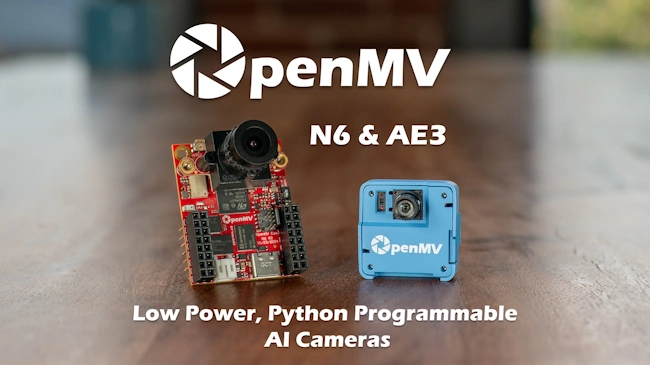
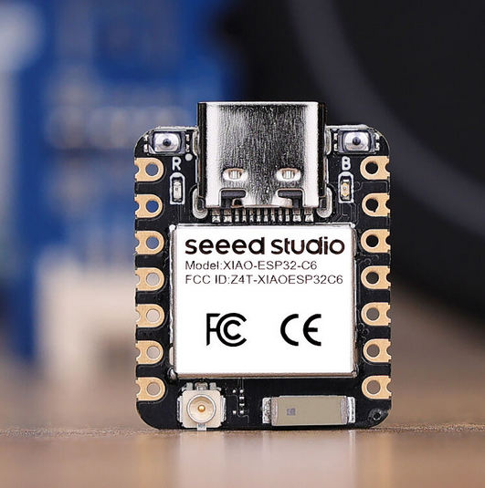
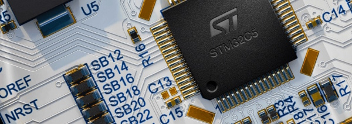
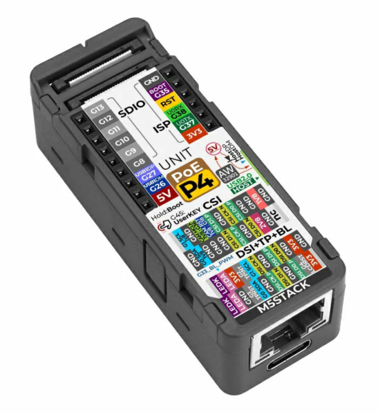
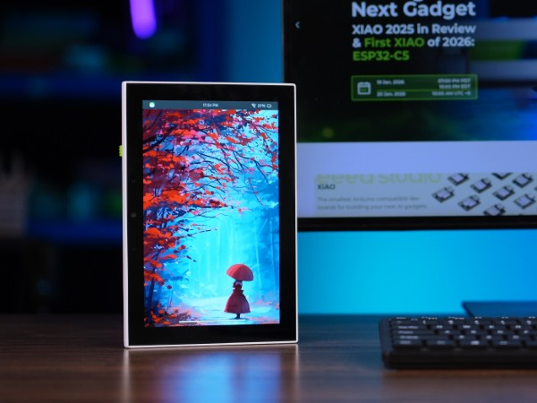
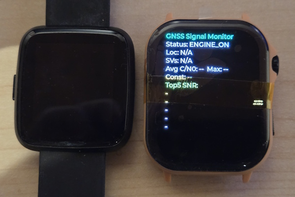
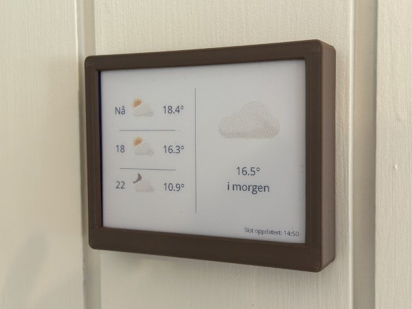
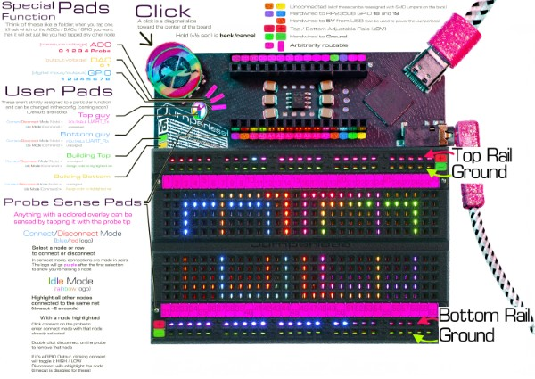

*Matt* delivers the news roundup, Moonbench discusses their
[catode32](https://github.com/moonbench/catode32?utm_source=luma) project

# News Round-up

## Headlines

### MicroPython v1.28


MicroPython v1.28 is nearing release. Some of the improvements:

- `machine.CAN` low-level driver added, stm32 to start with
- `machine.PWM` for stm32
- t-strings added
-  `machine.Counter` and `machine.Encoder` added to mimxrt (joins ESP32)

Check out [Milestone #12](https://github.com/micropython/micropython/milestone/12) for more!

---

### PyCon AU 2026


[PyCon AU 2026](https://2026.pycon.org.au/) is in Brisbane, August 26-30.

If you're thinking of attending, the [Call for
Proposals](https://2026.pycon.org.au/cfp/) ends this week on the 29th
[AOE](https://www.timeanddate.com/time/zones/aoe).

---

### Housekeeping: Luma


Some folks have mentioned they haven't received notifications for upcoming
meetups. Now that we're using Luma you should subscribe to the 'overall'
MicroPython Calendar:

[https://luma.com/micropython](https://luma.com/micropython)

You'll then get an email whenever a new meetup is scheduled and, I *think*, you'll
get a reminder close to each event. 

Note that each meetup *also* gets a unique page/URL.

I've noticed fewer people RSVP'ing to each event since moving to Luma; if you
could RSVP that would be really helpful! It's hard to know if I should be
'advertising' it more widely - but at least having a vague idea of how many
people are coming gives me an idea about attendance.

Unfortunately (with meetup and Luma) it's not possible to set up a recurring
event with the 'xth Wednesday of the month' rule.

Thanks!

---


## Matts New Hardware

### M5 Stack StickS3

(Covered in the [January
2026](https://melbournemicropythonmeetup.github.io/January-2026-Meetup/)
meetup.)


ESP32-S3, 8MB PSRAM, 8MB Flash, 1.14" 135x240 LCD display (ST7789P3).

Mic & speaker (I2S), 6-axis IMU, IR transmitter & receiver, 250mAh battery

---

### OpenMV AE3

(First covered in [March 2025](https://melbournemicropythonmeetup.github.io/March-2025-Meetup/).)



An aboslute powerhouse in a *tiny* package. My first Alif microcontroller. 

---

### Seeed XIAO ESP32C6

([May 2024](https://melbournemicropythonmeetup.github.io/May-2024-Meetup/).)



ESP32-C6, 4MB Flash, on-board & external antenna.

---


## Hardware News

### STMicro Announces STM32C5 family



[STMicro announces STM32C5 family](https://newsroom.st.com/media-center/press-item.html/p4754.html)

[CNX: STMicro STM32C5](https://www.cnx-software.com/2026/03/09/stmicro-stm32c5-entry-level-144-mhz-cortex-m33-mcu-features-up-to-1mb-flash-256kb-sram-ethernet-can-bus/)

STMicro launched their latest microcontroller family...and I think they'll sell
these by the bucketload.

They're positioned as the 'entry level' micro but are surprisingly powerful and
*very* affordable. 

Some highlights:

- Cortex M33 @ 144MHz
- Up to 1MB flash (at least 128KB)
- Up to 256KB RAM (at least 64KB)
- Rich peripherals: OctoSPI, up to 118x IO, USB, Ethernet, CAN, I2S, I3C,
  ADC/DAC, more
- 11 different packages: 3x3mm -> 14x14mm
- Wide operating temperature: -40°C to +125°C

Pricing starts at US$0.64 in quantity.

With those features, it's like they designed the family to target MicroPython!

### M5Stack Unit PoE with ESP32-P4



The new [Unit PoE with ESP32-P4](https://shop.m5stack.com/products/unit-poe-with-esp32-p4) is a compact little beast! This ESP32-P4-powered thumb-sized device adds PoE to the mix:

- ESP32-P4, 16MB flash, 32MB PSRAM
- 24 pin FPC breakouts for MIPI DSI and CSI
- 10/100M PoE Ethernet
- 2x USB-C
- Compact: 65x33x21mm

**US$21.50**

---

### Seeed Studio reTerminal D1001



Seeed Studio have expanded their reTerminal range with the
[D1001](https://www.seeedstudio.com/reTerminal-D1001-p-6729.html). If you're
looking for a decent microcontroller-powered display this might be it.

- ESP32-P4, 32MB flash, 32MB PSRAM
- 8" 1280x800 cap touch display
- 2MP (1600x1200) camera
- ESP32-C6 for wifi/ble
- Audio stack: dual mic and adc output
- 2500mAh battery
- RTC, 6-axis IMU

Also, Hackster.io: [Seeed Studio Targets Next-Gen HMI with the Espressif ESP32-P4-Powered reTerminal D1001](https://www.hackster.io/news/seeed-studio-targets-next-gen-hmi-with-the-espressif-esp32-p4-powered-reterminal-d1001-cd9cf0005a86)

**US$85**

---

### Dabao


The Dabao was discussed [last
month](https://melbournemicropythonmeetup.github.io/February-2026-Meetup/), but
there's an *excellent* article by Bunnie about one of the more unique features
of the Bao chip: [BIO: The Bao I/O
Coprocessor](https://www.bunniestudios.com/blog/2026/bio-the-bao-i-o-coprocessor/)

It's easy to imagine a MicroPython BIO assembler, similar to that implemented
for the Raspberry Pi RP2 PIO module.

---

### Inkplate 13SPECTRA


[Last month](https://melbournemicropythonmeetup.github.io/February-2026-Meetup/)
we covered the Inkplate 13SPECTRA, a *beautiful* six-colour 13" ePaper display.

[Soldered](https://soldered.com/) recently published their [Week Three
Status](https://www.crowdsupply.com/soldered/inkplate-13spectra/updates/week-three-status-report)
that includes update to the MicroPython library but did mention "because
MicroPython is an interpreted language and not very low-level friendly, decoding
and displaying a full 1600x1200 image file *can take up to a minute*."

Anyone want to prove them wrong?

(Kudos to Soldered for releasing the MicroPython library! But perf can be improved!)

---

### PineTime Pro Watch



[Pine64's March Update](https://pine64.org/2026/03/24/march_2026_fosdem)
announced that the [PineTime Pro was in
development](https://pine64.org/2026/03/24/march_2026_fosdem). 

We first covered the original PineTime Watch in [September
2019](https://melbournemicropythonmeetup.github.io/September-2019-Meetup/)!

Upgrades include:

- AMOLED display
- GPS
- A custom chip (??)
- A digital crown which also features an extra button
- A blood oxygen sensor
- Power management improvements

"More information to come!"

---


## Other news

### Amiga port


Fabrice - with LLM assistance - has built a MicroPython port for the Amiga
(Motorola 68K):
[micropython-amiga-port](https://github.com/OoZe1911/micropython-amiga-port). It
looks remarkably complete!

via [Amiga News.de](https://www.amiga-news.de/en/news/AN-2026-03-00087-EN.html).

This isn't the first Amiga port we've come across, we covered
[micropython-amiga](https://github.com/jyoberle/micropython-amiga) back in
[August 2024](https://melbournemicropythonmeetup.github.io/August-2024-Meetup/)

---
### PyBricks - now with 'LEGO Vision'


[Laurens Valk teases a new feature for
PyBricks](https://fosstodon.org/@laurensvalk/116279090476777981); Vision! 

Use a smartphone to process images in realtime and communicate details to a
PyBricks hub. The current example uses colour tracking so a robot can follow a
coloured ball - but Laurens mentioned "...there are more demos on the way".

---

### Agentic Test Bench

Provide Claude with the ability (via
[scope-mcp](https://github.com/Netlist-Studio/scope-mcp)) to communicate with
your (admittedly pricey) oscilloscope and then have your agent verify that I2C
timing is correct!

Uses MicroPython to generate the I2C signals, of course.

<iframe width="560" height="315" src="https://www.youtube.com/embed/9oMwjWW3wsg?si=5ux7fh1W9TYu4rXt" title="YouTube video player" frameborder="0" allow="accelerometer; autoplay; clipboard-write; encrypted-media; gyroscope; picture-in-picture; web-share" referrerpolicy="strict-origin-when-cross-origin" allowfullscreen></iframe>

---

### MicroPython ePaper Weather Station



Frederik Andersen seems to have started the
[micropython-ePaperWeatherStation](https://github.com/frederik-andersen/micropython-ePaperWeatherStation)
project but Daniel Kharlamov appears to have [updated it
recently](https://github.com/Damov/micropython-ePaperWeatherStation)...in any
case, it's a nice looking ePaper Weather Station! 

---

### micropython-usunfish


[Sunfish](https://github.com/thomasahle/sunfish) is a popular Chess engine known
for it's power, particularly given it's simple implementation (131 LOC!).
fizban99 has published a MicroPython fork of Sunfish:
[microptyhon-usunfish](https://github.com/fizban99/micropython-usunfish). 

It appears to have been modified carefully, with memory use being a prime
consideration. The changes have been well documented. GPLv3.

Just need to add a graphical UI - and perhaps a touchscreen - and you'll have
yourself a chess game that might not beat Magnus Carlsen but will challenge most
players! ([Peter Hinch may already be on the
case](https://github.com/fizban99/micropython-usunfish/issues/1)!)

[Note that there was [another MicroPython port of
Sunfish](https://github.com/jacklinquan/micropython-sunfish) a few years ago by
Quan Lin.]

---

### Planet Innovation open-source efforts


Planet Innovation recently open-sourced
[micropython-mock](https://github.com/PlanetInnovation/micropython-mock) which
provides a subset of the features `unittest.mock.Mock`:

```python
from micropython_mock import Mock

# Create a mock object
mock_obj = Mock()

# Use the mock
mock_obj.some_method("arg1", kwarg="value")
mock_obj.another_method()

# Check calls
assert mock_obj.some_method.called
assert mock_obj.some_method.call_count == 1
assert mock_obj.another_method.call_count == 1
```

And note that
[micropython-memory-profiler](https://github.com/PlanetInnovation/micropython-memory-profiler)
has been moved to the *PlanetInnovation* organization.

---

### Jumperless v5



I'm sure we've discussed [Jumperless
v5](https://github.com/Architeuthis-Flux/JumperlessV5) before; it is the most
wonderfully over-engineered breadboard *in history*. It allows you to establish
connections between breadboard points by using a 'wand' - and there are LEDs
*all over* this thing so you can easily see those connections.

Anyway, Jumperless can also [run
MicroPython](https://docs.jumperless.org/08-micropython/) so that you have an
[API](https://docs.jumperless.org/09.5-micropythonAPIreference/) to manage
those connections in software.

More recently, creator Kevin
[announced](https://bsky.app/profile/architeuthisflux.bsky.social/post/3mfkgqbdn7s2u)
that he's also forked [ViperIDE](https://viper-ide.org/) and made a custom IDE:
So [JumperIDE](https://ide.jumperless.org/) is now a thing! 

### micrOS


BxNxM released [micrOS](https://github.com/BxNxM/micrOS), a MicroPython
framework to accelerate IoT development; it provides OTA updates, remote config
management and shell access, as well as a bunch of built-in peripheral drivers
to get started quickly.

I'm still wrapping my head around how it works; maybe some of you can report
back?

---

### Build an F1 Display


Nuno Bispo published [Build an F1 Pit Wall Display with ESP32 CYD and OpenF1
API](https://developer-service.blog/build-an-f1-pit-wall-display-with-esp32-cyd-and-openf1-api/)
where he discusses a weekend project (trimmed for brevity):

> "The 2026 Australian GP is live. Russell and Leclerc are battling it out, and
> you want the data on your desk, not a browser tab, not your phone. Something
> physical that just sits there. You have an ESP32 CYD in the parts drawer:
> ...OpenF1 is free and has real F1 timing data.
> 
> This sounds like a fun Sunday afternoon project. **It wasn't**."

Nuno discusses the difficulties with the project; thankfully no major issues
with MicroPython! More with data wrangling since the API drops a heap of data as
a live stream; collating the information in a usable way is challenging. 

An important part of his solution was to sit a Python aggregator in between the
OpenF1 API and the microcontroller. 

On the plus side, the end result looks great!

---


## Quick Bytes

### Raspberry Pi Pico as AM Radio Transmitter

Pooya Esfandiar uses the PIOs in a Pico 2W to create a genuine AM signal:
[Raspberry Pi Pico as AM Radio
Transmitter](https://www.pesfandiar.com/blog/2026/02/28/pico-am-radio-transmitter)

Bonus: I never knew that ditty was called [Shave and a
Haircut](https://en.wikipedia.org/wiki/Shave_and_a_Haircut)! 

---

### Terminals and graphics

Nicolas Mattia published [Terminal Graphics Protocol for fast embedded
development](https://nmattia.com/posts/2026-03-10-kitty-graphics-micropython/)
where he documents how he created [termbuf](https://github.com/nmattia/termbuf)
to display images in the terminal using the Kitty Graphics Protocol.

Nicolas used it to rapidly iterate on framebuf designs before even using
hardware.

---

### Forth in MicroPython

I had a tab open for ages: [Build Your Own Forth
Interpreter](https://codingchallenges.fyi/challenges/challenge-forth/). I
thought it might make for a neat coding challenge.

But I never found time for it...so before closing the tab I threw Claude at it.
A one-shot later and we now have
[forth-in-micropython](https://github.com/mattytrentini/forth-in-micropython).

---

### Badge Engineering

Kevin McAleer dives deep into the three new Pimoroni badge boards (that we
covered [last month](https://melbournemicropythonmeetup.github.io/February-2026-Meetup/)) in a [recent
stream](https://www.youtube.com/live/L4bFDYHUAy0).

---


## Final Thoughts

### KiCAD 10 released


[KiCAD v10.0.0](https://www.kicad.org/blog/2026/03/Version-10.0.0-Released/) was
released on the 20th March. 

Although our group focuses on firmware, many of us play with hardware too - and
KiCAD has become an *excellent* tool for electronic design and PCB layout. 

---

### Midjourney fun

