*Matt* demos 'mp burner', *Sean* delivers the news roundup

# News Round-up

---
## Headlines

### MicroPython turns 13

13 years ago, on the 29th of April 2013, the Kickstarter for the Micro Python Board launched _(citation needed? Damien?)_ Kevin McAleer has marked the date with [a summary of all his MicroPython content](https://www.kevsrobots.com/blog/micropython.html).

Thank you Damien, and congratulations!

The [first commit to the repo on GitHub](https://github.com/micropython/micropython/commit/429d71943d6b94c7dc3c40a39ff1a09742c77dc2) was October 5, 2013 – and there's been 18,577 commits to `master` since then. It's also fun to look at The Wayback Machine's first captures of the [Kickstarter page](https://web.archive.org/web/20131116054147/http://www.kickstarter.com/projects/214379695/micro-python-python-for-microcontrollers) and the [MicroPython website](https://web.archive.org/web/20131126010602/https://micropython.org/), from November 2013.

### LiteX

MicroPython v1.28 is now available for LiteX, now with improved hardware API support

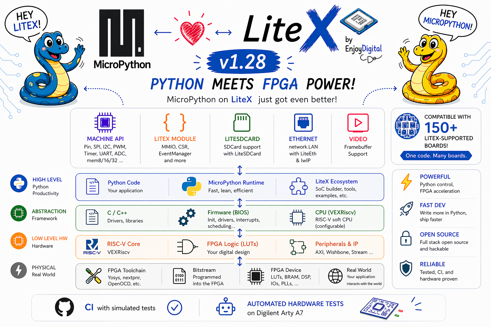

LiteX is a custom SoM builder for FPGAs, essentially it lets you define the system that you want with one (or more) CPUs and various hardware peripherals – which you can then control using MicroPython.

It's got familiar MicroPython APIs for:

* `Pin`, `SPI`, `I2C`, `PWM`, `Timer`, `UART`, `SDCard`, `ADC` – all automatically built depending on the SoC you've built
* `network.LAN` – using the standard MicroPython network API
* Helpers for `video` using a `framebuf.FrameBuffer`

Take a [look at their wiki to get started](https://github.com/enjoy-digital/litex/wiki/Run-MicroPython-CircuitPython-On-Your-SoC), where they've got links to everything you need (including their [fork of MicroPython](https://github.com/litex-hub/micropython/tree/litex-rebase/ports/litex))

### AMYboard

From Brian Whitman, following up from the excellent [Tulip](https://github.com/shorepine/tulipcc) board, comes the AMYboard – a "...fully complete audio synthesizer for US$29.90 that can be at least three things: synthesizer, dev board, Eurorack"

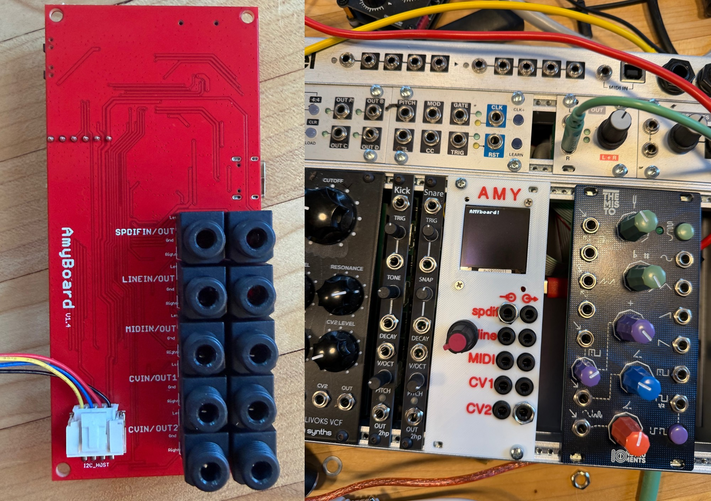

Similarly to the Tulip there's an [online editor](https://www.amyboard.com/editor/), but the AMYboard fits into a standard audio equipment rack mount – making it easy to fit into a professional setup, but for a fraction of the cost with so much more customisation than anything off the shelf.

It supports:

* MIDI in and out
* SPDIF digital audio in and out
* Line-level audio in and out
* CV in and out (for integrating with other hardware, pedals, etc)
* All sorts of software-defined synth effects

Only US$30

**Buy**: [AMYboard](https://www.amyboard.com/)

---
## Hardware News

### ESP32-S31

Unveiled in March, there's now some development boards coming soon:

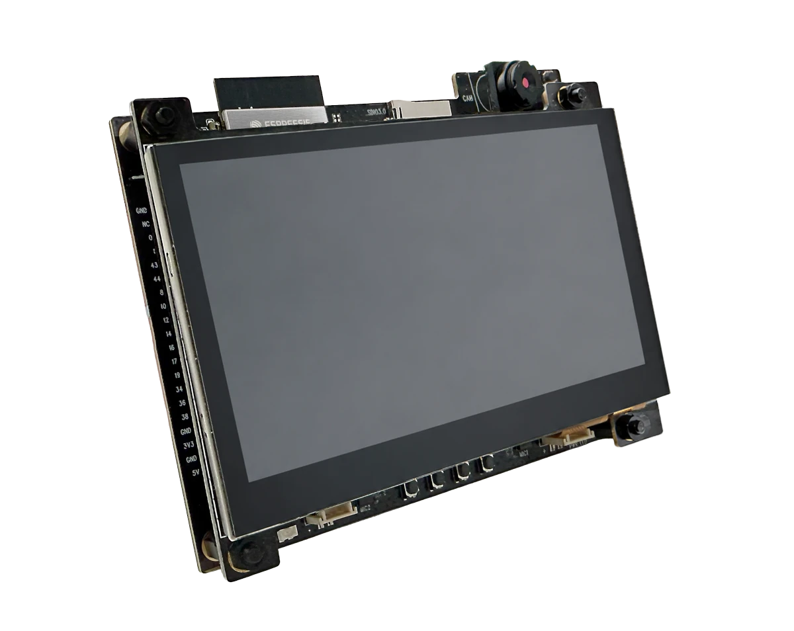

* **ESP32-S31-Function-CoreBoard-1**
    * ESP32-S31-WROOM-3 with two RISC-V cores
    * Microphone on-board and speaker output
    * Gigabit Ethernet
    * Native USB 2.0 to the MCU, as well as separate USB UART on-board
* **ESP32-S31-Korvo-1** _(pictured)_
    * Same chip as above
    * Display connector for the matching [ESP32-S3-LCD-EV-Board-SUB3](https://docs.espressif.com/projects/esp-dev-kits/en/latest/esp32s3/esp32-s3-lcd-ev-board/user_guide.html#lcd-subboards)
    * Camera connector for 3MP OV3660 module

Very new so not widely available yet, and no MicroPython port yet but it seems quite likely to get support quickly. The Korvo kit is AU$85, through AliExpress.

**Buy**: [AliExpress](https://www.aliexpress.com/item/1005012333744553.html)

### M5Paper Color ESP32S3 Dev Kit

Features a 4-inch Spectra 6 full-colour e-paper display with a 400×600 resolution

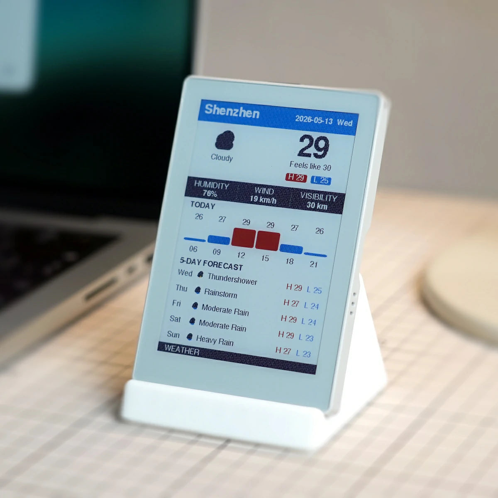

Pretty decently priced at US$75

**Buy**: [M5Stack](https://shop.m5stack.com/products/m5paper-color-esp32s3-dev-kit?variant=48771022258433)

### Qualcomm QCC74xM EVK

A neat little family of chips supporting Wi-Fi 6, Bluetooth 5.4, and Thread/Zigbee (IEEE 802.15.4). First announced in 2024, but finally there's an evaluation kit available to buy – for an impressive US$13.

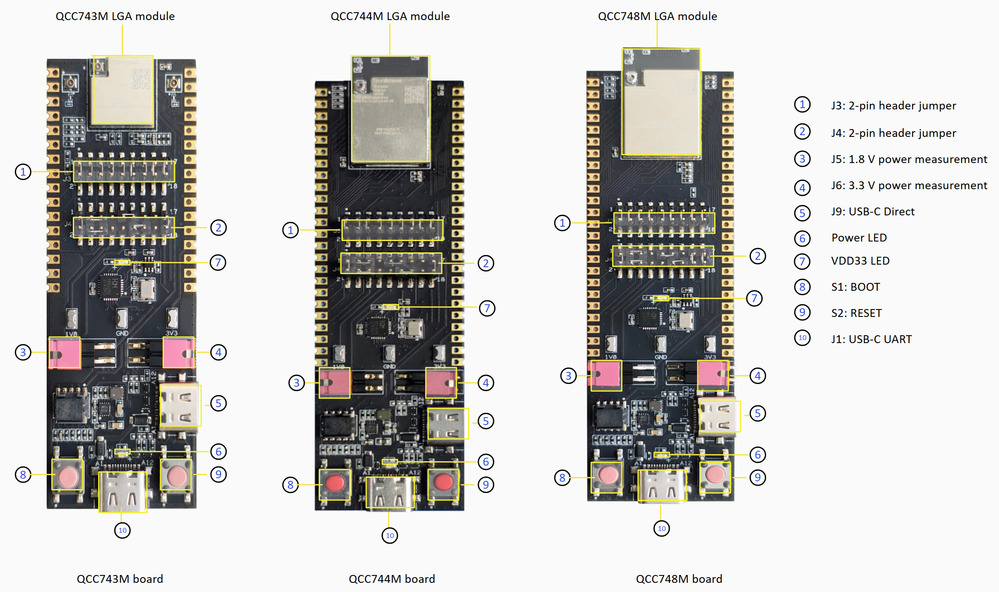

Appears to be aimed at competing with ESP32, it's got:

* 325 MHz RISC-V processor (RV32IMAFCP)
* 16 MB flash, 484 kB SRAM
* Ethernet PHY, Wi-Fi, BLE, 802.15.4 Thread and Zigbee

The top-spec QCC748M also has:

* 8 MB pSRAM
* MJPEG video encoding
* Display and camera support

Has [support for Zephyr](https://docs.zephyrproject.org/latest/boards/qcom/qcc744m_evk/doc/index.html), although not MicroPython (yet) – but the underlying chip (which is actually a Buoffalo Lab BL618) does have decent MicroPython support via the Zephyr port

**Buy**: [DigiKey](https://www.digikey.com.au/en/products/filter/evaluation-boards/rf-rfid-wireless-evaluation-boards/1165?s=N4IgTCBcDaIKIDUDSBaAigYQwdgCwgF0BfIA)

### Romu

Similar to the [Tomu and Fomu board](https://www.crowdsupply.com/omu) (although not the same creator), fits an RP2354A into a USB-A plug

There's obviously not much it can interface with apart from your computer, but it does squeeze in an RGB LED and capacitive touch

* 4 MB flash, 264 kB SRAM
* Native USB 2.0 (from the RP2354A chip)
* MicroPython!

No price yet

**Sign-up for updates**: [Crowd Supply](https://www.crowdsupply.com/bitmerse/romu)

### Pocket Deck

Beautifully made "distraction free" mini-computer, with some Japanese sci-fi flair

Uses an ESP32-S3 and a 400 × 240 monochrome display, and includes a bunch of (MicroPython-powered) utilities out of the box:

* text editor, with search and replace, Unicode support, syntax highlighting
* fully-featured terminal, with escape sequence support
* SSH and SCP clients
* journal, clock, calendar, timer apps
* USB keyboard support

This thing looks amazing and the software appears very polished… although you do pay for the luxury, it's US$220

Also, [Space Invaders](https://x.com/nunomo1/status/2049677784562450908)!

**Buy**: [Nunomo](https://shop.nunomo.net/products/pocket-deck?variant=45651763134662)

### Lilygo T-Watch Ultra

An IP65 (i.e. waterproof) DIY smartwatch, based on the ESP32-S3

It's got:

* 2 inch AMOLED touch display
* 16 MB flash, 8 MB pSRAM
* Wi-Fi and BLE (from the ESP32-S3 chip)
* LoRa (from a Semtech SX1262 chip)

Supposedly US$78, although when I checked it says it's sold out - hopefully they make more!

**Buy**: [Lilygo website](https://lilygo.cc/en-us/products/t-watch-ultra?variant=51364248191157)

---
## Other news

### IoPython

A new VSCode extension, aimed at integrating `esptool` and `mpremote` into an easy-to-use IDE tool

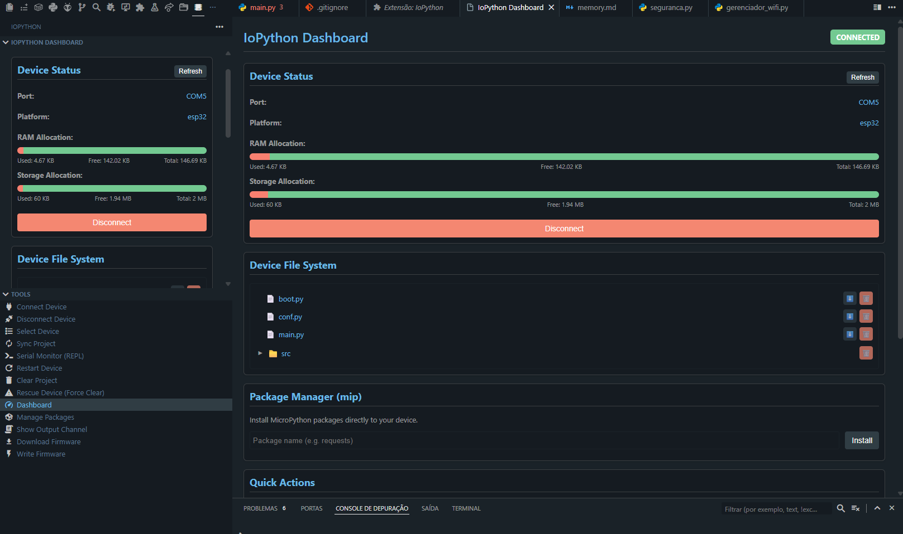

Also has a standardised project configuration TOML file, to make it easy to keep all your hardware setup in sync

[Check out the GitHub page](https://github.com/LeandroLimaPRO/iopython)

### Wokwi updates to MicroPython v1.28

Wokwi, the browser-based MicroPython hardware simulator, now uses v1.28 – and has support for installing packages with `mip`, including native C modules

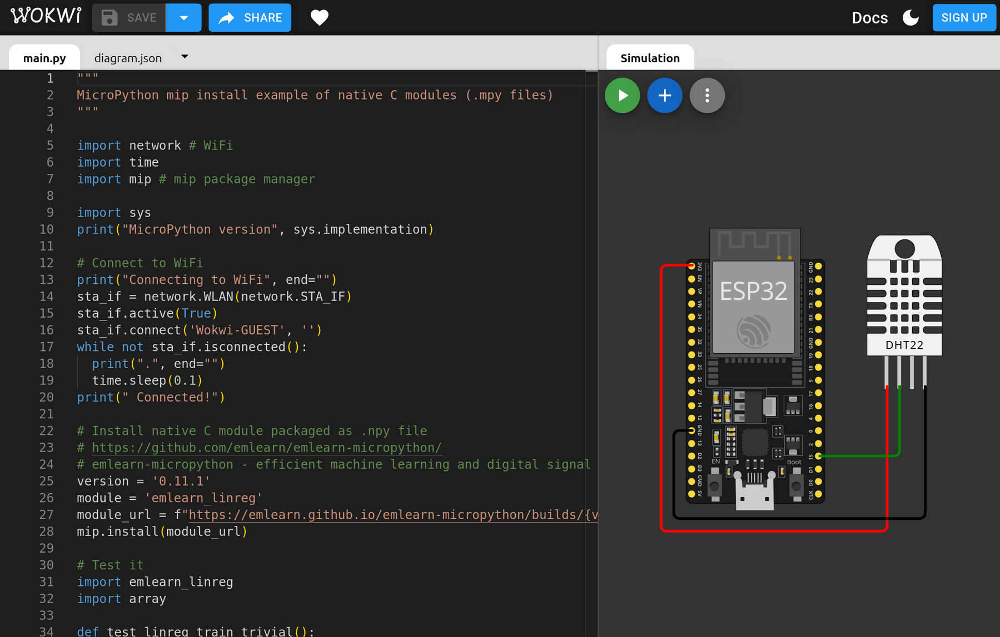

[Wokwi can simulate an ESP32](https://wokwi.com), Pi Pico, and an STM32 board, and lets you learn or test out code without needing access to real hardware

### Firefox launches WebSerial support

It was teased in a previous news roundup as a beta feature, but its now [officially released](https://www.firefox.com/en-US/landing/adafruit/) in [Firefox v151](https://www.firefox.com/en-US/firefox/151.0/releasenotes/). A great alternative for those who would prefer to avoid Google and Chrome

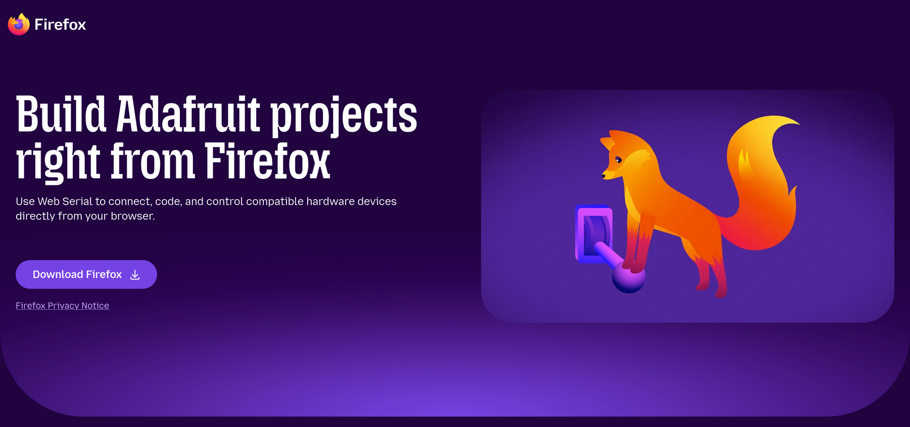

Mozilla has collaborated with Adafruit on testing the feature with CircuitPython, which should mean that it also works nicely with MicroPython

### ESP-NOW v2.0 in MicroPython

After a long-running request with Espressif to support longer messages in ESP-NOW, finally the ESP-IDF v5.5 supports up to 1470 bytes (up from 250 bytes). [Support for this has now reached MicroPython](https://github.com/micropython/micropython/pull/16737#issuecomment-4274610182) – after an impressive effort by Amirreza Hamzavi over two years to first get Espressif to support it, and after that starting the code to get it into MicroPython… despite living under months of Internet blackouts in Iran (and presumably that's hardly the worst of it)

### MicroPython v1.28 for AmigaOS

If you're into retro computing with classic m68k Amiga machines, the [latest release of MicroPython](https://github.com/OoZe1911/micropython-amiga-port) is now available for you

CPython is too heavy for the very limited Amiga machines, but MicroPython gets you most of what you might need with a fraction of the resource requirements

---
## Projects

### CPython and MicroPython cross-compatible MQTT and Modbus

[Carlos Tangerino](https://github.com/Tangerino) has created two new libraries, for MQTT and Modbus, but with a twist… both run the exact same code on "big" CPython and on MicroPython

[He says](https://www.reddit.com/r/MicroPythonDev/comments/1tldkwk/i_wanted_the_same_asyncio_code_to_run_on_linux/): _"I got tired of maintaining separate IoT stacks for Linux and ESP32 devices… so I started building libraries that run the same asyncio code on both CPython and MicroPython. That experiment turned into two open-source projects: aiomqttc, … and mpModbus"_

He's done a bunch of testing on it and has some great documentation and examples

Check it out: [aiomqttc](https://github.com/Tangerino/aiomqttc), [mpModbus](https://github.com/Tangerino/mpModbus)

### Femtonyl

[Kevin Santo Cappuccio](https://github.com/Architeuthis-Flux/) has released some code and build guide for a 3D capacitive gesture sensor, using nothing but some copper pads and the RP2040 PIO

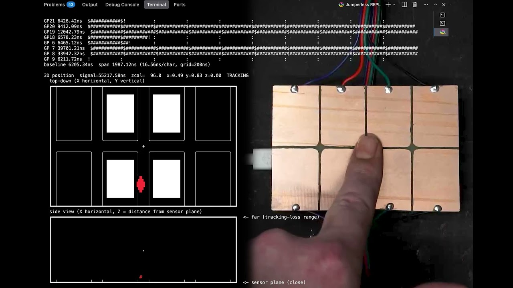

It builds on a project by [Matthias Wandel](https://github.com/Matthias-Wandel/Pico-femtofarad), measuring femtofarad-level capacitance changes with just a Pi Pico's GPIO pins. It sounds like magic, but it works!

> This uses single-ended sensing -- each pad measures capacitance between itself and ground. Your body is a big bag of conductive water connected to earth ground (capacitively, through your feet or whatever you're sitting on), so when your hand gets near a pad, you're effectively adding a few tens of femtofarads between that pad and ground. That's what we're measuring.
> 
> Each GPIO pin is briefly driven high, then switched to an input with the internal pull-down enabled. A PIO state machine counts clock cycles until the voltage drops below the logic threshold. More capacitance on the pin = longer discharge = your hand is nearby.
> 
> All 8 PIO state machines run simultaneously (~250k samples/sec per channel). The readings get smoothed, the common-mode background gets subtracted out, the centroid gets computed, and a One Euro filter tries to make the result not look like a seismograph. The terminal draws bargraphs, a top-down X-Y view, and a side X-Z view so you can see where it thinks your hand is.

All the [source code is here](https://github.com/Architeuthis-Flux/Femtonyl), as well as more detail on how it works and how you might use it.

### Autonomous Model Train

Hackster have a write-up using MicroPython to drive a HO gauge model train and an Infineon PSOC 6

They set up a few different operating modes, including matching the train stopping at a station to a real train stopping at a particular Munich S-Bahn station, as well as stopping when it passes a magnet placed near the track.

They've included heaps of detail and all of the 3D printed models for the train carriages and station buildings, as well as all the MicroPython code and wiring diagrams.

[Check it out!](https://www.hackster.io/Infineon_Team/autonomous-model-train-with-psoc-6-and-micropython-217f5e)

### RedBoard Robot

Have you got some LEGO SPIKE components, but not enough to do what you really want? Or do you want to use your own microcontroller rather than the LEGO ones? Turns out it's not that hard to interface to the SPIKE kit!

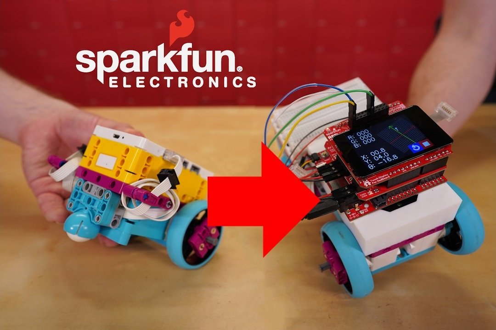

[SparkFun have a neat video](https://news.sparkfun.com/16410) on how they went about it, and have some [code available on GitHub](https://github.com/sfe-SparkFro/redboard_robot_compatible_with_lego)

### Beer delivery robot

A LEGO-based robot built by Arkady Axelrod, using Pybricks, to carry a beer up a set of stairs and deliver it onto a table

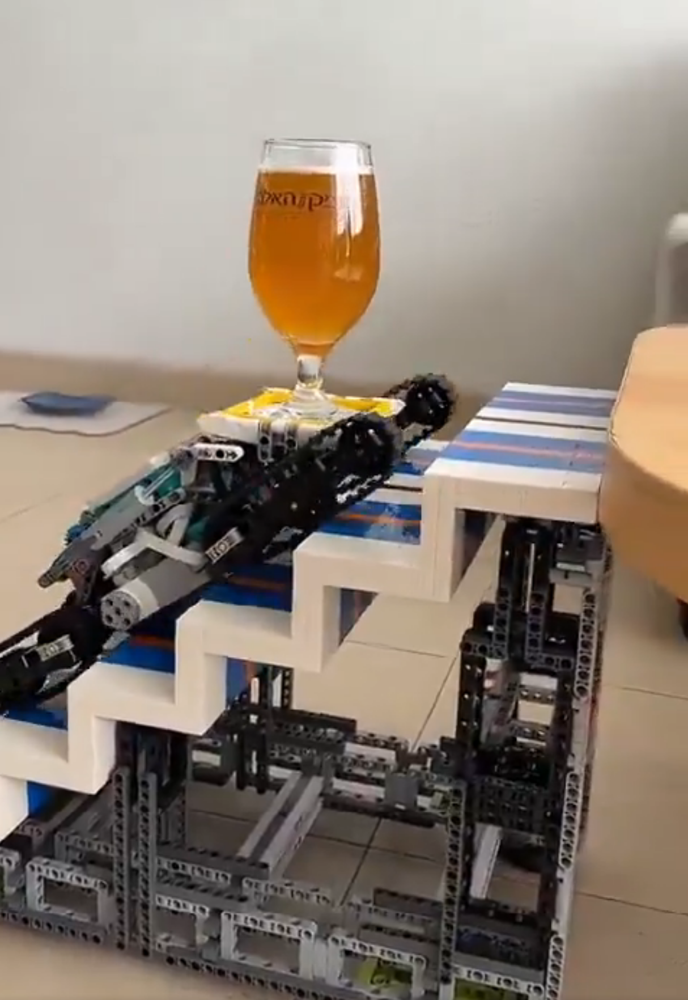

There's no write-up for this one, but it definitely looks cool

[X.com](https://x.com/i/status/2050629062935126490)

---
## Quick Bytes

### Flipper One

You may recall the [Flipper Zero](https://flipper.net/products/flipper-zero), a popular open source software-defined radio hacking Swiss Army Knife, that can interact with NFC, RFID, and sub-gigahertz protocols…

The same people are putting out a call for help on the Flipper One. It's been in the works for years, the idea being to do something similar to the Flipper Zero but as an embedded Linux system capable of poking around at Wi-Fi, Ethernet, Bluetooth, USB, PCIe, SATA. It's not meant as a replacement for the Flipper Zero, rather it targets a different feature set.

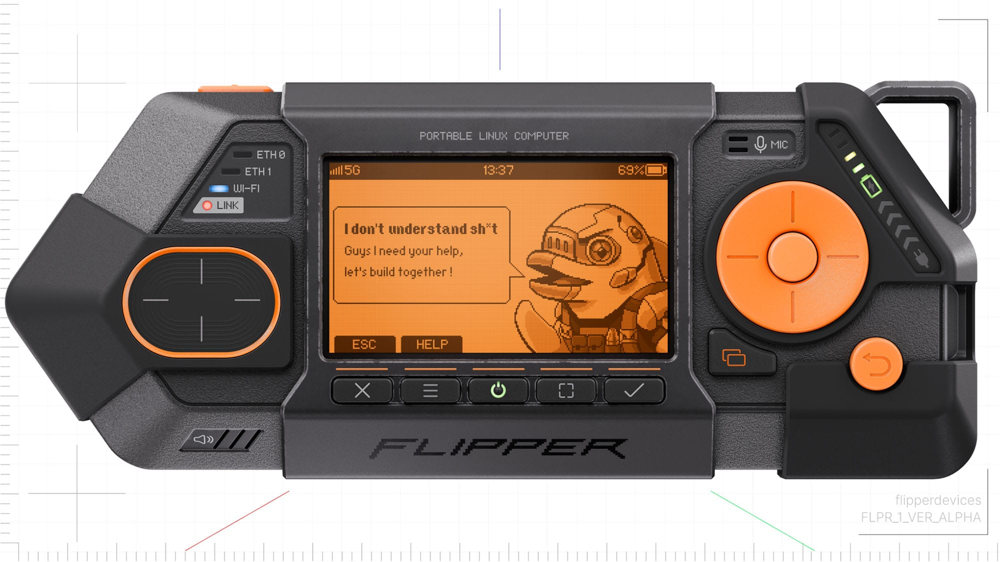

It's a super ambitious project, along with Collabora they ideally want to make every aspect of it fully open-source – which would make it one of the very few embedded Linux systems that can make such a claim, vendors tend to have their own proprietary "blobs" for things like bootloaders, video output, networking, etc.

They're putting out a call to the community to help out and get the Flipper One off the ground, if that sounds like something you could help with then [check out their blog post](https://blog.flipper.net/flipper-one-we-need-your-help/).

### 5x5 Pixel font for tiny screens

There's lots of very neat tiny displays out there, which are often very handy to have on a MicroPython project – but how do you actually use them when they're so tiny?

Turns out that with just 5×5 pixels you can do a decent job of the basic Latin alphabet:

[Check out mcufont](https://maurycyz.com/projects/mcufont/), from there you can also find more links to other tiny font experiments

---
## Final Thoughts

### CERN's KiCad component library now open source

CERN design a lot of hardware, and their Design Office has a huge library of over 17,000 footprints for all sorts of components.

They've now [made the whole lot available](https://gitlab.com/ohwr/cern-kicad-libs) under an open source OHL license.

### jlc2kicad

A [nifty web app that takes a JLCPCB part number](https://jlc2kicad-webui.manus.space/) and produces a footprint to use in KiCad

Not technically open source hardware ([the application is](https://github.com/TousstNicolas/JLC2KiCad_lib) but the JLCPCB parts aren't), but given the incredible access that JLCPCB bring to hobbyist hardware developers I'm sure this will be very handy for many people
