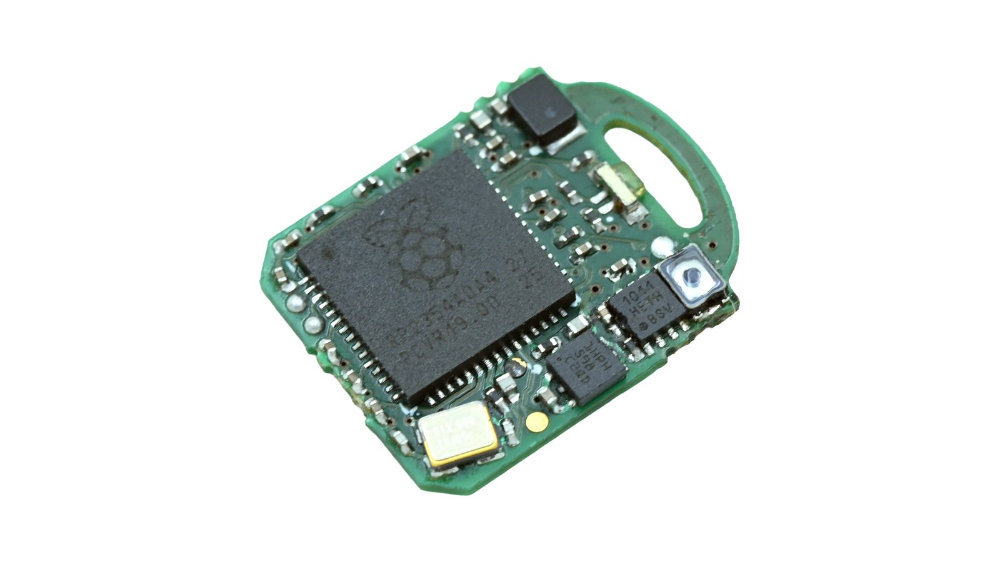
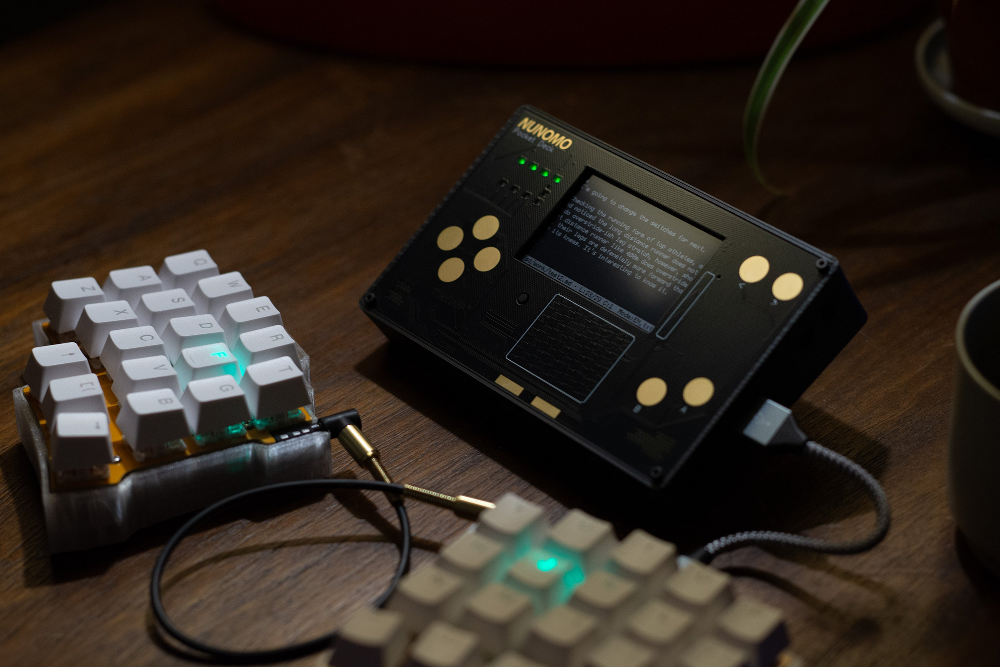
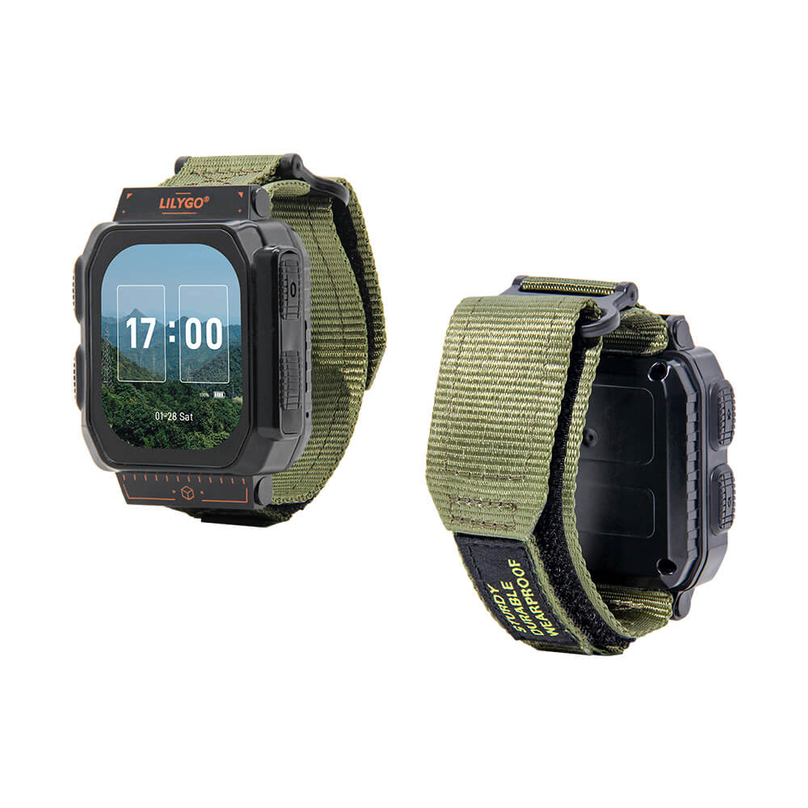
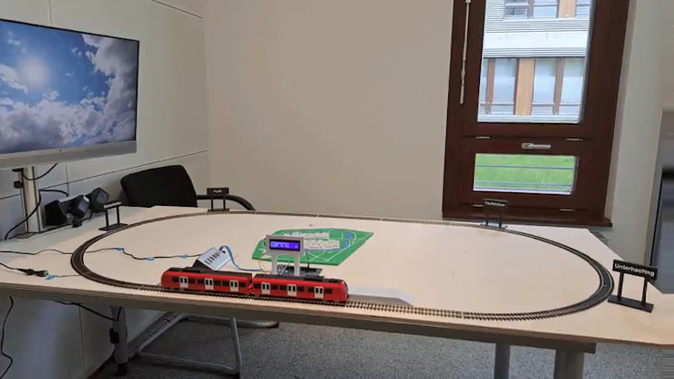
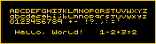

*Matt* demos 'mp burner', *Sean* delivers the news roundup

# News Round-up

---
## Headlines

### MicroPython turns 13

13

### LiteX

FPGA custom builder

---
## Hardware News

### Romu

Similar to the Tomu and Fomu board (although not the same creator), fits an RP2354A into a USB-A plug

There's obviously not much it can interface with apart from your computer, but it does squeeze in an RGB LED and capacitive touch

* 4 MB Flash, 264 KB SRAM
* Native USB 2.0 (from the RP2354A chip)
* MicroPython!

No price yet

**Sign-up for updates**: [Crowd Supply](https://www.crowdsupply.com/bitmerse/romu)

### Pocket Deck

Beautifully made "distraction free" mini-computer, with some Japanese sci-fi flair

Uses an ESP32-S3 and a 400 × 240 monochrome display, and includes a bunch of (MicroPython-powered) utilities out of the box:

* text editor, with search and replace, Unicode support, syntax highlighting
* fully-featured terminal, with escape sequence support
* SSH and SCP clients
* journal, clock, calendar, timer apps
* USB keyboard support

This thing looks amazing and the software appears very polished… although you do pay for the luxury, it's US$220

Also, [Space Invaders](https://x.com/nunomo1/status/2049677784562450908)!

**Buy**: [Nunomo](https://shop.nunomo.net/products/pocket-deck?variant=45651763134662)

### Lilygo T-Watch Ultra

An IP65 (i.e. waterproof) DIY smartwatch, based on the ESP32-S3

It's got:

* 2 inch AMOLED touch display
* 16 MB flash, 8 MB PSRAM
* Wi-Fi and BLE (from the ESP32-S3 chip)
* LoRa (from a Semtech SX1262 chip)

Supposedly US$78, although when I checked it says it's sold out - hopefully they make more!

**Buy**: [Lilygo website](https://lilygo.cc/en-us/products/t-watch-ultra?variant=51364248191157)

---
## Other news

### 

---
## Projects

### Autonomous Model Train

Hackster have a write-up using MicroPython to drive a HO gauge model train and an Infineon PSOC 6

They set up a few different operating modes, including matching the train stopping at a station to a real train stopping at a particular Munich S-Bahn station, as well as stopping when it passes a magnet placed near the track.

They've included heaps of detail and all of the 3D printed models for the train carriages and station buildings, as well as all the MicroPython code and wiring diagrams.

[Check it out!](https://www.hackster.io/Infineon_Team/autonomous-model-train-with-psoc-6-and-micropython-217f5e)

---
## Quick Bytes

### 5x5 Pixel font for tiny screens

[Check out mcufont](https://maurycyz.com/projects/mcufont/)

---
## Final Thoughts

### 