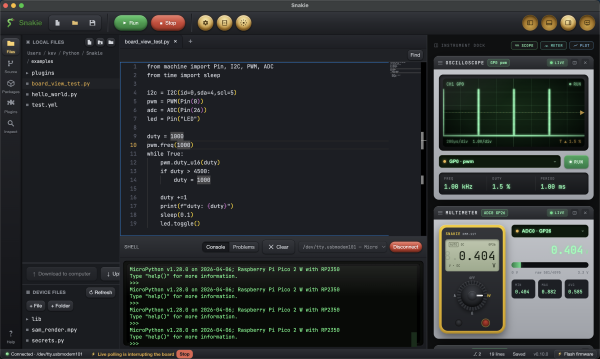
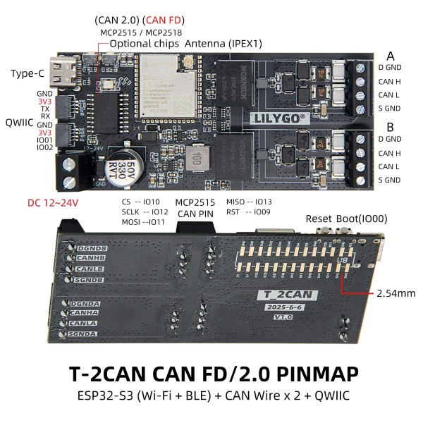
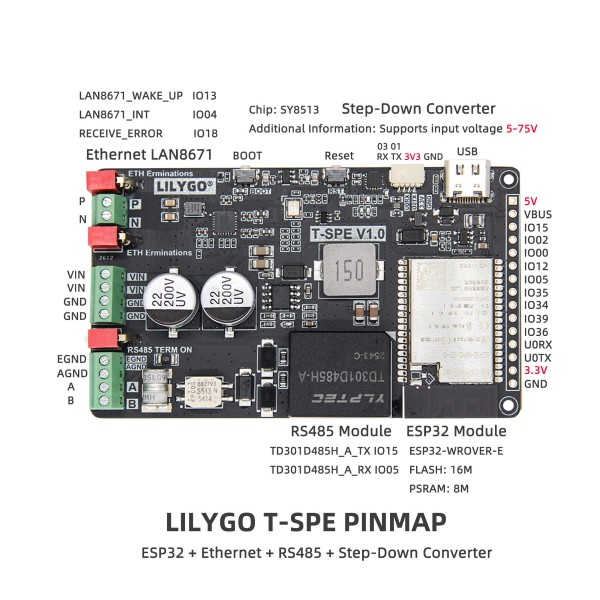
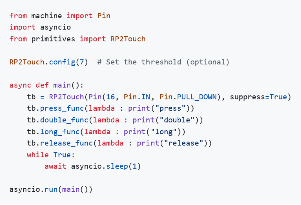
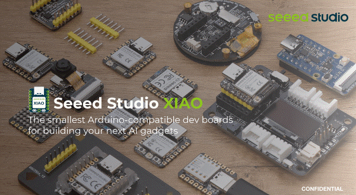
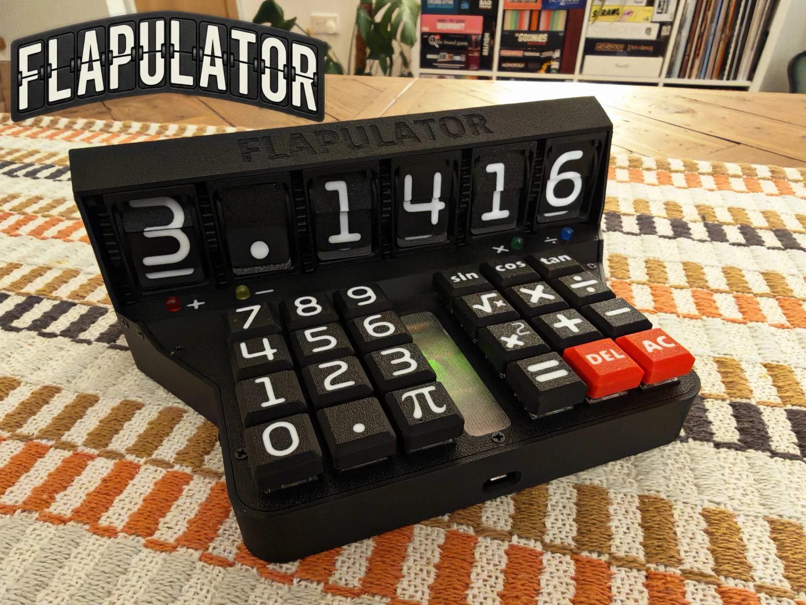

*Matt* delivers the news roundup

# News Round-up

---
## Headlines

### Running Python code in a sandbox

Simon Willison experiments with [Running Python code in a sandbox with
MicroPython and
WASM](https://simonwillison.net/2026/Jun/6/micropython-in-a-sandbox/).

Since it's related to AI tooling - and Simon is one of the most prolific devs
writing on the topic - this generated quite a fuss. It turns out that LLMs can
write Python code well...but they can also abuse it by executing code that can
break out of the environment and make unexpected and undesirable changes. The
idea here is to build MicroPython with WASM and host it as a sandbox for the
LLMs to use to develop Python solutions. It's a much smaller attack surface and
harder to do damage.

Simon is also embedding his
[micropython-wasm](https://github.com/simonw/micropython-wasm) in other tools
(like the excellent [datasette](https://datasette.io/)) so Python scripting can
be used safely.

### Snakie, MicroPython IDE

Kevin McAleer [announces](https://x.com/kevsmac/status/2068454814128689275)
Snakie, a modern, MIT-licensed, cross-platform IDE built in Electron to support
MicroPython development. You can see more screenshots in his [discord
post](https://discordapp.com/channels/574275045187125269/574275045611012097/1518035174372278313). 

Check out [Snakie](https://github.com/kevinmcaleer/snakie) on GitHub.

---

## Matts New Hardware

### AMYboard

Discussed [last
month](https://melbournemicropythonmeetup.github.io/May-2026-Meetup/), I
received an [AMYboard](https://www.amyboard.com/) recently! It's an amazing
little board and packs a heck of a punch! 

I hadn't realised how rich the web interface, [AMYboard
Online](https://www.amyboard.com/editor), is
- and just how tightly integrated the community is to the system. It's *very*
easy to share 'sketches' with *AMYboard World* which is an excellent way to
experiment with sound creation.

I may need to get a cheap MIDI keyboard to really put this thing to work...

---

### ManT1S pack

I've been looking forward to this one for a while; we first covered Patrick Van
Oosterwijck's ManT1s back in [August
2025](https://melbournemicropythonmeetup.github.io/August-2025-Meetup/). Since
then, the [ManT1S Crowd
Supply](https://www.crowdsupply.com/silicognition/mant1s) campaign was
successful and I received a package a couple of weeks ago!

The ManT1S is a device that provides Ethernet 10BASE-T1S connectivity; that
means that both power and a 10Mb signal can be transmitted over a twisted pair
of wires. So it's slower than modern Ethernet but wiring looms can be
dramatically simplified; this is really a technology to challenge the likes of
CAN and RS485.

The [ManT1S website](https://mant1s.net/) has been published and is full of
useful information, including how to use MicroPython to control the devices. The
board definition is available on MicroPython's [download
page](https://micropython.org/download/SIL_MANT1S/).

---

### LilyGo T-2CAN

LilyGo released the [T-2CAN](https://lilygo.cc/products/t-2can) recently and I
added one to the collection. In short, it's an ESP32-S3 with 2x CAN ports which
I thought would be useful for testing systems at work where CAN is a
commonly-used bus. 

LilyGo actually released two models, one provides 'regular' CAN, the other CAN
FD. Of note is that one channel is directly driven from the ESP32-S3, the other
is controlled by a SPI-connected peripheral. 

I've also been working on an [ESP32
implementation](https://github.com/mattytrentini/micropython/tree/esp32-machine-can)
of `machine.CAN`...let me know if you can help test!

**US$25**

---

### LilyGo T-SPE

Released with little fanfare, the [LilyGo
T-SPE](https://lilygo.cc/products/t-spe) is another Ethernet 10BASE-T1S board
that I want to try interoperating with the ManT1S. It lacks some of the polish
of the ManT1S but is very affordable and doesn't skimp on some hardware,
including 16MB flash, 8MB RAM and a 5-75V input range.

**US$25**

---

### M5Stack Keyboard for the Tab5 Keyboard

Getting the [Keyboard for the
Tab5](https://shop.m5stack.com/products/keyboard-for-tab5) was a no-brainer!

**US$11**

---

### M5Stack M5Paper Color

Discussed last month, the [M5Paper
Color](https://melbournemicropythonmeetup.github.io/May-2026-Meetup/) is a
lovely little device.

---
## Hardware News

### M5Stack Stopwatch Dev Kit

- ESP32-S3, 16MB Flash, 8MB PSRAM
- 1.75" AMOLED touch display, 466x466
- 6-axis IMU
- Mic, I2S audio
- RTC
- 450mAh Battery

**US$45**

---
## Other news

### RP2Touch

Peter Hinch has extended his excellent [asyncio
library](https://github.com/peterhinch/micropython-async/blob/master/v3/docs/DRIVERS.md)
with an
[RP2Touch](https://github.com/peterhinch/micropython-async/blob/master/v3/docs/DRIVERS.md#424-rp2touch-class)
button.

### Seeed Studio XIAO Series

Seeed Studio have amassed a large catalog of XIAO microcontrollers, all
conforming to the same pinout, and we've covered them numerous times in the
past. I only recently discovered there's a GitHub repo that pulls together all
of the information for the entire series, so if you're interested in these
micros, you'll want to visit
[OSHW-XIAO-Series](https://github.com/Seeed-Studio/OSHW-XIAO-Series/).

### Model Train Automated Level Crossing

<iframe width="560" height="315" src="https://www.youtube.com/embed/yq5GMvVzijw?si=pu0vwGMxg41NTOoy" title="YouTube video player" frameborder="0" allow="accelerometer; autoplay; clipboard-write; encrypted-media; gyroscope; picture-in-picture; web-share" referrerpolicy="strict-origin-when-cross-origin" allowfullscreen></iframe>

Pater Practicus
[shared](https://x.com/PaterPracticus/status/2068291546693197843) that he has
automated his model train level crossing system using Raspberry Pi Pico's. There
are sensors to detect the train, servos controlling the level crossing and
flashing lights that are all synchronised.

---

### Diffraction Clock

<iframe width="560" height="315" src="https://www.youtube.com/embed/1DD9vaVy1H8?si=dYbRSW45kJWzEeqX" title="YouTube video player" frameborder="0" allow="accelerometer; autoplay; clipboard-write; encrypted-media; gyroscope; picture-in-picture; web-share" referrerpolicy="strict-origin-when-cross-origin" allowfullscreen></iframe>

[Instructables](https://www.instructables.com/Diffraction-Grating-Clock/)

[GitHub](https://github.com/vonsivers/DiffractionGratingClock)

[HackerNews](https://hackaday.com/2026/06/03/a-diffraction-grating-makes-this-clock-readable/)

---
## Final Thoughts

### The Flapulator is gorgeous

[Makerworld](https://makerworld.com/en/models/2625039-flapulator-the-world-s-most-tactile-calculator#profileId-2897906)

[GitHub](https://github.com/ChristopherHaynes/flapulator)

### Midjourney fun

A micro python at a level crossing...

