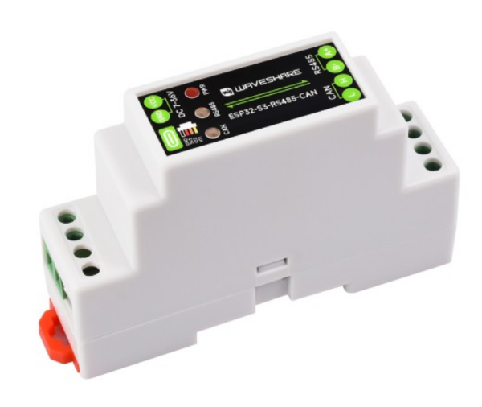
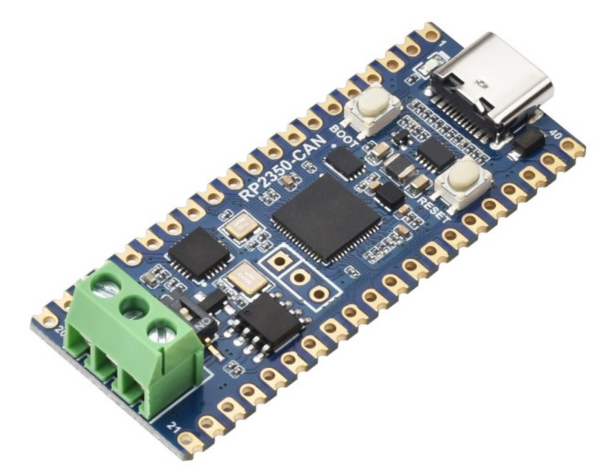
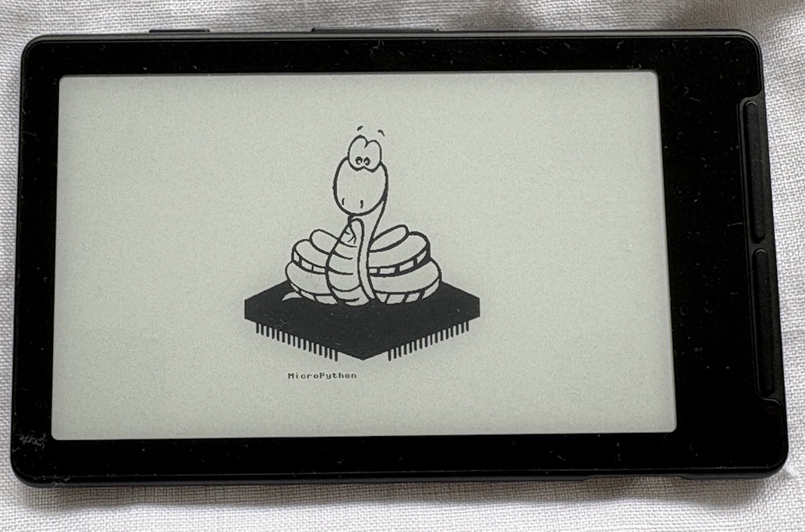
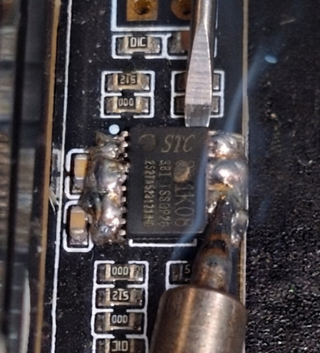
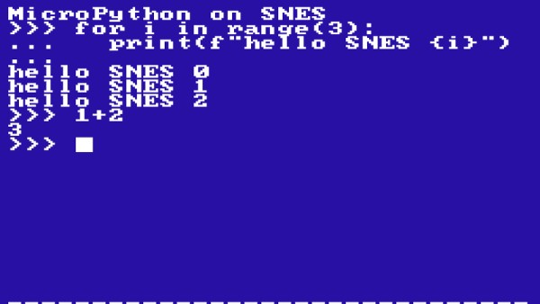
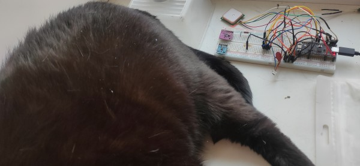
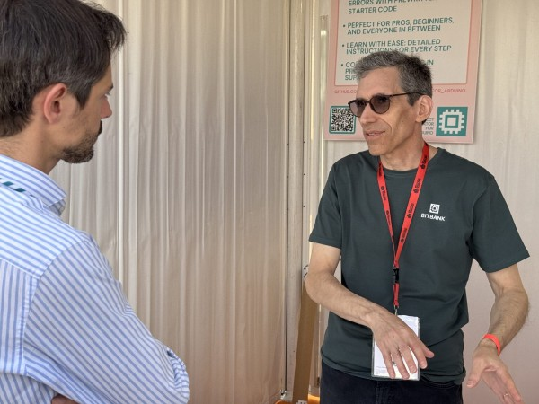
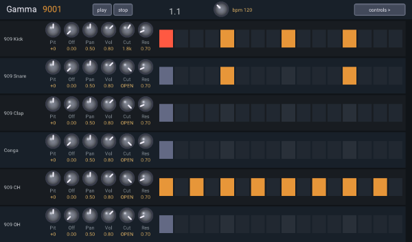

*Matt* delivers the news roundup

# News Round-up

---

## Headlines

### MicroPython v1.29 nears release

The [MicroPython v1.29
milestone](https://github.com/micropython/micropython/milestone/13) suggests
that the release will arrive early August. 

Some of the highlights:
  - [Add RTC.memory() backed by hardware
    registers](https://github.com/micropython/micropython/pull/19084)
  - [MIMXRT: Implement `machine.CAN`
    support](https://github.com/micropython/micropython/pull/19095)
  - [Add support for
    ESP32-H2](https://github.com/micropython/micropython/pull/19317)
  - [Improve Unicode support in
    MicroPython](https://github.com/micropython/micropython/pull/18854)

But that's just a glimpse of the 40 PRs already merged and there are 20+ more
hoping to land. Of those still open, I'm especially hoping for [PSOC
Edge](https://github.com/micropython/micropython/pull/18910) (Just merged!) and
[USB NCM](https://github.com/micropython/micropython/pull/16459) to make it
across the line.

### Infineon PSOC Edge micrcontrollers

(Next Month!)

---

## Matts New Hardware

As part of my day job I'm working with CAN devices, can you tell?

### Waveshare ESP32-S3-RS485-CAN

The [ESP32-S3-RS485-CAN](https://www.waveshare.com/wiki/ESP32-S3-RS485-CAN) is a
DIN-rail board that gives you CAN and RS485 from an ESP32-S3 in a neat little
package.

**US$20**

### Waveshare RP2350-CAN

The [RP2350-CAN](https://www.waveshare.com/rp2350-can.htm) is, well, what the
name suggests: Smoosh together an RP2350 and a CAN transceiver.

**US$10**

### Xteink X4

I couldn't help but pick up one of these [Xteink
X4](https://www.xteink.com/products/xteink-x4)'s, they're a cute little e-ink
mini-Kindle. But they're powered by an ESP32-C3, so...

Specs:
  - ESP32-C3
  - 4.3" 480x800 (220PPI) e-ink display (no touch)
  - 74g
  - 650mAh battery
  - USB-C
  - Magnetic back
  - microSD (comes with 32GB card)

Buy it direct! There are some challenges flashing firmware on the units sold
elsewhere.

I've raised a PR for an MicroPython [X4 board
definition](https://github.com/mattytrentini/micropython/pull/41) and have a
[driver for the e-ink display](https://github.com/mattytrentini/micropython-ssd1677).  

**AU$100**

Note that the X4 Pro just landed! Similar, but adds a front-light and
touchscreen, costs AU$50 more. It does drop the USB-C port though so it's not
yet clear if firmware updates will be possible.

---
## Other news

### Reverse Engineered Repairs with Micropython and Claude 

Our very own Andrew Leech has been experimenting with local LLMs powered by
graphics cards. That is, he *was*, until that familiar scent of magic smoke
started emanating from one of the said graphics cards!

His *excellent*
[write-up](https://notes.alelec.net/posts/reverse-engineered-repairs-with-micropython-and-claude/)
of identifying the problem (yep, a fan controller) and then replacing it with
some Claude-crafted MicroPython will have you amazed.

### MicroPython Is This Summer’s Hottest Title For The SNES, Thanks To Claude Fable

Fabian Kübler decided he needed MicroPython running on a SNES. So he had Claude
Fable make it so! It's a little slow on the 3.58MHz (emulated) system, taking
about 20 seconds to get to the REPL...but it *works*.

Hackaday has a [good
article](https://hackaday.com/2026/07/11/micropython-is-this-summers-hottest-title-for-the-snes-thanks-to-claude-fable/)
covering the effort.

---

### light-nmea-micropython

Roman [announced](https://github.com/orgs/micropython/discussions/19436) a new
MicroPython library to parse NMEA messages from GPS/GNSS devices.
[light-nmea-micropython](https://github.com/octaprog7/light-nmea-micropython)
has been written with a focus on performance and reduced memory allocations. 

If you're looking to detect your location with a GNSS device, this library looks
fantastic! 

---

### PNGdec

[Larry Bank](https://github.com/bitbank2) has released a handful of
microcontroller-ready well-written C libraries that perform focussed tasks,
particularly around codecs - eg JPEG, TIFF and PNG. I've wanted to wrap them up
for MicroPython for a long while; so I started!

Take a look at
[micropython-pngdec](https://github.com/mattytrentini/micropython-pngdec).

Thanks to Larry, read more about his work: [Meet Larry Bank: the performance
whisperer](https://blog.arduino.cc/2026/01/15/meet-larry-bank-the-performance-whisperer-making-code-faster-and-open-source-better/).

### Surfer

Brian Whitman, of Tulip and AMYboard fame, was frustrated with the performance
of LVGL on the ESP32-P4. So he's started developing a GUI library himself!
[Surfer](https://github.com/shorepine/surfer) is aiming for 60fps iOS-style
low-latency rendering. Given it's still early days, it's looking very promising!

---

## Quick bytes

### I replaced a $120k bowling center system with $1,600 in ESP32s

This [Hacker News headline](https://news.ycombinator.com/item?id=48968606) was
catnip to my ears. Buy an abandoned 8-lane bowling alley and, instead of
replacing the systems with a $100K+ commercial system, hack your own for less
than $2K - and open-source it. Currently not using MicroPython, but they really
*should* be. 

### ESP32 Comparison Chart

The ESP32 range has become large and it's difficult to keep track of the
features present in each model. This [ESP32 Comparison
Chart](https://www.espboards.dev/blog/esp32-soc-options/) helps by consolidating
all that information and presenting it in an easily-digestible way.

### I created a micro database

Not a small database, a database of my microcontrollers! It's very handy for,
say, asking Claude which devices have a particular kind of feature for testing.

### OpenMV document update

OpenMV have always had excellent hardware. But now they have [excellent
documentation](https://docs.openmv.io/v5.0.0/) too! 

### SiFli SF32 port

I've been hacking away at making a port for the SF32, specifically the
[SF32LB52-DevKit-LCD](https://wiki.sifli.com/en/board/sf32lb52x/SF32LB52-DevKit-LCD.html).
This is the same microcontroller that the [new Pebble
watches](https://repebble.com/watch) are using and it's a grunty little beast!
BLE, tons of memory and a very open SDK. I have a REPL running but nothing else
yet; if you're interested, reach out!

---

### Midjourney fun

A micro python on a bowling alley...

