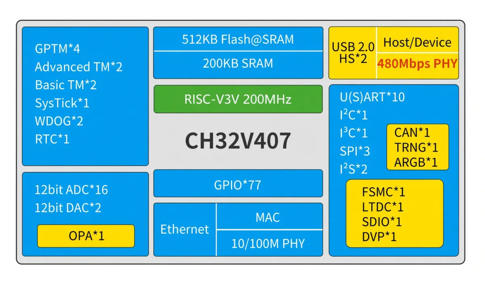
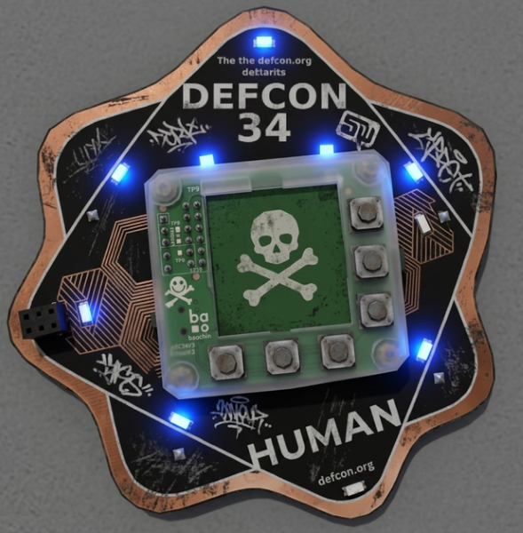
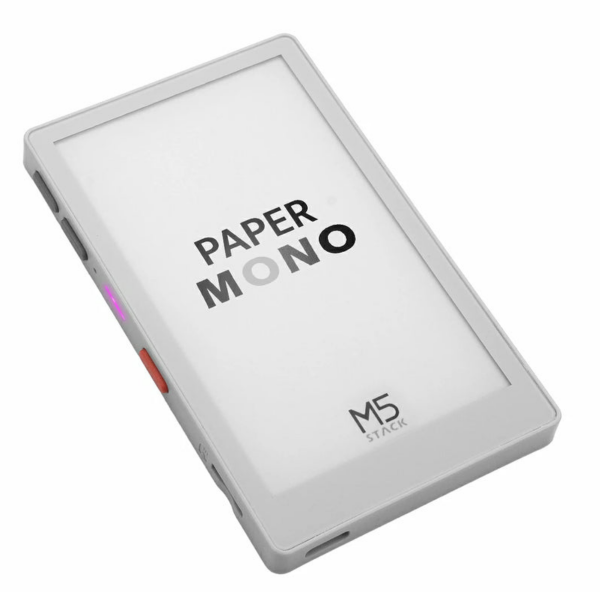
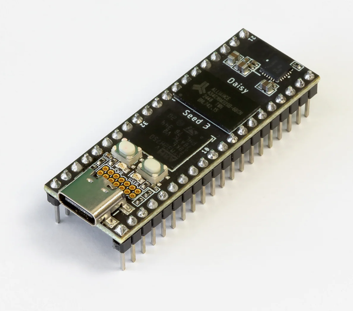
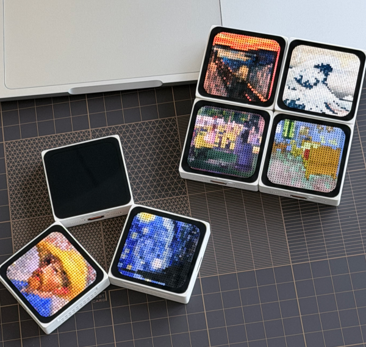
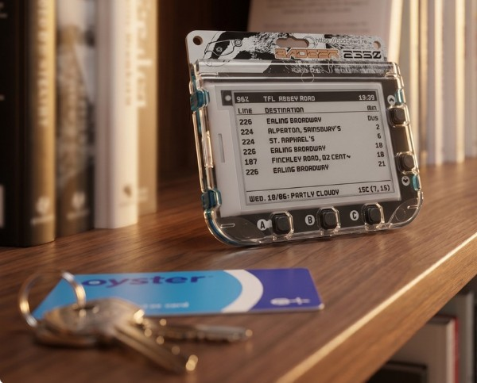
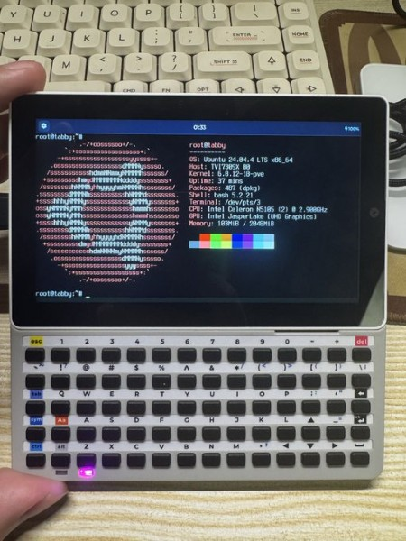
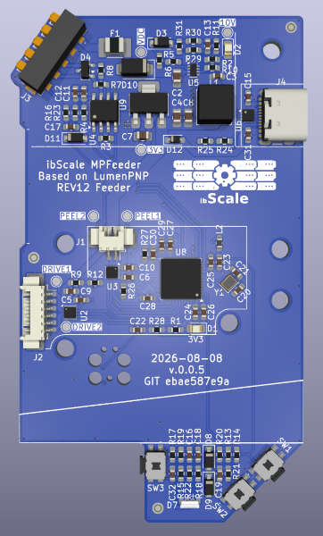

*Damien* covers the recently released v1.29, *Matt* delivers the news roundup.

# MicroPython v1.29

Damien covers the recently released v1.29:

<iframe width="560" height="315" src="https://www.youtube.com/embed/QjOl2KGSOwY?si=EXEmM4vyKb4VxdvU" title="YouTube video player" frameborder="0" allow="accelerometer; autoplay; clipboard-write; encrypted-media; gyroscope; picture-in-picture; web-share" referrerpolicy="strict-origin-when-cross-origin" allowfullscreen></iframe>

# News Round-up

Matt delivers the news roundup:

<iframe width="560" height="315" src="https://www.youtube.com/embed/CaAeSlU-dS4?si=gz-2_-WKnNVbyvak" title="YouTube video player" frameborder="0" allow="accelerometer; autoplay; clipboard-write; encrypted-media; gyroscope; picture-in-picture; web-share" referrerpolicy="strict-origin-when-cross-origin" allowfullscreen></iframe>

---

## Headlines

### MicroPython v1.29 is released!

Released just a few days ago, MicroPython v1.29.0 is here! Go check out Damien's
[detailed release
notes](https://github.com/micropython/micropython/releases/tag/v1.29.0).

(And yes, [USB NCM](https://github.com/micropython/micropython/pull/16459) made it in!)

---

### CircuitPython Day...and 400 issues of Python on Hardware!

Adafruit determined that August 21st was CircuitPython Day, a day to celebrate
all things CircuitPython. A bunch of interesting videos were published to the
Adafruit YouTube channel on the [CircuitPython Day
2026](https://www.youtube.com/playlist?list=PLY9yniFqxZXY) playlist. Happy
CircuitPython Day to our cousins!

And another milestone worth celebrating; the [400th issue of the Python on
Hardware
newsletter](https://www.adafruitdaily.com/2026/08/24/python-on-microcontrollers-newsletter-circuitpython-day-2026-wraps-400th-newsletter-bao-chip-magic-and-more/)!
Congrats to the team - and especially to editor, Anne Barela - for putting
together such a valuable resource to the community for so long. Subscribe at
[Adafruit Daily](https://www.adafruitdaily.com/).

---

### ColdCard vulnerability: US$100M in bitcoin stolen

ColdCard is a bitcoin wallet; a device to keep bitcoin keys and transactions
safe. However, a vulnerability in ColdCoin was exploited that allowed bitcoins
to be stolen. The estimate of the damage is in the order of US$100M (!).

ColdCard used MicroPython for part of their implementation. MicroPython wasn't
at fault, but Damien has a [Coldcard postmortem from MicroPython's
perspective](https://github.com/orgs/micropython/discussions/19588).

Other write-ups:
[Critical Coldcard flaw: what happened, who is affected, and what to do](https://wizardsardine.com/blog/coldcard-rng-vulnerability/)
[When random.bytes() runs but doesn't work](https://insider.btcpp.dev/p/when-randombytes-runs-but-doesnt)
[Flaw in Coldcard Firmware Build Pipeline Leads to $38 Million Bitcoin Heist](https://nile1.com/en/2026/07/31/flaw-in-coldcard-firmware-build-pipeline-leads-to-38-million-bitcoin-heist/)

---

### Infineon PSOC Edge micrcontrollers

I'm going to defer this another month as I don't yet have any PSOC Edge hardware.

---

## Housekeeping

### Luma

Working ok? Everyone getting reminders?

---

## Hardware news

### WCH CH32V407/467

The WCH CH32V407/467 are now available and they pack a heck of a punch:

* RISC-V core @200MHz
* 200KB SRAM
* 4MB or 8MB PSRAM memory (CH32V467 only)
* 512KB Flash
* 100Mbps Ethernet MAC and 10Mbps/100Mbps PHY
* USB – 2x USB 2.0 High-speed host/device (480Mbps)
* Up to 77x GPIO

CNX [WCH CH32V407/467 RISC-V MCU integrates Fast Ethernet MAC + PHY, 480 Mbps
USB 2.0 PHY, up to 8 MB on-chip
PSRAM](https://www.cnx-software.com/2026/08/13/wch-ch32v407-467-risc-v-mcu-integrates-fast-ethernet-mac-phy-480-mbps-usb-2-0-phy-up-to-8-mb-on-chip-psram/)

Hackster.io [WCH Electronics' CH32V407 Packs Vector Extensions for a Speed Boost — Plus Optional PSRAM](www.hackster.io/news/wch-electronics-ch32v407-packs-vector-extensions-for-a-speed-boost-plus-optional-psram-290b6ebe5e9e0)

They'll be cheap. Likely less than US$3/unit.

---

### Baochip News

The Baochip was used in the [DEFCON 34
badge](https://www.hackster.io/news/the-def-con-34-badge-packs-a-surprise-andrew-bunnie-huang-s-mostly-open-baochip-x1-1e03307d4797.amp)
which means there are a *bunch* - 27,000! - more of these chips in the wild
being hacked on! The baochip discord increased from 800 users to ~2000 over the
DEFCON weekend.

We've also got the [experimental MicroPython
has quite a lot of features now (I2C, SPI, RTC, GPIO, USB CDC, WDT, PWM).
port](https://github.com/mattytrentini/micropython/tree/baochip-i2c-spi), which

<iframe width="560" height="315" src="https://www.youtube.com/embed/rTCPyJJwXIw?si=ugLLMKtZhsCLExda" title="YouTube video player" frameborder="0" allow="accelerometer; autoplay; clipboard-write; encrypted-media; gyroscope; picture-in-picture; web-share" referrerpolicy="strict-origin-when-cross-origin" allowfullscreen></iframe>

Phil at Adafruit has also been experimenting with the Baochip, doing some very
cool audio work with it.

### M5Stack M5PaperMono [Lite]

M5Stack have released a pair of e-ink devices. The
[M5PaperMono](https://shop.m5stack.com/products/m5papermono-with-lora-nfc-800x480-3-97-eink-display)
and the [M5PaperMono
Lite](https://shop.m5stack.com/products/papermono-lite-dev-kit-800x480-3-97-e-ink-display).

Specs:

* 800x480 4" 4-level greyscale e-ink display
  * With touch controller and front light
* ESP32-S3 with 16MB flash, 8MB PSRAM 
* 6-axis IMU, microSD, PDM mic, buzzer
* 1150mAh battery
* LoRa & NFC (not present on Lite)

**US$65** and **US$55** [Note: out of stock on day 1!]

---

### Daisy Seed3

Popular in the audio space, the [Daisy
Seed3](https://daisy.audio/products/seed3) is a powerful micro in a tiny
package. It's recently had a minor bump in specs, moving to USB-C and featuring
a new audio codec.

Specs:

* STM32H7 Cortex-M7 MCU @ 480MHz
* 192kHz/32-Bit Stereo Audio Hardware
* 65MB RAM
* 8MB flash
* 31x GPIO
* 16-Bit ADC x12
* 12-Bit DAC x2

**US$30** [Also out of stock!]

### ESP-Mosaico

Espressif have slowly started making their ESP32-S31 available and the
[ESP-Mosaico](https://docs.espressif.com/projects/esp-dev-kits/en/latest/esp32s31/esp-mosaico/index.html)
is the latest of their dev boards to feature the new micro. 

Looks very influenced by M5Stack!

Specs:

* ESP32-S31, 16MB flash, 16MB RAM
* 480x480 touch display
* 6-axis IMU and dual magnetometers
* Magnetic expansion to connect multiple devices at the edges

---

## Matts New Hardware

### Dry month!

Nothing significant...except some motors and encoders. Andrew and I may talk
about that in the future...

---
## Other news

### Arcade Classics in MicroPython on the Fruit Jam

Sam Neggs is at it again, making *awesome* retro games in MicroPython! This time
he has a *bunch* of games and he's running them on the RP2350-powered [Adafruit
Fruit Jam](https://www.adafruit.com/product/6200) - which has the benefit of DVI
output.

<iframe width="560" height="315" src="https://www.youtube.com/embed/lezSQGN2llM?si=Sop17xkw6fpqaUdk" title="YouTube video player" frameborder="0" allow="accelerometer; autoplay; clipboard-write; encrypted-media; gyroscope; picture-in-picture; web-share" referrerpolicy="strict-origin-when-cross-origin" allowfullscreen></iframe>

Not only is there a great video but Sam has taken the time to write up his
strategy for making the games:

[Inside a Fruit Jam Console - Field Notes](https://samneggs.github.io/FruitJam/)

We should also mention [Sparkfun's HSTX
MR](https://github.com/micropython/micropython/pull/18345), which is what Sam
uses for DVI output. The HSTX is a high-speed peripheral on the RP2350 that
appears to have had include DVI output as part of it's design. Very cool.

I also have a [board definition for the Fruit
Jam](https://github.com/mattytrentini/micropython/tree/adafruit-fruit-jam-board)
ready-to-go but it probably makes sense for the HSTX MR to land first.

---

### PyScript enters maintenance mode

Andrea Giammarchi announces that [PyScript is entering maintenance
mode](https://gist.github.com/WebReflection/37cd8ff649ffa336782fec9d28646fae).

That doesn't mean the project is dead! But it is largely feature-complete.

---

### Pythons Quiet Takeover of IoT and Robotics

[MicroPython and CircuitPython: Pythons Quiet Takeover of IoT and Robotics](https://arxiv.org/abs/2608.18160)

### Live London bus departures board

Marcio Lopes shares that he's built a [Live London bus departures board on a
Pimoroni Badger 2350](https://github.com/orgs/micropython/discussions/19631). As
well as the bus times, the weather is also displayed and Marcio has given some
serious thought about power use; the device should run for a week or more on
battery. Github link to the code:
[tfl-bus-arrivals-badger2350](https://github.com/marciolopes93/tfl-bus-arrivals-badger2350)

---

### Tabby delivers SSH on the M5Stack Tab5

Leslie Leung has an ESP IDF project,
[Tabby](https://github.com/LeslieLeung/tabby), that allows the M5Stack Tab5 to
establish SSH connections. It also includes a bunch of other features including
bundling a build of MicroPython into the system.

via [SSH, MicroPython and more on a M5Stack
Tab5](https://x.com/3verest_at_x/status/2090370379483418716) 

--- 

### Automatically Retrofitting JIT Compilers

At QCon London, Laurence Tratt discusses yk, an open-source meta-tracing JIT
compiler framework. He shares how to automatically speed up C-based language
interpreters like Lua and MicroPython with minimal, non-invasive code changes. 

It's a different approach to ahead-of-time compiling as it looks for
optimisations at runtime; hot paths that could be optimised. Looks pretty
interesting!

[Automatically Retrofitting JIT
Compilers](https://www.infoq.com/presentations/yk-meta-tracing-jit-compiler/)

---

### Building a Smart Home Device with MicroPython

by Michał Karzyński, at EuroPython 2026:

<iframe width="560" height="315" src="https://www.youtube.com/embed/qRfo0rD4cdY?si=XtYHaKCGTLj4RC7m" title="YouTube video player" frameborder="0" allow="accelerometer; autoplay; clipboard-write; encrypted-media; gyroscope; picture-in-picture; web-share" referrerpolicy="strict-origin-when-cross-origin" allowfullscreen></iframe>

### ibScaleMPFeeder

From the [Showcase channel on
Discord](https://discordapp.com/channels/574275045187125269/1046992271708520478/1536461983577153726),
James shares that he's built a drop-in replacement for the LumenPNP 8mm/12mm
feeders. The [LumenPNP](https://www.opulo.io/products/lumenpnp) is a popular
open-source Pick 'n' Place machine to assemble circuit boards. 

The [ibScaleMPFeeder repo](https://github.com/ibScale/ibScaleMPFeeder) contains
the schematic, PCB layout and MicroPython code. 

>"I made a replacement motherboard for the LumenPNP 8/12mm tape feeders based on
>an STM32F411CE . It has a serial console over USB, DRV8837 motor controlers,
>quad encoder feedback, and RS485 implementing the Photon feeder protocol. Used
>as much native hardware as I could to avoid bit-banging. Only thing I couldn't
>do that with was a onewire EEPROM. Pretty happy with how it's turned out.

---

## Quick bytes

### Schrödinger’s Toilet: Are You in There or Not?

On hackster.io, user otojun created a simple device (M5Stack StampS3 and ST ToF
sensor) to detect when someone was in the toilet and light an LED so folks
outside could tell. Great write-up - including MicroPython code - on
hackster.io:

[Schrödinger’s Toilet: Are You in There or
Not?](https://www.hackster.io/otojun8959/schrodinger-s-toilet-are-you-in-there-or-not-e5a667)

### This $4 Computer is Flying my Drone 

Friend of the Meetup, Tim Hanewich posts a neat YouTube short explaining how his
drone is built on MicroPython running on an RP Pico:

<iframe width="560" height="315" src="https://www.youtube.com/embed/gJ3T6LsLneg?si=xB24eK2PADj6mie5" title="YouTube video player" frameborder="0" allow="accelerometer; autoplay; clipboard-write; encrypted-media; gyroscope; picture-in-picture; web-share" referrerpolicy="strict-origin-when-cross-origin" allowfullscreen></iframe>

---

### Midjourney fun

