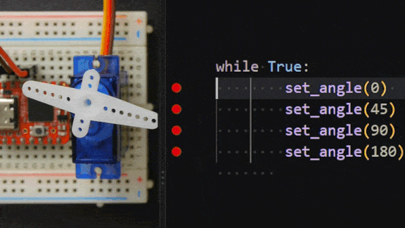
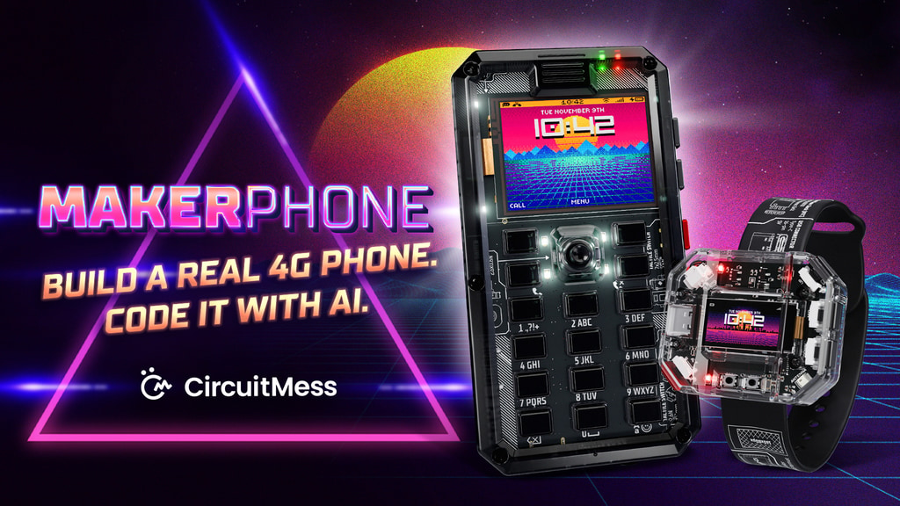
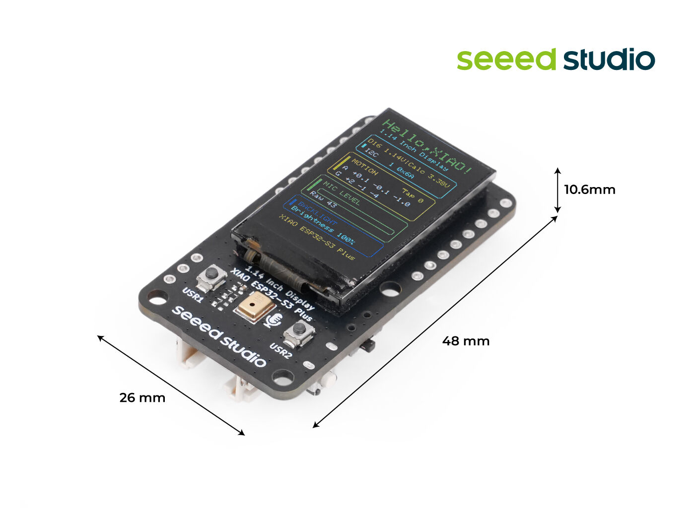
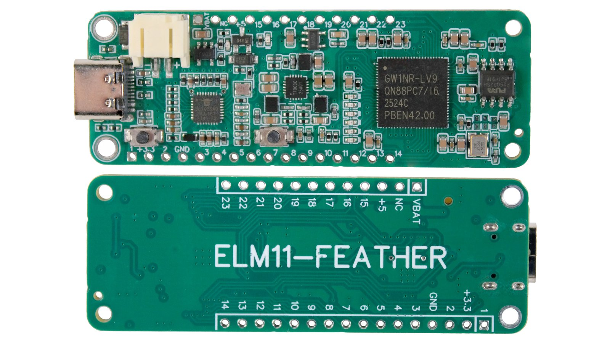

_Sean_ delivers the news roundup, _Matt_ runs us through his latest hardware

# News Round-up

Sean delivers the news roundup:

---

## Headlines

### MicroPython Debugger

[GHI Electronics](https://www.ghielectronics.com/) have created a real source-level hardware debugger for MicroPython, with breakpoints, call stack, and variables, just like you'd expect for debugging code in an IDE.

The project consists of a [VSCode extension](https://github.com/ghi-electronics/micropython-vsc-extension) and some custom [MicroPython firmware](https://github.com/ghi-electronics/micropython-firmware-debugger), and supports RP2040, RP2350, ESP32-S2, and ESP32-S3.

Their firmware changes are open source, so if you have a different board to the ones they provide builds for then maybe it won't be too hard to port.

[Check our their announcement](https://forums.ghielectronics.com/t/micropython-and-source-code-debugging-in-vs-code/26361) to get started.

---

### Incremental Garbage Collection

Originally developed for the [Pocket Deck](https://shop.nunomo.net/products/pocket-deck), [raspy135](https://github.com/raspy135) has published their changes that introduce "incremental" garbage collection. 

---

### c

---

### d

---

## Hardware news

### Makerphone 2.0 ([Kickstarter](https://www.kickstarter.com/projects/albertgajsak/makerphone-20-an-educational-diy-mobile-phone#h:Past-Projects))

A follow-up from 2018's original Makerphone, the 2.0 is still a phone that you build yourself – but no soldering is required this time around. It's powered by an ESP32-S3 and an unspecified 4G LTE modem, with a 160×128 colour display and an old-school keypad style.

The main pitch seems to be for education, and they have an AI-powered app called VibeBoy which aims to help a user write code for their Makerphone and help them understand how that code works.

There's also a companion smart watch-esque gadget, the Makerband, which can pair over Bluetooth with the Makerphone (or an Android or iOS device)

**US$189** for the phone and the watch, ends October 11

---

### TriviaPOD ([M5Stack](https://shop.m5stack.com/products/triviapod))

Digital games without the distractions of a smartphone seems to be the pitch here, the TriviaPOD touts itself as a "tiny trivia machine built for real family play". 

It looks like a pretty neat bit of kit, and is a complete ready-to-use product – but it's also powered by an ESP32-S3 so could also form the basis for your next MicroPython project (there's also the physically similar but more development-focussed [StopWatch](https://docs.m5stack.com/en/core/StopWatch), which exposes a range of GPIO on the rear)

**US$39**, available to pre-order

---

### XIAO 1.14'' IPS Display ([SeeedStudio](https://www.seeedstudio.com/1-14-Inch-Display-Powered-by-XIAO-ESP32-S3-Plus-p-6991.html))

A cute little XIAO board with both _nRF52840_ and _ESP32-S3_ options, with a 1.14 inch colour IPS display.

Comes with all the usual interfaces, like a Grove I²C port, IMU, LiPo battery connector, and some buttons.

Their wiki includes Arduino instructions, but the ST7789 display driver is well supported in MicroPython – and the full KiCAD schematics are available.

**US$16.90**

---

### ELM11 Feather ([Crowd Supply](https://www.crowdsupply.com/brisbanesilicon/elm11-feather))

This one is partly hardware news, and partly software…

The ELM11-Feather is dev board in the Adafruit Feather form factor, and is natively programmable with Lua (as well as C, SystemVerilog, and VHDL)

Although it looks like a pretty standard dev kit, the ELM11-Feather actually uses a GoWIN FPGA (part _GW1NR9-C_, specifically). As such, the hardware can be redefined to provide you exactly the peripherals that you need – there's 23 I/O pins, each supporting GPIO, PWM, UART, SPI, and I²C.

The creators, [BrisbaneSilicon](https://brisbanesilicon.com.au/), also have an IDE to guide you through the board setup, including assigning the pins to a hardware-backed peripheral. There's also details on how to extend the FPGA logic in the hardware layer, and how to create the necessary C driver layer to then use that hardware from Lua.

No specific word on MicroPython, but maybe someone will make a port!

**US$39**, available now

---

## Software news

### a

---

### b

---

### c

---

### d

---

## Matt's New Hardware

### a

---
## Quick bytes

### a

### b

---

### Midjourney fun

